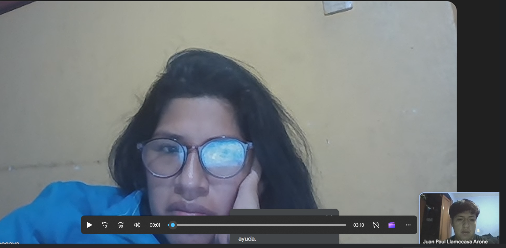
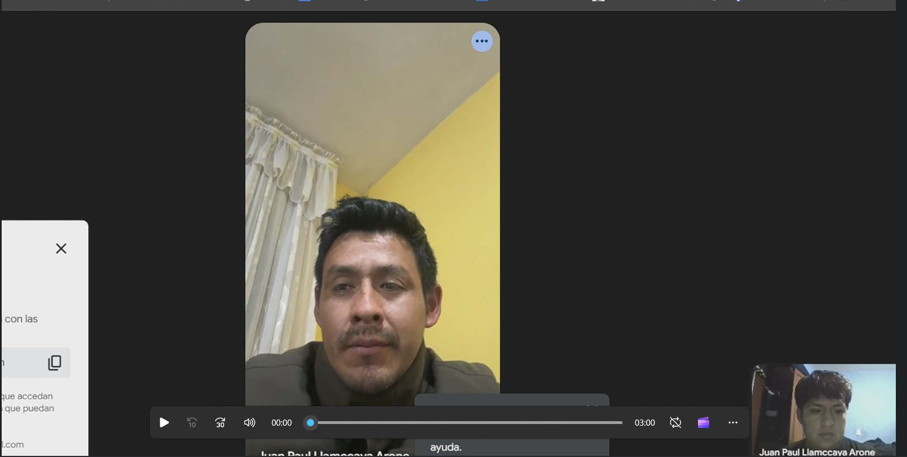

### Capítulo II: Requirements Elicitation & Analysis

###   2.1. Competidores. 

En el ecosistema de soluciones para la gestión de eventos musicales y contratación de artistas, existen diversas plataformas que ofrecen funcionalidades similares a las de VibeStage. A continuación, se presentan algunos de los competidores más relevantes, junto con un análisis de sus enfoques y una comparación con las fortalezas diferenciales de nuestra propuesta.

  

**Songkick:** Plataforma internacional que permite a los usuarios seguir a sus artistas favoritos, recibir alertas de conciertos en su área y comprar entradas. Aunque facilita el descubrimiento de eventos y la compra de boletos, no gestiona contrataciones directas ni procesos logísticos para los artistas.

🔹 Ventaja de VibeStage: Nuestra solución no solo conecta, sino que formaliza y ejecuta todo el ciclo de contratación, desde la exploración hasta el pago y la evaluación post-evento.

**GigSalad:**  Marketplace enfocado en conectar talentos artísticos con contratistas para eventos privados, principalmente en EE. UU. Funciona bien en espectáculos particulares, pero carece de enfoque en la escena musical independiente y local.

🔹 Ventaja de VibeStage: Apuntamos a artistas emergentes que buscan espacios reales de exposición en circuitos culturales, y promovemos la contratación en vivo en espacios públicos y comunitarios.

  

**Indie on the Move:** Plataforma que ayuda a bandas a encontrar lugares donde tocar en Estados Unidos, ofreciendo bases de datos y herramientas para giras. Sin embargo, la gestión sigue siendo manual y sin respaldo de contratos ni pagos seguros.

🔹 Ventaja de VibeStage: Ofrecemos una experiencia automatizada y segura, con contrato digital, logística integrada y pagos protegidos mediante escrow, además de promoción integrada del evento.

#### 2.1.1. Análisis competitivo. 

| **Competitive Analysis Landscape** |                                                                                      |
|--------------------------------------|--------------------------------------------------------------------------------------|
| **¿Por qué llevar a cabo este análisis?** | Llevar a cabo este análisis nos brindará información crítica que nos permitirá tomar decisiones más informadas y estratégicas para el desarrollo, comercialización y crecimiento de **TocaAquí**. |
------------------------------------------------------------------------------------------------------------------
| **Categoría** | ** VibeStage **  | **Songkick** | **GigSalad** | **Indie on the Move** |
|---------------|--------------|--------------|--------------|------------------------|
| **Perfil - Overview** | App móvil que conecta músicos emergentes con bares, promotores y espacios culturales. Ofrece contratación directa, contrato digital, pagos seguros (escrow) y herramientas de promoción. | Plataforma internacional que notifica sobre conciertos de artistas favoritos, con opción de compra de entradas. | Marketplace para contratar artistas y animadores para eventos privados (principalmente en EE. UU.). | Plataforma para que bandas independientes encuentren lugares donde tocar. Ofrece listas de contactos y recursos para planear giras. |
| **Ventaja competitiva** | Conexión directa y segura, contrato digital, logística integrada, sistema de pagos protegidos y promoción del evento. | Gran alcance global y facilidad para descubrir eventos, pero sin contratación directa ni gestión logística. | Facilidad para eventos privados, pero sin enfoque cultural ni contratación formal. | Buen recurso de base de datos, pero sin automatización, sin contratos ni pagos seguros. |
| **Mercado objetivo** | Músicos emergentes, bares, discotecas, centros culturales, promotores de eventos comunitarios. | Fans de la música que buscan descubrir conciertos y comprar entradas. | Organizadores de eventos privados que buscan entretenimiento (bodas, fiestas, etc.). | Bandas que organizan sus propias giras en EE. UU. |
| **Estrategias de marketing** | Redes sociales, colaboraciones con espacios culturales, showcases, recomendaciones por reputación y calificaciones. | Notificaciones personalizadas, integración con plataformas musicales. | Publicidad local y anuncios en redes para eventos privados. | Blog, comunidad en línea y estrategia de posicionamiento SEO. |
| **Productos & Servicios** | Plataforma integral: contratación, pago escrow, firma digital, agenda compartida, validación del rider técnico y promoción del evento. | Seguimiento de artistas, alertas de conciertos, venta de entradas. | Catálogo de artistas, perfiles profesionales, contacto directo. | Listas de contactos de venues, herramientas de planificación de giras. |
| **Precios & Costos** | Comisión por evento concretado. Acceso gratuito con opción premium para funciones adicionales. | Gratuito para usuarios. Ingresos por venta de entradas y acuerdos con promotores. | Comisión por contratación. Costos variables por tipo de artista. | Costos por acceso a base de datos y herramientas. Modelos freemium. |
| **Canales de distribución** | App móvil, WhatsApp Business, integración con plataformas de pago y redes sociales. | App móvil, notificaciones por correo y apps de música. | App y correo directo con artistas. | App responsiva. |
| **Fortalezas** | Contratación segura, experiencia automatizada, visibilidad para artistas emergentes, soporte integral al evento. | Gran base de usuarios y alianzas con plataformas musicales. | Amplia variedad de artistas para eventos sociales. | Apoyo a bandas independientes, útil para giras DIY. |
| **Debilidades** | Plataforma en crecimiento. Necesita generar masa crítica de usuarios y confianza del mercado. | No gestiona contrataciones ni logística de artistas. | Limitado a eventos privados. Poca presencia cultural o comunitaria. | Gestión manual. Sin soporte legal ni de pagos. Limitado a EE. UU. |
| **Oportunidades** | Expansión a más ciudades, alianzas con promotores, sistema de recompensas por reseñas, integración con plataformas de streaming. | Integración con redes sociales, nuevas funciones de comunidad. | Expansión internacional, integrar funciones logísticas. | Modernización con IA, agregar soporte contractual y pagos. |
| **Amenazas** | Competidores consolidados, reticencia a la digitalización en algunos sectores culturales, dependencia del éxito en eventos piloto. | Saturación del mercado de entradas, cambios en algoritmos de plataformas sociales. | Dependencia del mercado de eventos privados, reputación variable. | Competencia tecnológica, falta de diferenciación a largo plazo. |

####  2.1.2. Estrategias y tácticas frente a competidores.

Para sobresalir dentro del competitivo sector musical y de entretenimiento, VibeStage necesita poner en marcha estrategias y acciones diferenciadoras que fortalezcan su propuesta de valor y le permitan atraer tanto a artistas como a promotores y espacios de presentación. A continuación, se plantean algunas de las principales iniciativas y enfoques estratégicos diseñados para alcanzar este objetivo.

###### 1.**Desarrollar una Propuesta de Valor Única**
- **Estrategia:** Resaltar los beneficios clave de VibeStage como plataforma integral para la contratación y promoción de talento musical emergente.  
- **Táctica:** Enfatizar características como contratos digitales, pagos seguros (escrow), validación de rider técnico y agenda compartida para destacar la profesionalización del proceso.

###### 2. **Enfoque en la Experiencia del Usuario**
- **Estrategia:** Optimizar la experiencia tanto para músicos como para promotores mediante una interfaz clara, intuitiva y funcional.  
- **Táctica:** Mejorar continuamente la usabilidad de la plataforma, con flujos ágiles para programación de eventos, seguimiento de pagos y validación de logística técnica.

###### 3. **Ampliar la Base de Usuarios**
- **Estrategia:** Aumentar la comunidad de usuarios para consolidar la red y generar más oportunidades de conexión musical.  
- **Táctica:** Implementar campañas de referidos para músicos y promotores, junto con descuentos por primera contratación y beneficios por uso frecuente.

###### 4. **Marketing Digital Segmentado**
- **Estrategia:** Enfocar la comunicación digital hacia artistas independientes, bookers y dueños de locales culturales.  
- **Táctica:** Usar campañas dirigidas en redes sociales, con contenidos creativos (videos de artistas, experiencias de contratación) y pauta en nichos como festivales locales, ferias musicales y foros de emprendimiento artístico.

###### 5. **Alianzas Estratégicas**
- **Estrategia:** Colaborar con instituciones culturales, asociaciones de músicos y marcas relacionadas con la música en vivo para aumentar la visibilidad y credibilidad.  
- **Táctica:** Generar convenios con bares, discotecas, escuelas de música y empresas de sonido para ofrecer beneficios cruzados y asegurar presencia constante en la escena.

###   2.2. Entrevistas. 

####   2.2.1 Diseño de entrevistas. 

#### Segmento Objetivo Administradores de locales
#### Preguntas Objetivas:

**Características Demográficas:**
- ¿Cual es tu nombre?
- ¿Cuántos años tienes?
- ¿En qué ciudad y distrito está ubicado tu local?
- ¿Cuál es el aforo y tipo de espacio que administras (bar, discoteca, centro cultural, etc.)?

**Ocupación y Responsabilidades:**

- ¿Cuál es tu cargo dentro del establecimiento?
- ¿Qué funciones desempeñas específicamente en la organización y gestión de eventos?
- ¿Con qué frecuencia alquilas tu espacio para presentaciones musicales?
- ¿Cómo gestionas actualmente la programación de artistas y bandas?

**Uso de Tecnología:**

- ¿Qué dispositivos usas para gestionar tu local (PC, laptop, tablet, celular)?
- ¿Qué herramientas digitales o sistemas usas para reservas, programación o promoción?
- ¿Qué canales usas para comunicarte con músicos o productores?

#### Preguntas Subjetivas:

**Personalidad y Habilidades:**

- ¿Qué habilidades personales consideras claves para manejar eventos y relaciones con artistas?

**Objetivos y Frustraciones:**

- ¿Qué objetivos tienes al permitir que bandas se presenten en tu espacio?
- ¿Qué problemas o frustraciones enfrentas al gestionar reservas, pagos o promociones?
- ¿Qué procesos te gustaría automatizar?

**Preferencias y Canales Digitales:**
- ¿Qué funcionalidades valorarías en una plataforma que centralice reservas, pagos y promoción de eventos?
-¿Cómo prefieres recibir notificaciones sobre postulaciones o confirmaciones de artistas?

**Visión del Futuro:**

- ¿Cómo te gustaría que evolucionara el proceso de reserva y programación musical?
- ¿Qué mejoras digitales facilitarían tu trabajo como administrador de espacios?

#### Segmento Objetivo Artistas:
#### Preguntas Objetivas:

**Características Demográficas:**

- ¿Cuál es tu género?
- ¿Cuántos años tienes?
- ¿Cuál es tu rol musical (solista, vocalista, guitarrista, DJ, etc.)?
- ¿Tocas solo o formas parte de una banda?

**Ocupación y Responsabilidades:**

- ¿Desde hace cuánto tiempo estás activo/a como músico?
- ¿Cuántas presentaciones en vivo realizas en promedio al mes?
- ¿Qué tipo de escenarios frecuentas (bares, festivales, discotecas)?

**Uso de Tecnología:**

- ¿Qué dispositivos usas para organizar tus presentaciones (PC, celular, tablet)?
- ¿Qué redes o plataformas usas para gestionar tus bookings o mostrar tu trabajo (Instagram, SoundCloud, etc.)?
- ¿Usas algún sistema para generar contratos o manejar pagos?

#### Preguntas Subjetivas:

**Personalidad y Habilidades:**

- ¿Cómo defines tu estilo musical y tu enfoque en vivo?
- ¿Qué habilidades consideras esenciales para posicionarte como artista en la escena local?

**Objetivos y Frustraciones:**

- ¿Qué metas tienes en relación con tus presentaciones en vivo?
- ¿Qué dificultades encuentras al buscar espacios para tocar?
- ¿Qué parte del proceso (contacto, pagos, contratos, logística) te resulta más difícil o engorrosa?

**Preferencias y Canales Digitales:**

- ¿Qué funcionalidades valoras en una plataforma para músicos (contratos automáticos, pagos seguros, agenda, etc.)?
- ¿Por qué motivos dejarías de usar una plataforma si no cumpliera con tus expectativas?

**Visión del Futuro:**
- ¿Cómo te gustaría que evolucionaran los procesos de contratación y visibilidad para músicos independientes?
- ¿Qué esperas de una plataforma digital que prometa conectarte con promotores y espacios?

####   2.2.2 Registro de entrevistas. 

#### Segmento Administrador de locales

Entrevistado #1

| Campo                        | Información                                                                                                                           |
|-----------------------------|---------------------------------------------------------------------------------------------------------------------------------------|
| **Nombre del entrevistado** |                Eduardo Arenas                                                                                                           |
| **Edad**                    |                         23 años                                                                                                       |
| **Screenshot de la entrevista**|                                                                                 |
| **Link de la entrevista**   |                   [Ver entrevista en Youtube](https://youtu.be/Pw7NdsG1w44)                                                                                                      |
| **Tiempo de inicio y duración** |                 00:00 - 7:14                                                                  |                                                                                    |
| **Resumen**                 |       Eduardo Arenas, un joven trabajador de un bar en San Isidro, nos comparte los desafíos que enfrenta en la gestión de los eventos del local. Señala que trabajan de jueves a domingo, y que cada día se desarrolla bajo una temática distinta, lo que implica una constante organización y adaptación. Además, Eduardo nos brinda su opinión acerca de lo que le gustaría encontrar en una aplicación móvil que lo apoye en su labor diaria. En particular, espera que esta herramienta le permita desempeñar su trabajo de manera más eficiente y sencilla, facilitando la coordinación de las actividades y mejorando la experiencia tanto del personal como de los clientes.                                                          |
----
Entrevistado #2

| Campo                        | Información                                                                                                                           |
|-----------------------------|---------------------------------------------------------------------------------------------------------------------------------------|
| **Nombre del entrevistado** |               Anapaula Diaz                                                                                                         |
| **Edad**                    |                         25 años                                                                                                       |
| **Screenshot de la entrevista**|                                                                                 |
| **Link de la entrevista**   |                   [Ver entrevista en Youtube](https://youtu.be/lG9ygANtY2c)                                                                                                      |
| **Tiempo de inicio y duración** |                 00:00 - 9:40                                                                  |                                                                                    |
| **Resumen**                 |       Anapaula Díaz, una joven profesional del rubro de organización de eventos, nos comparte los procesos que sigue en su trabajo, las dificultades que enfrenta y sus expectativas respecto a una aplicación que pueda facilitar la gestión de eventos. Además, nos brinda algunas propuestas sobre las funcionalidades que le gustaría encontrar en esta app, con el objetivo de optimizar y potenciar su desempeño laboral.                                                          |
----

#### Segmento Artistas

Entrevistado #1

| Campo                        | Información                                                                                                                           |
|------------------------------|---------------------------------------------------------------------------------------------------------------------------------------|
| **Nombre del entrevistado**  |   Sebastian Rivera                                                                                                                    |
| **Edad**                     |    23 años                                                                                                                            |
| **Distrito**                 |         San Luis                                                                                                                    |
| **Screenshot de la entrevista** |                                  |
| **Link de la entrevista**    |                    [Ver entrevista en Youtube](https://youtu.be/fFyIb1JSkuo)                                                                                                  |
| **Tiempo de inicio y duración** |                  0:00 - 19:40                                                                                                  |
| **Resumen**                  |   Sebastián Rivera es un joven cantante y estudiante de la carrera de Música, que además desarrolla su talento de manera profesional tanto en coros como en presentaciones como solista. Nos comparte los diversos desafíos que enfrenta en su día a día dentro del mundo del canto profesional, así como su perspectiva sobre el mercado y las oportunidades que este ofrece. Asimismo, señala algunas deficiencias que ha identificado en distintas situaciones relacionadas con su ámbito artístico y nos brinda valiosas sugerencias sobre las mejoras que le gustaría encontrar en nuestra aplicación móvil, con el fin de que esta se adapte mejor a las necesidades de músicos y cantantes como él.                       |

Entrevistado #2

| Campo                           | Información                                                                                                                                                                                                                                                                                                                                                                                                                                                                                                                                                                                     |
| ------------------------------- | ----------------------------------------------------------------------------------------------------------------------------------------------------------------------------------------------------------------------------------------------------------------------------------------------------------------------------------------------------------------------------------------------------------------------------------------------------------------------------------------------------------------------------------------------------------------------------------------------- |
| **Nombre del entrevistado**     | Valeria Gómez                                                                                                                                                                                                                                                                                                                                                                                                                                                                                                                                                                                   |
| **Edad**                        | 26 años                                                                                                                                                                                                                                                                                                                                                                                                                                                                                                                                                                                         |
| **Distrito**                    | Jesús María                                                                                                                                                                                                                                                                                                                                                                                                                                                                                                                                                                                     |
| **Screenshot de la entrevista** |                                                                                                                                                                                                                                                                                                                                                                                                                                                                                |
| **Link de la entrevista**       | [Ver entrevista en Youtube](https://youtu.be/xyx-ALs1DmU)                                                                                                                                                                                                                                                                                                                                                                                                                                                                                                                                       |
| **Tiempo de inicio y duración** | 0:00 – 3:12                                                                                                                                                                                                                                                                                                                                                                                                                                                                                                                                                                                    |
| **Resumen**                     | Valeria Gómez es una joven cantautora solista que combina el canto con la guitarra. Con más de 5 años en la escena independiente, realiza de 3 a 4 presentaciones mensuales en bares y pequeños festivales. Destaca la importancia de transmitir emociones en vivo y la necesidad de autenticidad para posicionarse como artista local. Señala dificultades recurrentes: la informalidad en contratos, pagos poco claros y la falta de espacios para artistas emergentes. Resalta que valoraría en una plataforma funcionalidades como agenda integrada, contratos automáticos y pagos seguros. |

Entrevistado #3

| Campo                           | Información                                                                                                                                                                                                                                                                                                                                                                                                                                                                                                                                                                                                                                                                                          |
| ------------------------------- | -------------------------------------------------------------------------------------------------------------------------------------------------------------------------------------------------------------------------------------------------------------------------------------------------------------------------------------------------------------------------------------------------------------------------------------------------------------------------------------------------------------------------------------------------------------------------------------------------------------------------------------------------------------------------------------------------------- |
| **Nombre del entrevistado**     | Diego Fernández                                                                                                                                                                                                                                                                                                                                                                                                                                                                                                                                                                                                                                                                                          |
| **Edad**                        | 32 años                                                                                                                                                                                                                                                                                                                                                                                                                                                                                                                                                                                                                                                                                                  |
| **Distrito**                    | Miraflores                                                                                                                                                                                                                                                                                                                                                                                                                                                                                                                                                                                                                                                                                               |
| **Screenshot de la entrevista** |                                                                                                                                                                                                                                                                                                                                                                                                                                                                                                                                                                                           |
| **Link de la entrevista**       | [Ver entrevista en Youtube](https://youtu.be/R_xZXfhcGd8)                                                                                                                                                                                                                                                                                                                                                                                                                                                                                                                                                                                                                                                |
| **Tiempo de inicio y duración** | 0:00 – 21:15                                                                                                                                                                                                                                                                                                                                                                                                                                                                                                                                                                                                                                                                                             |
| **Resumen**                     | Diego Fernández es DJ y productor de música electrónica con más de 10 años de trayectoria en la escena limeña. Se presenta entre 6 y 8 veces al mes en discotecas y raves. Durante la entrevista menciona los problemas más frecuentes: pagos retrasados, negociaciones poco claras y condiciones que cambian a último minuto. Afirma que lo que más valora es mantener la energía en vivo y generar conexión con el público. Señala que para crecer en la escena es clave el networking con promotores y la visibilidad digital. Le interesaría contar con una plataforma que brinde pagos inmediatos, contratos automáticos y un sistema de reputación que aporte seguridad a músicos y organizadores. |

####   2.2.3 Análisis de entrevistas. 

#### Segmento Objetivo #1: Administradores de Locales

Tras las entrevistas realizadas a tres responsables de espacios culturales y de entretenimiento —(NOMBRE DE LOS ENTREVISTADOS)— se logró identificar una serie de patrones recurrentes, necesidades específicas y retos compartidos vinculados con la gestión de eventos musicales y los procesos de contratación de artistas en el ámbito independiente.

---

#### Uso de Tecnología y Herramientas de Gestión

Todos los entrevistados manifestaron usar tecnología básica para la gestión de sus espacios. Los dispositivos más frecuentes son el **celular y la laptop**, y las herramientas más empleadas son **WhatsApp, Instagram, llamadas telefónicas**, y **procesadores de texto como Word o Excel**.

Sin embargo, a pesar del uso cotidiano de herramientas digitales, la gestión aún es **altamente manual y descentralizada**. Se evidenció que:

- **100%** de los entrevistados utiliza WhatsApp como canal principal de coordinación con artistas.
- **100%** emplea hojas de cálculo (Excel o similar) para organizar agendas o contratos.
- **67%** aún redacta contratos de forma manual en Word.
- **67%** indicó que reciben propuestas artísticas por redes sociales, principalmente **Instagram**, lo que dificulta su seguimiento.
- **0%** usa actualmente una plataforma integral de contratación musical o programación de eventos.

---
#### Dispositivos Utilizados

A partir de las entrevistas realizadas, se evidenció que el 100% de los administradores hacen uso tanto de laptops como de teléfonos celulares para el desarrollo de sus actividades, lo que pone de manifiesto la importancia que otorgan a la portabilidad y a la flexibilidad en su gestión cotidiana. Asimismo, ninguno de los entrevistados mencionó utilizar tabletas ni depender de manera exclusiva de un único tipo de dispositivo, lo que refuerza la necesidad de contar con herramientas digitales adaptables a diferentes contextos y situaciones de trabajo.

| Canal                   | Uso (%) |
|------------------------|---------|
| Laptop                 | 100%    |
| Celular                | 100%    |

---

#### Canales de Comunicación más Usados

| Canal                   | Uso (%) |
|------------------------|---------|
| WhatsApp               | 100%    |
| Instagram (DMs)        | 67%     |
| Llamadas telefónicas   | 67%     |
| Correo electrónico     | 33%     |

La informalidad en estos canales genera pérdida de información y dificulta el seguimiento de acuerdos o condiciones pactadas.

---

#### Expectativas hacia Soluciones Tecnológicas

Los tres entrevistados coincidieron en la necesidad de profesionalizar y automatizar sus procesos de gestión, resaltando que una solución digital debería incorporar funciones que aporten orden, transparencia y eficiencia en cada etapa del trabajo. Entre los elementos más valorados se encuentra la posibilidad de contar con una agenda visual compartida que facilite la programación de eventos y brinde claridad a todos los involucrados; la implementación de contratos digitales automatizados, con cláusulas estándar y firma integrada, que agilicen la formalización de acuerdos; y un sistema de pagos seguros y automáticos que evite retrasos y reduzca los malentendidos financieros. Asimismo, consideran fundamental disponer de un mecanismo de postulación filtrada por estilo musical, que elimine la necesidad de revisar mensajes irrelevantes, junto con un historial de bandas acompañado de evaluaciones post-evento, capaz de generar confianza y respaldar decisiones basadas en reputación. Finalmente, destacan como un aspecto logístico clave la opción de que el propio músico pueda realizar la carga directa de su rider técnico, optimizando la coordinación y reduciendo posibles contratiempos antes de cada presentación.

---

#### Principales Desafíos Identificados

| Desafío                                                    | Mención (%) |
|-------------------------------------------------------------|-------------|
| Informalidad en la contratación y comunicación              | 100%        |
| Falta de una agenda visual centralizada                     | 100%        |
| Redacción manual y repetitiva de contratos                  | 67%         |
| Dificultad para recibir y filtrar propuestas artísticas     | 67%         |
| Problemas logísticos derivados de cambios de último minuto  | 67%         |

---

#### Conclusiones del Segmento

Los administradores entrevistados señalaron que enfrentan una alta carga operativa derivada de la informalidad en la gestión musical, lo que genera procesos fragmentados, poco eficientes y difíciles de sostener en el tiempo. Ante esta situación, se evidencia una necesidad latente de contar con una plataforma digital integral como VibeStage, capaz de centralizar en un mismo entorno la contratación de artistas, la gestión de pagos, la organización de agendas, la comunicación entre las partes y la promoción de eventos. Los responsables coincidieron en que una solución de este tipo tendría una rápida y amplia adopción, siempre que logre adaptarse a los flujos de trabajo ya existentes, reduzca la fricción operativa y contribuya a elevar el estándar profesional tanto para los espacios culturales como para los músicos independientes. Asimismo, se detecta un interés genuino en dejar atrás los métodos dispersos, manuales e informales que actualmente predominan, apostando por una gestión más moderna, eficiente, confiable y alineada con las demandas del sector.

---
### Segmento Objetivo #2: Artistas y Músicos Independientes

A partir de las entrevistas realizadas a tres músicos de distintos perfiles y géneros (NOMBRE DE LOS ARTISTAS Y MUSICOS) se lograron identificar patrones comunes que ponen en evidencia los problemas de informalidad, incertidumbre y desorganización que persisten en la escena musical independiente. Todos ellos coinciden en que, si bien participan en múltiples presentaciones cada mes, los procesos de contratación actuales resultan poco confiables, carecen de estandarización y generan un entorno de trabajo desordenado que dificulta tanto la planificación como la estabilidad profesional de los artistas.

---

#### Herramientas y dispositivos más utilizados

Los artistas entrevistados señalaron que hacen un uso intensivo de herramientas digitales básicas para coordinar y dar seguimiento a sus presentaciones. De manera unánime, mencionaron que el teléfono celular constituye su recurso principal de trabajo, al cual recurren constantemente para comunicarse y organizarse. Entre los canales más utilizados destacan WhatsApp, las llamadas directas y, en algunos casos, Instagram, plataformas que les permiten concretar acuerdos, resolver dudas de último minuto y mantenerse en contacto con los organizadores, aunque sin ofrecer una estructura formal que garantice orden y seguridad en los procesos.

| Herramienta / Dispositivo   | Uso (%) |
|-----------------------------|---------|
| Celular                     | 100%    |
| WhatsApp                    | 100%    |
| Llamadas telefónicas        | 100%    |
| Laptop                      | 67%     |
| Instagram                   | 33%     |

Si bien los músicos recurren a medios digitales para coordinar sus actividades, la gestión actual se caracteriza por ser fragmentada y poco articulada. No hacen uso de plataformas centralizadas ni de herramientas especializadas que les permitan profesionalizar procesos clave como la contratación, la gestión de pagos o la promoción de sus presentaciones, lo que genera duplicidad de esfuerzos, falta de control y una evidente vulnerabilidad frente a imprevistos.

---

#### Canales de Coordinación

Los tres músicos entrevistados coincidieron en que la coordinación con los promotores se lleva a cabo casi de manera exclusiva a través de WhatsApp o llamadas telefónicas, mientras que uno de ellos mencionó que también recibe propuestas por mensajes directos en Instagram, aunque señaló que este canal suele dificultar el seguimiento y la organización de la información. Esta dinámica refleja una marcada dependencia de canales informales y dispersos, lo que no solo limita la eficiencia en la gestión, sino que también incrementa el riesgo de malentendidos y pérdidas de oportunidades. Al mismo tiempo, esta situación abre una oportunidad significativa para el desarrollo de una herramienta que permita centralizar la comunicación, estructurar los procesos y elevar el nivel de profesionalización en la escena musical independiente.

---

#### Desafíos Actuales Identificados

| Desafío                                                        | Mención (%) |
|----------------------------------------------------------------|-------------|
| Informalidad en pagos                                           | 100%        |
| Falta de contratos escritos o claros                           | 100%        |
| Cambios de último minuto en condiciones o fechas               | 67%         |
| Incertidumbre hasta el día del evento                          | 100%        |
| Mala comunicación con algunos locales                          | 67%         |

---

#### Expectativas hacia soluciones tecnológicas

Todos los artistas expresaron un fuerte interés por contar con una solución que:

- Les permita centralizar fechas y postulaciones.
- Ofrezca contratos digitales automáticos.
- Garantice pagos seguros, idealmente bajo un sistema tipo escrow.
- Permita promocionar sus shows de forma profesional.
- Reduzca la necesidad de múltiples conversaciones y negociaciones por separado.

---

#### Conclusión del análisis

Los artistas entrevistados muestran un perfil activo y profesional, con una fuerte vocación hacia el crecimiento de su carrera, aunque actualmente se desenvuelven en un sistema marcado por la informalidad y la falta de estructura. En este contexto, se evidencia de manera clara la necesidad de una plataforma como TocaAquí, capaz de automatizar y profesionalizar el proceso completo de contratación musical, abarcando desde la postulación inicial hasta la confirmación del evento y el pago final de manera segura y transparente. Entre los aspectos más críticos señalados en las entrevistas destaca la ausencia de contratos formales y la inseguridad en los pagos, factores que generan incertidumbre y, en muchos casos, desconfianza en la relación con los organizadores. No obstante, los músicos también expresaron una alta disposición a incorporar nuevas tecnologías, siempre que estas logren reducir la carga operativa, eliminen la improvisación y les permitan concentrarse en lo que verdaderamente valoran: la creación y la interpretación de su música.

###   2.3. Needfinding. 

####   2.3.1 User Personas. 

Con el fin de comprender en mayor profundidad a nuestros usuarios clave, se diseñaron dos perfiles de User Persona que representan de manera ficticia, pero fundamentada, a los principales segmentos de nuestra plataforma: los artistas independientes y los administradores de locales. Estos arquetipos permiten identificar con claridad sus motivaciones, frustraciones, hábitos de trabajo y expectativas frente al uso de herramientas digitales, lo que a su vez facilita el diseño de una solución más cercana a sus necesidades reales. Al apoyarnos en estos perfiles, buscamos no solo optimizar la funcionalidad de la aplicación, sino también mejorar de forma significativa la experiencia integral de los usuarios al interactuar con nuestra App.

#### Segmento Objetivo Administradores de locales

#### Segmento Objetivo Artista independiente

####   2.3.2 User Task Matrix.

#### - Artista Independiente:

| **Tareas** | **Frecuencia** | **Importancia** |
|------------|----------------|-----------------|
| Buscar y postularse a nuevos escenarios y eventos | Always | High |
| Firmar contratos formales para presentaciones | Sometimes | High |
| Coordinar fechas, pagos y ensayos desde una sola plataforma | Always | High |
| Gestionar su agenda y compromisos artísticos | Always | High |
| Promocionar sus eventos en redes sociales | Sometimes | Medium |
| Crear y actualizar su perfil artístico profesional | Always | High |
| Evaluar presentaciones y recibir feedback para mejorar | Sometimes | Medium |
| Asegurar pagos mediante mecanismos confiables | Sometimes | High |
| Crear contenido para mantener su visibilidad en redes | Sometimes | Medium |

---

#### - Administrador de Local:

| **Tareas** | **Frecuencia** | **Importancia** |
|------------|----------------|-----------------|
| Publicar disponibilidad de fechas y espacios para eventos | Always | High |
| Recibir y filtrar propuestas de artistas | Always | High |
| Coordinar logística y ensayos de manera organizada | Sometimes | High |
| Formalizar contratos y pagos a través de una plataforma | Sometimes | High |
| Gestionar inventario técnico (sonido, luces, etc.) | Sometimes | Medium |
| Evaluar artistas después de los eventos | Sometimes | Medium |
| Promocionar eventos en redes sociales | Sometimes | Medium |
| Controlar asistencia y recolectar feedback del público | Sometimes | Medium |
| Automatizar tareas operativas para ahorrar tiempo | Always | High |

####   2.3.3 User Journey Mapping.

En esta sección, analizaremos el recorrido del usuario al utilizar nuestra App VibeStage

**Segmento 1: Músicos Independientes**  

**Segmento 2: Promotores**  

####   2.3.4 Empathy Mapping.

En esta sección se expone el Empathy Mapping, una herramienta que permite construir un perfil más completo de los user personas y, con ello, desarrollar una comprensión profunda de su manera de pensar, actuar y relacionarse con su entorno. A través de este recurso, se busca representar no solo los comportamientos observables, sino también las percepciones y emociones que influyen en sus decisiones. Para cada user persona se analizan cinco dimensiones fundamentales: lo que el usuario ve, lo que escucha, lo que dice, lo que hace y lo que siente, ofreciendo así una visión integral que facilita el diseño de soluciones más empáticas, relevantes y alineadas con sus necesidades reales.

**Segmento 1: Músicos Independientes**  

**Segmento 2: Promotores**  

####   2.3.5 Ubiquitous Language.
A continuación se presenta un glosario con los términos centrales del dominio de la plataforma ** VibeStage **. Este vocabulario compartido garantiza que todas las partes involucradas (usuarios, desarrolladores, stakeholders) utilicen un lenguaje consistente y sin ambigüedades.

| **Término (Inglés)**       | **Término (Español)**          | **Definición clara y compartida** |
|----------------------------|-------------------------------|-----------------------------------|
| **Artist**                 | Artista                        | Músico independiente o banda registrada en la plataforma que busca espacios para tocar en vivo. |
| **Venue**                  | Local / Espacio                | Bar, discoteca, café cultural u otro lugar físico que organiza eventos musicales y contrata artistas. |
| **Booking**                | Contratación / Reserva         | Proceso de solicitud, selección y confirmación de un artista por parte de un local para una fecha específica. |
| **Application**            | Postulación                    | Acción mediante la cual un artista se propone para tocar en una fecha publicada por un local. |
| **Digital Contract**       | Contrato digital               | Acuerdo legal generado automáticamente por la plataforma y firmado por ambas partes (artista y local). |
| **Escrow Payment**         | Pago con garantía (escrow)     | Sistema de pago seguro en el que el dinero se libera solo después de realizarse el evento según lo acordado. |
| **Technical Rider**        | Rider técnico                  | Documento que contiene los requerimientos técnicos del artista para su presentación (sonido, luces, etc.). |
| **Soundcheck**             | Prueba de sonido               | Ensayo técnico previo al evento para ajustar equipos de audio e instrumentos en el escenario. |
| **Shared Agenda**          | Agenda compartida              | Herramienta visual donde locales y artistas pueden ver fechas reservadas, confirmadas y disponibles. |
| **Event Promotion**        | Promoción del evento           | Acciones realizadas para visibilizar un show programado (publicación en redes, cartelera digital, etc.). |
| **Post-event Evaluation**  | Evaluación post-evento         | Sistema de calificación y feedback mutuo entre artistas y locales una vez realizado el evento. |
| **Filtered Application**   | Postulación filtrada           | Mecanismo mediante el cual los locales reciben propuestas artísticas según criterios definidos (género, reputación, etc.). |
| **Logistics Manager**      | Gestor de logística            | Módulo de la plataforma que centraliza todos los detalles técnicos, fechas, contratos y coordinación del evento. |

###   2.4. Requirements Specification.
####   2.4.1 User Stories.

| Epic ID  | Título                                    | Descripción |
|----------|-------------------------------------------|-------------|
| EPIC-01  | Construcción de la landing page           | Página inicial pública con información clara sobre Vibestage, sus beneficios, funcionalidades principales y llamado a la acción para captar usuarios. |
| EPIC-02  | Implementación responsive y visual        | Adaptación del diseño de la landing a todos los dispositivos y aplicación del Web Style Guide con identidad gráfica coherente. |
| EPIC-03  | Versiones multilenguaje y accesibilidad   | Inclusión de una versión en inglés y adecuación de la landing a criterios básicos de accesibilidad web. |
| EPIC-04  | Captura de interés y contacto             | Inclusión de botones de registro, sección de contacto funcional y otras herramientas para convertir visitantes en usuarios. |
| EPIC-05  | Registro y login como artista             | Creación de formulario de registro e inicio de sesión para artistas, con validación, recuperación de contraseña y redirección al dashboard. |
| EPIC-06  | Dashboard y navegación del artista        | Construcción del home privado del artista, con acceso rápido a perfil, eventos, postulaciones, agenda, pagos y evaluaciones. |
| EPIC-07  | Exploración de eventos y postulación      | Implementación del sistema de búsqueda de espacios/eventos y postulación automática con filtros por afinidad musical. |
| EPIC-08  | Perfil del artista                        | Creación, edición y visualización de perfil artístico incluyendo biografía, estilo musical, links multimedia y evaluaciones previas. |
| EPIC-09  | Contratos digitales y rider técnico       | Generación automática de contratos, firma digital integrada y flujo para subir, validar y coordinar logística técnica del show. |
| EPIC-10  | Sistema de pagos para artistas            | Gestión de pagos pendientes, pagos liberados vía escrow y visualización de historial económico. |
| EPIC-11  | Evaluación y reputación del artista       | Implementación de evaluaciones post evento hacia locales, visualización de reputación acumulada en el perfil del artista. |
| EPIC-12  | Registro y login como promotor/local      | Registro y acceso de administradores de espacios, con login, recuperación de contraseña y asignación automática de rol. |
| EPIC-13  | Dashboard del promotor/local              | Creación del home privado del local con vista rápida de shows agendados, publicaciones activas, agenda, contratos, pagos y evaluaciones. |
| EPIC-14  | Publicación y gestión de eventos          | Sistema de publicación de fechas, condiciones, restricciones técnicas y tipos de música aceptada. |
| EPIC-15  | Gestión de postulaciones e invitaciones   | Revisión de postulaciones recibidas, filtrado de bandas y opción para invitar a postular. |
| EPIC-16  | Contratos, validaciones y coordinación logística | Validación del rider técnico, firma digital del contrato y coordinación de pruebas de sonido. |
| EPIC-17  | Pagos y confirmación de shows             | Validación del show completado y activación del pago a artista a través del sistema escrow. |
| EPIC-18  | Evaluación de bandas y reputación         | Evaluación de las bandas post evento, con sistema de puntuación y visibilidad futura en el perfil del artista. |
| EPIC-19  | Implementación del formulario de contacto | Crear una sección "Contáctanos" en la landing page, que permita a los visitantes enviar consultas o dudas mediante un formulario de contacto con botón de envío claro y funcional. |
| EPIC-20  | Implementación de la sección de testimonios | Crear una sección de testimonios en la landing page que permita visualizar opiniones de artistas y promotores con nombre, rol y reseña breve de su experiencia. |
| EPIC-21  | Gestión de agenda y eventos confirmados   | Implementación de una vista de agenda con formato semanal que permita al artista organizar eventos confirmados, visualizar estados de pago/contrato y acceder a los detalles. |
| EPIC-22  | Vista rápida y resumen de actividades     | Crear módulos visuales dentro del dashboard que resuman actividades relevantes del artista, como próximos eventos y pagos pendientes. |
| EPIC-23  | Seguimiento de reservas activas           | Permitir al artista visualizar reservas confirmadas y acceder al detalle de cada una, incluyendo condiciones técnicas y contacto con el promotor. |

| Story ID | User                        | Priority | Epic    |
|----------|-----------------------------|----------|---------|
| US01     | Visitante (Artista o Local) | Alta     | EPIC-01 |
| **Title** | Visualización clara del propósito de la plataforma | | |
| **Description** | Como visitante de ambos segmentos, quiero entender rápidamente qué es Vibestage y cómo funciona, para saber si es relevante para mí como artista o local. | | |
| **Acceptance Criteria** | **Escenario 1** Given que el visitante accede a la página principal When visualiza el encabezado principal y la descripción Then comprende claramente qué es la plataforma y qué roles pueden usarla. | | |

| Story ID | User                        | Priority | Epic    |
|----------|-----------------------------|----------|---------|
| US02     | Visitante (Artista o Local) | Alta     | EPIC-01 |

| Title | Navegación fluida entre secciones informativas |
|-------|------------------------------------------------|

| Description |
|-------------|
| Como visitante de ambos segmentos, quiero navegar entre secciones como "Sobre Nosotros" o "Planes" desde el menú principal, para explorar fácilmente la solución. |

| Acceptance Criteria |
|---------------------|
| **Escenario 1** Given que el visitante está en cualquier parte de la landing When selecciona un ítem del menú Then la página se desplaza automáticamente a la sección correspondiente sin recargar.  **Escenario 2** Given que el visitante hace clic en un ítem When selecciona una sección Then la página realiza un scroll automático y suave hacia dicha sección. |

| Story ID | User                        | Priority | Epic    |
|----------|-----------------------------|----------|---------|
| US03     | Visitante (Artista o Local) | Alta     | EPIC-02 |

| Title | Visualización adecuada en móviles y pantallas pequeñas |
|-------|-------------------------------------------------------|

| Description |
|-------------|
| Como visitante de ambos segmentos, quiero que el sitio se adapte bien a mi celular o tablet, para tener una experiencia óptima sin importar el dispositivo. |

| Acceptance Criteria |
|---------------------|
| **Escenario 1** Given que el visitante accede desde un dispositivo móvil When navega por la landing Then los elementos se reorganizan para visualización óptima.  **Escenario 2** Given que el visitante interactúa con elementos táctiles When selecciona botones o menús Then responden correctamente y permanecen accesibles sin errores de visualización. |

| Story ID | User                        | Priority | Epic    |
|----------|-----------------------------|----------|---------|
| US04     | Visitante (Artista o Local) | Media    | EPIC-03 |

| Title | Acceso a la versión en inglés del sitio |
|-------|-----------------------------------------|

| Description |
|-------------|
| Como visitante de los segmentos, quiero ver la página en inglés, para comprender toda la información sin barreras de idioma. |

| Acceptance Criteria |
|---------------------|
| **Escenario 1** Given que el visitante extranjero selecciona el idioma inglés When actualiza el contenido Then todo el texto de la página se muestra correctamente en inglés. |

| Story ID | User                        | Priority | Epic    |
|----------|-----------------------------|----------|---------|
| US05     | Visitante (Artista o Local) | Alta     | EPIC-04 |

| Title | Envío de un mensaje a través del formulario de contacto |
|-------|--------------------------------------------------------|

| Description |
|-------------|
| Como visitante de ambos segmentos con dudas, quiero enviar un mensaje desde el formulario de contacto, para comunicarme fácilmente con el equipo de Vibestage. |

| Acceptance Criteria |
|---------------------|
| **Escenario 1** Given que el visitante completa todos los campos requeridos When envía el formulario Then el sistema confirma que el mensaje fue enviado correctamente.  **Escenario 2** Given que el visitante omite un campo obligatorio When intenta enviar el formulario Then el sistema muestra un mensaje indicando que debe completarlo. |

| Story ID | User                        | Priority | Epic    |
|----------|-----------------------------|----------|---------|
| US06     | Visitante (Artista o Local) | Alta     | EPIC-04 |

| Title | Selección del tipo de usuario desde la landing |
|-------|------------------------------------------------|

| Description |
|-------------|
| Como visitante de ambos segmentos interesado, quiero seleccionar si soy artista o promotor desde la landing, para empezar mi registro de forma adecuada. |

| Acceptance Criteria |
|---------------------|
| **Escenario 1** Given que el visitante está en la sección principal When selecciona “Soy artista” o “Soy local” Then es redirigido al flujo de registro correspondiente.  **Escenario 2** Given que el visitante selecciona un rol When continúa navegando Then las secciones y botones se muestran personalizados según el rol elegido. |

| Story ID | User              | Priority | Epic    |
|----------|-------------------|----------|---------|
| US07     | Visitante Artista | Alta     | EPIC-05 |

| Title | Registro como artista en la plataforma |
|-------|----------------------------------------|

| Description |
|-------------|
| Como visitante del segmento Artista nuevo, quiero registrarme en Vibestage seleccionando mi rol, para poder acceder a mi panel personalizado. |

| Acceptance Criteria |
|---------------------|
| **Escenario 1** Given que el visitante del segmento Artista accede al formulario de registro When completa sus datos y selecciona “Artista” Then se crea una cuenta con acceso directo al dashboard de artista. |

| Story ID | User             | Priority | Epic    |
|----------|------------------|----------|---------|
| US08     | Artista registrado | Alta   | EPIC-06 |

| Title | Acceso al dashboard personalizado de artista |
|-------|---------------------------------------------|

| Description |
|-------------|
| Como usuario del segmento Artista registrado, quiero ingresar a un panel con herramientas específicas para músicos, para gestionar mis eventos y perfil fácilmente. |

| Acceptance Criteria |
|---------------------|
| **Escenario 1** Given que el artista ha iniciado sesión When accede a la plataforma Then visualiza un dashboard con módulos como perfil, postulaciones, agenda y pagos. |

| Story ID | User             | Priority | Epic    |
|----------|------------------|----------|---------|
| US09     | Artista registrado | Alta   | EPIC-07 |

| Title | Búsqueda de eventos compatibles con mi perfil |
|-------|----------------------------------------------|

| Description |
|-------------|
| Como usuario del segmento Artista, quiero ver eventos recomendados según mi género musical y ubicación, para postular solo a los que se alinean con mi estilo. |

| Acceptance Criteria |
|---------------------|
| **Escenario 1** Given que el artista accede a “Eventos recomendados” When consulta la sección en su dashboard Then visualiza tarjetas de eventos filtradas por afinidad musical, localización y disponibilidad. |

| Story ID | User             | Priority | Epic    |
|----------|------------------|----------|---------|
| US10     | Artista registrado | Alta   | EPIC-07 |

| Title | Postulación rápida a un evento desde la plataforma |
|-------|---------------------------------------------------|

| Description |
|-------------|
| Como usuario del segmento Artista, quiero postularme a un evento en pocos pasos, para agilizar mi proceso de presentación. |

| Acceptance Criteria |
|---------------------|
| **Escenario 1** Given que el artista encuentra un evento que le interesa When selecciona “Postular” Then la solicitud se envía automáticamente al local con su perfil adjunto.  **Escenario 2** Given que el artista se postula a un evento When la postulación se completa Then recibe una confirmación visible de que fue exitosa. |

| Story ID | User             | Priority | Epic    |
|----------|------------------|----------|---------|
| US11     | Artista registrado | Alta   | EPIC-08 |

| Title | Gestión y edición de mi perfil artístico |
|-------|------------------------------------------|

| Description |
|-------------|
| Como usuario del segmento Artista, quiero crear y editar mi perfil con biografía, estilo musical y contenido multimedia, para mostrarme profesionalmente a los locales. |

| Acceptance Criteria |
|---------------------|
| **Escenario 1** Given que el artista accede a “Mi perfil” When edita biografía, redes sociales o sube contenido multimedia Then los cambios se guardan y son visibles en su perfil público. |

| Story ID | User             | Priority | Epic    |
|----------|------------------|----------|---------|
| US12     | Artista confirmado | Alta   | EPIC-09 |

| Title | Subida y validación del rider técnico |
|-------|---------------------------------------|

| Description |
|-------------|
| Como artista confirmado para un show, quiero subir mi rider técnico, para que el promotor lo revise y apruebe antes del evento. |

| Acceptance Criteria |
|---------------------|
| **Escenario 1** Given que el artista tiene un show confirmado When accede a la sección de logística Then puede subir un archivo con sus requerimientos técnicos visible para el promotor. |

| Story ID | User             | Priority | Epic    |
|----------|------------------|----------|---------|
| US13     | Artista registrado | Alta   | EPIC-10 |

| Title | Visualización de pagos recibidos y pendientes |
|-------|-----------------------------------------------|

| Description |
|-------------|
| Como artista, quiero revisar mis pagos pendientes, liberados y el historial de ingresos, para tener control sobre mis ganancias. |

| Acceptance Criteria |
|---------------------|
| **Escenario 1** Given que el artista accede a “Pagos” When consulta la sección Then visualiza pagos realizados, pendientes y montos de cada evento.  **Escenario 2** Given que el artista revisa sus pagos When selecciona la opción exportar Then descarga un reporte con su historial. |

| Story ID | User                  | Priority | Epic    |
|----------|-----------------------|----------|---------|
| US14     | Promotor/Local nuevo  | Alta     | EPIC-12 |

| Title | Registro como administrador de local |
|-------|--------------------------------------|

| Description |
|-------------|
| Como visitante del segmento Promotor/Local de un espacio, quiero registrarme en la plataforma con mi rol, para acceder a herramientas de publicación y gestión de eventos. |

| Acceptance Criteria |
|---------------------|
| **Escenario 1** Given que el visitante del segmento Local accede al registro When completa sus datos y selecciona “Promotor / Local” Then se crea su cuenta con acceso al dashboard de local. |

| Story ID | User                  | Priority | Epic    |
|----------|-----------------------|----------|---------|
| US15     | Promotor/Local        | Alta     | EPIC-13 |

| Title | Acceso al dashboard del local |
|-------|-------------------------------|

| Description |
|-------------|
| Como usuario del segmento Promotor/Local, quiero visualizar un panel con mis shows, publicaciones y herramientas clave, para organizar fácilmente mis eventos. |

| Acceptance Criteria |
|---------------------|
| **Escenario 1** Given que el promotor inicia sesión en su cuenta When accede a la plataforma Then visualiza un dashboard con secciones como eventos agendados, publicar show, agenda y evaluaciones. |

| Story ID | User                  | Priority | Epic    |
|----------|-----------------------|----------|---------|
| US16     | Promotor/Local        | Alta     | EPIC-14 |

| Title | Publicación de eventos musicales |
|-------|----------------------------------|

| Description |
|-------------|
| Como usuario del segmento Promotor/Local, quiero publicar fechas disponibles con condiciones específicas, para recibir postulaciones de bandas que cumplan mis criterios. |

| Acceptance Criteria |
|---------------------|
| **Escenario 1** Given que el promotor accede a “Publicar evento” When completa los datos requeridos (fecha, género musical, ubicación, requisitos técnicos) Then el evento queda publicado y visible para artistas compatibles. |

| Story ID | User                  | Priority | Epic    |
|----------|-----------------------|----------|---------|
| US17     | Promotor/Local        | Alta     | EPIC-15 |

| Title | Revisión de postulaciones y selección de artista |
|-------|--------------------------------------------------|

| Description |
|-------------|
| Como usuario del segmento Promotor/Local, quiero ver las postulaciones recibidas y elegir la mejor opción, para asegurar un show alineado a mi público. |

| Acceptance Criteria |
|---------------------|
| **Escenario 1** Given que existen postulaciones en

| Story ID | User                        | Priority | Epic    |
|----------|-----------------------------|----------|---------|
| US21     | Visitante (Artista o Local) | Alta     | EPIC-01 |

| Title | Visualización de planes para artistas y promotores/locales |
|-------|------------------------------------------------------------|

| Description |
|-------------|
| Como visitante de ambos segmentos, quiero ver claramente los diferentes planes disponibles para artistas y promotores/locales, para decidir cuál se adapta mejor a mis necesidades. |

| Acceptance Criteria |
|---------------------|
| **Escenario 1** Given que el visitante accede a la sección “Planes” When consulta la página Then visualiza claramente las diferencias entre los planes Básico, Medio y Premium para cada tipo de usuario. |

| Story ID | User                        | Priority | Epic    |
|----------|-----------------------------|----------|---------|
| US22     | Visitante (Artista o Local) | Alta     | EPIC-04 |

| Title | Acceso rápido a registro desde botones CTA |
|-------|--------------------------------------------|

| Description |
|-------------|
| Como visitante de ambos segmentos interesado, quiero encontrar botones claros para registrarme como artista o como local, para comenzar a usar la plataforma con un clic. |

| Acceptance Criteria |
|---------------------|
| **Escenario 1** Given que el visitante está en la sección principal de la landing When visualiza los botones “Soy artista” o “Soy local” Then puede hacer clic y ser redirigido al formulario de registro correspondiente. |

| Story ID | User                        | Priority | Epic    |
|----------|-----------------------------|----------|---------|
| US23     | Visitante (Artista o Local) | Media    | EPIC-02 |

| Title | Navegación accesible desde menú fijo |
|-------|--------------------------------------|

| Description |
|-------------|
| Como visitante de ambos segmentos, quiero contar con un menú que permanezca visible mientras navego, para poder acceder fácilmente a cualquier sección de la página. |

| Acceptance Criteria |
|---------------------|
| **Escenario 1** Given que el visitante hace scroll en la landing When se desplaza hacia abajo Then el menú de navegación permanece visible en la parte superior de la pantalla. |

| Story ID | User                        | Priority | Epic    |
|----------|-----------------------------|----------|---------|
| US24     | Visitante (Artista o Local) | Baja     | EPIC-01 |

| Title | Visualización del equipo de desarrollo en la landing |
|-------|------------------------------------------------------|

| Description |
|-------------|
| Como visitante de ambos segmentos curioso, quiero conocer al equipo de personas que desarrolla Vibestage, para sentir mayor confianza en la solución. |

| Acceptance Criteria |
|---------------------|
| **Escenario 1** Given que el visitante accede a la sección “Nuestro equipo” When navega por ella Then visualiza tarjetas con nombre, rol e imagen de cada desarrollador. |

| Story ID | User                        | Priority | Epic    |
|----------|-----------------------------|----------|---------|
| US25     | Visitante (Artista o Local) | Media    | EPIC-20 |

| Title | Visualización de testimonios de usuarios |
|-------|------------------------------------------|

| Description |
|-------------|
| Como visitante de ambos segmentos, quiero ver testimonios de artistas y promotores en la landing, para generar confianza en la calidad y efectividad de la plataforma. |

| Acceptance Criteria |
|---------------------|
| **Escenario 1** Given que el visitante accede a la sección de testimonios When navega por esa parte de la landing Then visualiza opiniones de usuarios reales con nombre, rol (artista o promotor) y una reseña de su experiencia. |

| Story ID | User                        | Priority | Epic    |
|----------|-----------------------------|----------|---------|
| US26     | Visitante (Artista o Local) | Media    | EPIC-06 |

| Title | Botón de Call to Action "Enviar" en la sección de "Contáctanos" |
|-------|----------------------------------------------------------------|

| Description |
|-------------|
| Como visitante de ambos segmentos, quiero ver el botón de "Enviar" en la sección "Contáctanos", para poder enviar mis dudas o consultas directamente a la plataforma. |

| Acceptance Criteria |
|---------------------|
| **Escenario 1** Given que el visitante está en la sección "Contáctanos" When visualiza el formulario Then observa un botón claramente etiquetado como "Enviar".  **Escenario 2** Given que el visitante completa todos los campos requeridos When hace clic en el botón "Enviar" Then el formulario se envía correctamente y muestra un mensaje de confirmación. |

| Story ID | User             | Priority | Epic    |
|----------|------------------|----------|---------|
| US27     | Artista registrado | Alta   | EPIC-22 |

| Title | Visualización de próximos eventos agendados |
|-------|---------------------------------------------|

| Description |
|-------------|
| Como artista registrado, quiero ver un resumen de mis próximos eventos desde el panel principal, para tener claridad de mi agenda sin tener que navegar a otras secciones. |

| Acceptance Criteria |
|---------------------|
| **Escenario 1** Given que el artista tiene eventos agendados When accede al dashboard Then visualiza una tarjeta con los próximos eventos, incluyendo fecha, lugar y estado.  **Escenario 2** Given que el artista no tiene eventos próximos When accede al dashboard Then visualiza un mensaje indicando que no tiene eventos próximos. |

| Story ID | User             | Priority | Epic    |
|----------|------------------|----------|---------|
| US28     | Artista registrado | Alta   | EPIC-06 |

| Title | Visualización de pagos pendientes desde el dashboard |
|-------|------------------------------------------------------|

| Description |
|-------------|
| Como artista registrado, quiero ver de forma inmediata si tengo pagos pendientes, para gestionar mejor mis ingresos. |

| Acceptance Criteria |
|---------------------|
| **Escenario 1** Given que el artista tiene eventos realizados con pagos pendientes When consulta el dashboard Then visualiza el monto y estado de dichos pagos.  **Escenario 2** Given que un pago está atrasado When el artista revisa la sección de pagos Then el sistema muestra una alerta visual indicando que hay un pago vencido. |

| Story ID | User             | Priority | Epic    |
|----------|------------------|----------|---------|
| US29     | Artista registrado | Media  | EPIC-06 |

| Title | Acceso rápido a calificaciones recibidas |
|-------|------------------------------------------|

| Description |
|-------------|
| Como artista registrado, quiero ver mis calificaciones directamente desde el panel, para conocer cómo me evalúan los locales. |

| Acceptance Criteria |
|---------------------|
| **Escenario 1** Given que el artista tiene evaluaciones When accede al dashboard Then visualiza su calificación promedio y número de evaluaciones.  **Escenario 2** Given que el artista quiere detalles de las evaluaciones When selecciona el módulo de calificación Then accede al listado con comentarios y valoraciones por evento. |

| Story ID | User             | Priority | Epic    |
|----------|------------------|----------|---------|
| US30     | Artista registrado | Alta   | EPIC-23 |

| Title | Visualización de reservas confirmadas |
|-------|---------------------------------------|

| Description |
|-------------|
| Como artista registrado, quiero saber si tengo reservas activas con locales, para prepararme adecuadamente para mis presentaciones. |

| Acceptance Criteria |
|---------------------|
| **Escenario 1** Given que el artista tiene reservas confirmadas When accede al dashboard Then visualiza un resumen de las reservas activas.  **Escenario 2** Given que el artista tiene reservas When selecciona la tarjeta de “Reservas” Then accede al detalle completo de la reserva, incluyendo condiciones técnicas y datos de contacto del promotor. |

| Story ID | User       | Priority | Epic    |
|----------|------------|----------|---------|
| US31     | Nuevo usuario | Alta  | EPIC-05 |

| Title | Registro de usuario con selección de rol |
|-------|------------------------------------------|

| Description |
|-------------|
| Como nuevo visitante, quiero registrarme eligiendo si soy músico/banda o promotor/espacio, para que la plataforma me dirija al flujo adecuado. |

| Acceptance Criteria |
|---------------------|
| **Escenario 1** Given que el usuario accede a la pantalla de registro When selecciona su rol y completa los campos Then se crea su cuenta y se le redirige al dashboard correspondiente.  **Escenario 2** Given que el usuario intenta registrarse sin elegir un rol When hace clic en "Registrarse" Then el sistema muestra un mensaje indicando que debe seleccionar un rol. |

| Story ID | User             | Priority | Epic    |
|----------|------------------|----------|---------|
| US32     | Usuario registrado | Alta   | EPIC-05 |

| Title | Inicio de sesión para usuarios registrados |
|-------|--------------------------------------------|

| Description |
|-------------|
| Como usuario registrado, quiero iniciar sesión con mis credenciales, para acceder a mi panel y funcionalidades personalizadas. |

| Acceptance Criteria |
|---------------------|
| **Escenario 1** Given que el usuario ya tiene una cuenta registrada When ingresa correo y contraseña correctos Then accede a su panel según su rol.  **Escenario 2** Given que el usuario introduce credenciales incorrectas When intenta iniciar sesión Then el sistema muestra un mensaje de error indicando revisar credenciales. |

| Story ID | User   | Priority | Epic    |
|----------|--------|----------|---------|
| US33     | Artista | Alta    | EPIC-10 |

| Title | Visualización de pagos recibidos y pendientes |
|-------|-----------------------------------------------|

| Description |
|-------------|
| Como artista, quiero visualizar mis pagos recibidos y pendientes, para hacer seguimiento de mis ingresos por eventos. |

| Acceptance Criteria |
|---------------------|
| **Escenario 1** Given que el artista accede a “Pagos Recibidos” When la página carga Then observa una tabla con listado de pagos (evento, monto, estado, fecha).  **Escenario 2** Given que el artista consulta un pago específico When selecciona la acción de detalle Then visualiza información completa (evento, monto, método, banco, cuenta y estado).  **Escenario 3** Given que el artista observa el estado de los pagos When revisa la tabla Then identifica fácilmente pagos “Pendiente”, “Retenido” o “Completado” con etiquetas visuales diferenciadas. |

| Story ID | User   | Priority | Epic    |
|----------|--------|----------|---------|
| US34     | Artista | Alta    | EPIC-21 |

| Title | Visualización de agenda de eventos |
|-------|------------------------------------|

| Description |
|-------------|
| Como artista, quiero visualizar mis eventos confirmados en una agenda, para organizar mis fechas y acceder fácilmente a los detalles. |

| Acceptance Criteria |
|---------------------|
| **Escenario 1** Given que el artista accede a “Agenda” When se carga la vista Then observa un calendario en formato semanal con eventos confirmados.  **Escenario 2** Given que el artista tiene eventos confirmados When revisa la agenda Then visualiza nombre, fecha, hora, lugar y estado del contrato y pago.  **Escenario 3** Given que los eventos tienen estados asociados When se muestran los detalles Then aparecen etiquetas como “Contrato firmado” o “Pago 50%” de forma clara. |

| Story ID | User   | Priority | Epic    |
|----------|--------|----------|---------|
| US35     | Artista | Media   | EPIC-11 |

| Title | Confirmación visual del estado del contrato |
|-------|---------------------------------------------|

| Description |
|-------------|
| Como artista, quiero visualizar fácilmente si un contrato fue firmado por ambas partes, para estar seguro del compromiso. |

| Acceptance Criteria |
|---------------------|
| **Escenario 1** Given que el artista tiene un contrato pendiente o firmado When accede a su panel Then observa una tarjeta con el estado actual (“Pendiente”, “Firmado por ambos”).  **Escenario 2** Given que el artista quiere consultar el contrato When selecciona el enlace Then accede directamente al documento del contrato. |

| Story ID | User   | Priority | Epic    |
|----------|--------|----------|---------|
| US36     | Artista | Media   | EPIC-15 |

| Title | Visualización de validación de rider técnico |
|-------|----------------------------------------------|

| Description |
|-------------|
| Como artista, quiero saber si mi rider técnico fue validado por el promotor, para confirmar la logística del show. |

| Acceptance Criteria |
|---------------------|
| **Escenario 1** Given que el rider fue aprobado o rechazado When el artista accede al dashboard Then observa una tarjeta con el estado (“Aprobado” o “Rechazado”) y la fecha.  **Escenario 2** Given que el contrato tiene un rider asociado When el artista selecciona el enlace Then accede al archivo subido. |

| Story ID | User   | Priority | Epic    |
|----------|--------|----------|---------|
| US37     | Artista | Alta    | EPIC-10 |

| Title | Indicador de pago liberado en el evento |
|-------|-----------------------------------------|

| Description |
|-------------|
| Como artista, quiero saber que el evento ya fue confirmado como realizado, para validar que el pago se liberó. |

| Acceptance Criteria |
|---------------------|
| **Escenario 1** Given que el evento fue confirmado como realizado When el artista consulta los detalles Then observa el estado “Pago liberado” o “Pago en revisión”.  **Escenario 2** Given que el pago fue exitoso When el artista accede a la sección de comprobantes Then puede descargar el comprobante correspondiente. |

| Story ID | User   | Priority | Epic    |
|----------|--------|----------|---------|
| US38     | Artista | Media   | EPIC-11 |

| Title | Acceso directo al contrato desde el evento |
|-------|--------------------------------------------|

| Description |
|-------------|
| Como artista, quiero acceder directamente al contrato firmado desde la ficha del evento, para consultar sus condiciones. |

| Acceptance Criteria |
|---------------------|
| **Escenario 1** Given que el evento tiene un contrato firmado When el artista accede a la ficha del evento Then observa un botón “Ver contrato”.  **Escenario 2** Given que el contrato ya está firmado When el artista selecciona el botón “Ver contrato” Then el documento se abre en formato PDF o se descarga. |

| Story ID | User     | Priority | Epic    |
|----------|----------|----------|---------|
| US39     | Promotor | Media   | EPIC-09 |

| Title | Edición del perfil del promotor |
|-------|---------------------------------|

| Description |
|-------------|
| Como promotor, quiero editar mi perfil con la información de mi local, para mantener mis datos actualizados y visibles para los artistas. |

| Acceptance Criteria |
|---------------------|
| **Escenario 1** Given que el promotor accede a la sección de perfil When modifica datos como nombre del local, ciudad o descripción Then los cambios se guardan correctamente.  **Escenario 2** Given que el promotor intenta guardar el formulario sin completar campos obligatorios When hace clic en guardar Then el sistema muestra un mensaje de error indicando los campos faltantes. |

####   2.4.2 Impact Mapping.

####   2.4.3 Product Backlog.
| Orden | User Story Id | Título                                                   | Descripción                                                                                                                                                   | Story Points (1/2/3/5/8) |
|-------|----------------|-----------------------------------------------------------|---------------------------------------------------------------------------------------------------------------------------------------------------------------|---------------------------|

###   2.5. Strategic-Level Domain-Driven Design.
####   2.5.1. EventStorming.
**Segmento 1: Músicos Independientes**  

**Segmento 2: Promotores**  

#####   2.5.1.1. Candidate Context Discovery.
En esta sección el equipo, a partir del dominio modelado como EventStorm, explica y
evidencia el proceso realizado para la sesión de Candidate Context Discovery, en la
que se busca identificar los bounded contexts. Puede aplicar las técnicas de start-with-
value (Identificar las partes core del dominio que tienen el mayor valor para el
negocio), start-with-simple (Crear modelos simples, pero con propósito,
descomponiendo el timeline en steps secuenciales), ó look-for-pivotal-events (Buscar
eventos clave del negocio que indiquen cambios de estado entre diferentes partes del
proceso de negocio). La sesión de Candidate Context Discovery no debería durar más
de 2 horas. Utilice para el proceso la herramienta indicada. Complemente la
explicación con capturas en imagen de los cambios progresivos del EventStorm.

#####   2.5.1.2. Domain Message Flows Modeling.
En esta sección, el equipo explica y evidencia el proceso seguido para visualizar cómo
deben colaborar los bounded contexts para resolver los casos que se presentan en el negocio para los usuarios del sistema. Para ello debe aplicar la técnica de visualización
Domain Storytelling. Complemente la explicación con capturas en imágenes de los
diagramas de Domain Storytelling elaborados.
#####   2.5.1.3. Bounded Context Canvases.
En esta sección el equipo diseña sus candidate bounded contexts, detallando los
criterios de diseño. El equipo debe ir seleccionando cada bounded context, por orden
de importancia, para elaborar su Bounded Context Canvas. La elaboración del
Bounded Context Canvas debe seguir un proceso iterativo con los pasos de Context
Overview Definition, Business Rules Distillation & Ubiquitous Language Capture,
Capability Analysis, Capability Layering (si aplica), Dependencies Capture, y Design
Critique.

####   2.5.2. Context Mapping.
En esta sección el equipo explica y evidencia el proceso de elaboración de un conjunto
de contexts maps (visualizaciones de las relaciones estructurales entre bounded
contexts). Para ello el equipo revisa información recolectada y la utiliza para producir
los diseños candidatos. Se recomienda en el proceso incluir preguntas como: “¿qué
pasaría si movemos este capability a otro bounded context?”, “¿qué pasaría si
descomponemos este capability y movemos uno de los sub-capabilities a otro
bounded context?”, “¿qué pasaría si partimos el bounded context en múltiples
bounded contexts?”, “¿qué pasaría si tomamos este capability de estos 3 contexts y
lo usamos para formar un nuevo context?”, “¿qué pasaría si duplicamos una
funcionalidad para romper la dependencia?”, “¿qué pasaría si creamos un shared
service para reducir la duplicación entre múltiples bounded contexts?”, “¿qué pasaría
si aislamos los core capabilities y movemos los otros a un context aparte?”. Debe
finalizar este proceso discutiendo cada alternativa de context mapping a fin de llegar
a la mejor aproximación. Es importante que el equipo considere los patrones de
relaciones entre Bounded Contexts establecidos en Domain-Driven Design, como Anti-
corruption Layer, Conformist, Customer/Supplier ó Shared Kernel.

####   2.5.3.  Software Architecture.
##### 2.5.3.1. Software Architecture Context Level Diagrams.

##### 2.5.3.2. Software Architecture Container Level Diagrams.

##### 2.5.3.3. Software Architecture Deployment Diagrams.
En esta sección, el equipo realiza una introducción, presenta y explica el Deployment
Diagram, el cual muestra la distribución física del sistema, destacando cómo los
componentes del software se despliegan sobre el hardware y otros entornos. Este
diagrama visualiza las máquinas, servidores, redes y otros dispositivos físicos que
alojan el software, así como las relaciones y dependencias entre los distintos nodos.
Su objetivo es describir cómo se implementa el sistema en la infraestructura de
hardware.

###   2.6. Tactical-Level Domain-Driven Design
####   2.6.x. Bounded Context: <Bounded Context Name>
En esta sección, para cada uno de los productos, el equipo presenta las clases
identificadas y las detalla a manera de diccionario, explicando para cada una su
nombre, propósito y la documentación de atributos y métodos considerados, junto
con las relaciones entre ellas.

#####   2.6.x.1. Domain Layer

En esta capa el equipo explica por medio de qué clases representará el core de la
aplicación y las reglas de negocio que pertenecen al dominio para el bounded context.
Aquí el equipo presenta clases de categorías como Entities, Value Objects, Aggregates,
Factories, Domain Services, o abstracciones representadas por interfaces como en el
caso de Repositories.

#####   2.6.x.2. Interface Layer
En esta sección el equipo introduce, presenta y explica las clases que forman parte de
Interface/Presentation Layer, como clases del tipo Controllers o Consumers.

#####   2.6.x.3. Application Layer
En esta sección el equipo explica a través de qué clases se maneja los flujos de
procesos del negocio. En esta sección debe evidenciarse que se considera los
capabilities de la aplicación en relación al bounded context. Aquí debe considerarse
clases del tipo Command Handlers e Event Handlers.

#####   2.6.x.4. Infrastructure Layer
En esta capa el equipo presenta aquellas clases que acceden a servicios externos como
databases, messaging systems o email services. Es en esta capa que se ubica la
implementación de Repositories para las interfaces definidas en Domain Layer. Algo
similar ocurre con interfaces definidas para MessageBrokers.

#####   2.6.x.5. Bounded Context Software Architecture Component Level Diagrams.
En esta sección, el equipo explica y presenta los Component Diagrams de C4 Model
para cada uno de los Containers considerados para el bounded context. En estos
diagramas el equipo busca reflejar la descomposición de cada Container para
identificar los bloques estructurales principales y sus interacciones. Un Component
Diagram debe mostrar cómo un container está conformado por components, qué son
cada uno de dichos components, sus responsabilidades y los detalles de
implementación/tecnología. Utilice la herramienta indicada para la elaboración del
diagrama.

#####   2.6.x.6. Bounded Context Software Architecture Code Level Diagrams.

######   2.6.x.6.1. Bounded Context Domain Layer Class Diagrams.
En esta sección el equipo presenta el Class Diagram de UML para las clases del Domain
Layer en el bounded context. El nivel de detalle debe incluir además de las clases,
interfaces, enumeraciones y sus relaciones, los miembros para cada clase, incluyendo
atributos, métodos y el scope en cada caso (private, public, protected). Las relaciones
deben incluir la calificación con nombres, la dirección (cuando aplica) y la
multiplicidad. Utilice para la elaboración del diagrama la herramienta indicada.

######   2.6.x.6.1. Bounded Context Database Design Diagram.
Bounded Context Database Diagram
En esta sección el equipo presenta y explica para cada producto donde se implementa
el bounded context, el Database Diagram que incluye los objetos de base de datos que
permitirán la persistencia de información para los objetos del bounded context. Para
el caso de un almacenamiento en base de datos relacional, aquí debe especificarse
tablas, columnas, constraints (por ejemplo, primary, foreign key) y evidenciarse las
relaciones entre tablas. Utilice para la elaboración del diagrama la herramienta
indicada.

