

    <strong>Universidad Peruana de Ciencias Aplicadas</strong> 
    </img> 
    <strong>Ingeniería de Software</strong> 
    <strong> Aplicaciones para Dispositivos Móviles - 1ACC0238</strong> 
    <strong>Profesor: Eduardo Martin Reyes Rodriguez</strong> 
     INFORME DE TB1

    <strong>Startup: Vibestage </strong> 
    <strong>Producto:  </strong>

    <h3 align="center">Team Members:</h3>
    

     <table align="center">
        <tr>
            <th style="text-align:center;">Member</th>
            <th style="text-align:center;">Code</th>
        </tr>
        <tr>
            <td>Llamccaya Arone, Juan Paul</td>
            <td>U201923571</td>
        </tr>
        <tr>
            <td>Cuya Villegas, Rafael Alberto</td>
            <td>U201913495</td>
        </tr>
        <tr>
           <td>Lapa de la Cruz, Gabriel Omar</td>
           <td>U202216831</td>
        </tr>
        <tr>
           <td>Landauri Preciado, Stephano</td>
           <td>U202311828</td>
        </tr>
        <tr>
            <td>Alvarez Ponce, Carlos Antonio</td>
            <td>U201919386</td>
        </tr>
    </table>

    <strong>Agosto 2025</strong>

 

# Registro de Versiones del Informe

| Versión | Fecha             | Autor                                                                                                                                                     | Descripción de modificación                                                                                                                                                                                                                                                                                                                                        |
| ------- | ----------------- | --------------------------------------------------------------------------------------------------------------------------------------------------------- | ------------------------------------------------------------------------------------------------------------------------------------------------------------------------------------------------------------------------------------------------------------------------------------------------------------------------------------------------------------------ |
| **TB1** | 18/09 | - Rafael Cuya Villegas - Juan Paul Llamccaya Arone -  - Gabriel Omar Lapa de la Cruz  - Stephano Landauri Preciado | Se han incluído los siguientes capítulos: - Capítulo I: Introducción - Capítulo II: Requirements Elicitation & Analysis - Avance de Conclusiones, Bibliografía y Anexos |

# Project Report Collaboration Insights

URL Project Report (Github): https://github.com/Mayrzon02/1ACC0238-2520-14650-VIBESTAGE

TB1:

# Student Outcome

**ABET –  Student Outcome 7**

*Criterio: La capacidad de adquirir y aplicar nuevos conocimientos según sea necesario,
utilizando estrategias de aprendizaje apropiadas.*

En el siguiente cuadro se describe las acciones realizadas y enunciados de conclusiones por parte del grupo, que permiten sustentar el haber alcanzado el logro del ABET – Student Outcome 7.
| Criterio Específico | Acciones Realizadas | Conclusiones |
| :--- | :--- | :--- |
| ** Actualiza conceptos y conocimientos necesarios para su desarrollo profesional y en especial para su proyecto en soluciones de ingeniería de software.** | **TB1** - Cuya Villegas, Rafael Alberto:   Aunque ya dominaba algunos de los conceptos, hubo partes del informe en las que fue necesario profundizar más. Para ello busqué información adicional y revisé documentación que me permitió desarrollar esas secciones de manera adecuada. - Stephano Mayrzon Landauri Preciado: En esta entrega me desenvolví mejor con las herramientas para realizar el trabajo. Tuve que leer algunos conceptos, pero al final todo me quedó claro.  - Lapa de la Cruz, Gabriel Omar:  Al desarrollar el trabajo encontré puntos que no dominaba del todo, así que tuve que reforzar mi entendimiento para poder aportar con claridad en mi parte del informe.  - Juan Paul Llamccaya Arone: Para poder cumplir con mi parte del informe, tuve que reforzar ciertos conceptos técnicos que no dominaba completamente. Revisé documentación y ejemplos prácticos, lo que me ayudó a comprenderlos mejor y aplicarlos de forma adecuada en el proyecto.     - Estudiante5:    |
| ** Reconoce la necesidad del aprendizaje permanente para el desempeño profesional y el desarrollo de proyectos en soluciones de tecnologías de ingeniería de software.** | **TB1** - Cuya Villegas, Rafael Alberto:   Durante el trabajo me encontré con términos que desconocía y tuve que investigarlos. Esto me ayudó no solo a comprenderlos mejor, sino también a aplicarlos en el proyecto de manera efectiva. - Stephano Mayrzon Landauri Preciado: En el transcurso del trabajo me topé con desafíos que tuve que abordar de la mejor manera para cumplir con los tiempos establecidos. Esto me ayudó a comprender mejor algunos conceptos que no tenía claros, pero que, tras la investigación, pude manejar sin problemas. - Lapa de la Cruz, Gabriel Omar:  Me di cuenta de que siempre surgen nuevos conceptos que requieren esfuerzo extra para asimilarlos, lo que reafirma la importancia de seguir aprendiendo constantemente.  - Juan Paul Llamccaya Arone: Este trabajo me permitió darme cuenta de que siempre habrá nuevos términos, metodologías o tecnologías que aprender. La investigación constante fue clave para resolver mis dudas y me motivó a mantener una actitud de aprendizaje continuo en el ámbito profesional.    - Estudiante5:     | **TB1** El equipo demostró disposición para actualizar y complementar los conocimientos previos con nuevos aprendizajes. Esa integración nos permitió adaptarnos a los requerimientos del proyecto y alcanzar un resultado final de calidad.  |

# **Capítulo I: Introducción**
## 1.1. Startup Profile
El startup profile es una pieza clave para comprender de manera integral la naturaleza y la orientación estratégica de una empresa emergente. Este perfil no solo refleja su visión a futuro y los valores que la sustentan, sino que también facilita identificar con claridad la propuesta de valor que la distingue en el mercado.

En este apartado se presentarán los elementos más representativos de la identidad de la startup, como su origen, las motivaciones que impulsaron su creación, el problema que busca resolver y cómo su enfoque innovador le otorga una ventaja frente a la competencia.

Asimismo, se explorarán sus objetivos a mediano y largo plazo, junto con las estrategias que implementa para crecer y consolidarse en su sector. Comprender estos aspectos resulta fundamental para evaluar el potencial del startup profile y el impacto que puede generar en su entorno.
### 1.1.1. Descripción de la Startup

VibeStage es una plataforma web innovadora que surge con el objetivo de conectar a músicos emergentes con bares, discotecas, centros culturales y promotores de eventos, creando un espacio digital donde se facilita no solo la contratación directa, sino también la gestión integral de la disponibilidad de locales, la organización logística, la programación de presentaciones y la promoción musical en diferentes formatos. Los espacios pueden publicar de manera clara su disponibilidad indicando fechas, estilos musicales y ubicación, lo que permite que las bandas interesadas encuentren oportunidades acordes a su propuesta artística, postulen con facilidad, revisen posibles restricciones y agenden su participación sin intermediarios innecesarios. De igual manera, el sistema está equipado con funciones que agilizan el proceso profesional, como la generación y firma de contratos digitales, la administración de pagos seguros bajo la modalidad de escrow, la programación colaborativa en una agenda compartida y la promoción automatizada mediante la creación de entradas digitales que fortalecen la difusión de cada espectáculo. Cada presentación contempla un flujo de trabajo detallado que incluye la validación del rider técnico de la banda, el seguimiento en tiempo real de la agenda, el control de asistencia y una evaluación posterior al evento que permite mejorar futuras experiencias, garantizando así un ecosistema confiable, transparente y eficiente tanto para los artistas como para los organizadores, con el propósito de impulsar la escena musical independiente y acercar al público a nuevas propuestas artísticas.
### 1.1.2. Perfiles de integrantes del equipo

|                                               |                                                                                                                                                                                                                                                                                                                                                                                                                                                                                                                                                  |
|-----------------------------------------------|--------------------------------------------------------------------------------------------------------------------------------------------------------------------------------------------------------------------------------------------------------------------------------------------------------------------------------------------------------------------------------------------------------------------------------------------------------------------------------------------------------------------------------------------------|
|  | Me llamo Rafael Alberto Cuya Villegas, estudiante de la carrera de Ingeniería de Software; tengo conocimiento en los lenguajes HTML, CSS, Javascript, SQL, MongoDB ciberseguridad y Python. Me considero una persona responsable y que le gusta trabajar en equipo. |
|  | Mi nombre es Juan Paul Llamccaya Arone, estoy cursando el sexto ciclo en la carrera de Ingeniería de Software. Cuento con conocimientos de desarrollo de Apps Web profundizando el dominio de lenguajes de Programción como python, C++, HTML y otros mas. Me considero una persona reponsable y me gusta trabajar en equipo. |
|  | Mi nombre es Stephano Mayrzon Landauri Preciado, estoy cursando el sexto ciclo en la carrera de Ingeniería de Software. Tengo conocimentos en los lenguajes HTML, JS y py, siempre me gusta ayudar, soy una persona que me gusta trabajar en equipo y siempre sacar lo mejor de mis compañeros. |
|  | Mi nombre es Gabriel Omar Lapa de la Cruz, estudiante de Ingeniería de Software en la UPC. En mi faceta de formación y desarrollo, he adquirido conocimientos técnicos como el manejo intermedio de C++, JavaScript, Python y SQL. Estoy acostumbrado al trabajo individual, pero mis responsabilidades pueden ayudar al grupo en lo que sea necesario. |
|  | Mi nombre es Carlos Alvarez Ponce, estudiante de Ingeniería de Software en la UPC. Me considero una persona comprometida, organizada y con una gran capacidad para adaptarme a nuevos retos. Me apasiona crear soluciones tecnológicas innovadoras, y en cada proyecto busco aportar lo mejor de mí para resolver los problemas de forma efectiva y eficiente. Tengo experiencia en desarrollo de software y programación en lenguajes como JavaScript, C++, Python y tecnologías modernas como Next.js y React. |

## 1.2. Solution Profile

VibeStage es una plataforma web integral desarrollada para transformar la forma en que se conectan músicos emergentes con espacios de entretenimiento como bares, discotecas, centros culturales y promotores de eventos. Su enfoque principal es profesionalizar y digitalizar todo el proceso de contratación musical en vivo, resolviendo desafíos críticos como la informalidad, la falta de visibilidad, la logística poco estructurada y los riesgos asociados a los pagos. La plataforma busca revolucionar la industria musical independiente al combinar tecnología con gestión cultural eficiente y segura, brindando oportunidades reales de crecimiento tanto a artistas como a promotores.

Características Principales:

  - **Conexión Inteligente entre Músicos y Espacios:** VibeStage permite a músicos y bandas independientes explorar y postularse a espacios disponibles según ubicación, género musical y fechas. A través de filtros inteligentes, los artistas encuentran escenarios afines a su propuesta y los promotores acceden a un catálogo confiable de talento emergente.

- **Gestión Logística Digitalizada:** La plataforma digitaliza cada paso del proceso: desde la publicación de fechas y requisitos por parte de los locales, hasta la coordinación del rider técnico, validación de la agenda y seguimiento en tiempo real de la programación. Esto garantiza una experiencia fluida, transparente y sin improvisaciones.

- **Contratación Formal y Segura:** Con el uso de contratos digitales, VibeStage formaliza cada presentación. Los acuerdos incluyen condiciones, cláusulas de cancelación y validación de cumplimiento. Además, los pagos son gestionados a través de un sistema de escrow, asegurando que el músico reciba su compensación solo cuando el evento ha sido validado.

- **Promoción Automatizada de Eventos:** Una vez cerrada la contratación, la plataforma genera automáticamente materiales de promoción, incluyendo entradas digitales, imágenes para redes sociales y publicación del evento en la agenda virtual del espacio. Esto facilita la difusión y aumenta la asistencia sin esfuerzo adicional.

- **Seguimiento y Evaluación Post-Evento:** Tanto músicos como espacios pueden evaluarse mutuamente tras cada presentación. Este sistema de reputación ayuda a construir confianza en la comunidad, destacando a los artistas más responsables y a los promotores más organizados, fortaleciendo así el ecosistema musical independiente.

VibeStage no solo conecta talento con oportunidades, sino que impulsa un cambio estructural en la forma de organizar y vivir la música en vivo. Su visión es clara: profesionalizar la escena independiente y democratizar el acceso a escenarios reales para artistas emergentes.

### 1.2.1 Antecedentes y problemática

| Pregunta   | Descripción                           | Detalle                                                                                                                                                                                                                                                                                                                                                                                                                                                                                       |
|------------|---------------------------------------|----------------------------------------------------------------------------------------------------------------------------------------------------------------------------------------------------------------------------------------------------------------------------------------------------------------------------------------------------------------------------------------------------------------------------------------------------------------------------------------------|
| Who?       | ¿Quién es afectado?                   | Músicos emergentes que buscan oportunidades para presentarse en vivo y espacios como bares, discotecas y centros culturales que necesitan talento nuevo. También se ven afectados los promotores de eventos que buscan artistas para fechas específicas.                                                                                                                   |
| What?      | ¿Cuál es el problema?                 | La dificultad para conectar de manera confiable y profesional a músicos independientes con promotores o locales. Actualmente, muchas contrataciones se realizan de forma informal, lo que genera riesgos de impago, cancelaciones de último minuto y falta de visibilidad para los artistas.                                                                                                                     |
| When?      | ¿Cuándo sucede el problema?           | Este problema ocurre constantemente en el ecosistema musical. Cada vez que un artista intenta conseguir una presentación o un local necesita llenar su agenda musical, ambos enfrentan complicaciones por la falta de una herramienta centralizada y confiable.                                                                                                             |
| Where?     | ¿Dónde surge el problema?             | El problema surge principalmente en contextos urbanos y zonas con alta actividad cultural donde hay una gran oferta de músicos pero pocos canales formales de contratación. Con VibeStage, se busca resolverlo desde cualquier lugar con conexión a internet.                                                                                                               |
| Why?       | ¿Cuál es la causa del problema?       | El origen radica en la informalidad de la industria musical emergente, la falta de visibilidad para los artistas independientes, y la ausencia de una plataforma que profesionalice la gestión de eventos y presentaciones musicales en vivo.                                                                                                                                |
| How?       | ¿Qué llevó a la persona a esta situación? | Los músicos independientes suelen carecer de representación o contactos, mientras que los locales enfrentan incertidumbre sobre la calidad y responsabilidad de los artistas. Esta brecha impide relaciones sostenibles y eventos exitosos. VibeStage surge como solución digital que facilita la logística, contratación, pago seguro y retroalimentación para todas las partes. |
| How Much?  | ¿Cuál es la cantidad, duración o intensidad del evento? | La plataforma apunta a atender un mercado activo en el que muchos espacios realizan entre 4 a 12 eventos mensuales, y existen decenas de miles de músicos que buscan espacios donde tocar. La falta de una solución como VibeStage representa una pérdida constante de oportunidades para ambos lados, así como eventos mal organizados y poco rentables. |
                                

### 1.2.2 Lean UX Process

El proceso Lean UX es una metodología ágil que transforma la manera de diseñar y construir productos digitales. En esta sección se analizarán los principios esenciales de Lean UX y la forma en que se incorporan dentro del ciclo de desarrollo. A través de la colaboración entre equipos multidisciplinarios, la iteración constante y la validación continua, veremos cómo este enfoque facilita la creación de productos centrados en el usuario de manera ágil, práctica y efectiva.

### 1.2.2.1 Lean UX Problem Statements  
#### **VibeStage: Plataforma para la Contratación de Músicos Emergentes**

---

#### **Descripción del Problema**

En el competitivo mundo de la industria de eventos musicales, los **músicos emergentes** enfrentan grandes dificultades para acceder a oportunidades reales de contratación. La mayoría carece de visibilidad, redes de contacto y canales formales para conectar con **promotores de eventos** que buscan talento nuevo.  
Por otro lado, los promotores suelen invertir demasiado tiempo en buscar músicos adecuados y muchas veces no tienen acceso a un **catálogo confiable y actualizado** de artistas.  
Esta **desconexión** genera frustración, pérdida de oportunidades y procesos de contratación informales e ineficientes.

🔗 [Informe IFPI sobre Industria Musical](https://www.ifpi.org/resources/)  
🔗 [Estudio sobre Booking de Artistas Emergentes – Berklee Online](https://online.berklee.edu/)

---

#### **Solución Propuesta: VibeStage**

** VibeStage ** es una **plataforma web** que permite a músicos emergentes y promotores de eventos conectar de manera fácil, segura y estructurada.  
A través de la plataforma, los músicos pueden **postularse a eventos**, firmar **contratos digitales**, recibir **pagos seguros** y construir su **reputación artística**.  
Simultáneamente, los promotores pueden encontrar talento filtrado por género, estilo o ubicación, revisar perfiles artísticos verificados y **gestionar todo el proceso de contratación y pago de forma automatizada**.

🔗 [Sofar Sounds – Comunidad musical global](https://www.sofarsounds.com/)  
🔗 [Gigmor – Plataforma de contratación de músicos](https://www.gigmor.com/)  
🔗 [Stripe – Pagos seguros](https://stripe.com)  
🔗 [DocuSign – Contratos digitales](https://www.docusign.com/)

---

#### **Contexto del Sector y Evidencia**

Según el estudio “Banda Sonora del Mercado Latino”, el 74% de los músicos independientes en América Latina reporta **dificultades para conseguir espacios donde tocar**, y más del 60% afirma que ha trabajado sin contrato o sin pago asegurado.  
🔗 [Fuente: Latin Music Business Report, 2022](https://www.latinmusicreport.com)

Los promotores de eventos en ciudades como Lima, Bogotá o Buenos Aires indican que les toma en promedio entre 5 y 7 días concretar la contratación de un artista emergente, en parte por la **falta de plataformas confiables**.  
🔗 [Estudio: Gestión de Eventos Independientes, Universidad de Palermo](https://fido.palermo.edu/)

---

#### **Objetivos Esperados con VibeStage **

- **Reducir en un 40%** el tiempo promedio que toma encontrar y contratar músicos emergentes  
  _(de 7 días a 3-4 días en promedio mediante contratación automatizada)_

- **Aumentar en un 60%** la visibilidad de músicos independientes mediante perfiles públicos, reputación por estrellas y métricas de rendimiento

- **Digitalizar el 100%** del proceso de contratación (registro, contrato, pago y evaluación)  
  _(uso de Stripe + DocuSign + sistema de notificaciones)_

- **Reducir en un 70% los casos de impago o incumplimiento**, gracias a los contratos digitales con pago seguro en escrow

- **Consolidar una red activa de al menos 1.000 músicos verificados y 250 promotores en el primer año**

 #### 1.2.2.2. Lean UX Assumptions
 
  ### **Business Assumptions**
  
- **Demanda del mercado:**  
  Se asume una creciente demanda en el sector de eventos musicales en vivo, impulsada por músicos emergentes que buscan oportunidades y espacios que requieren talentos confiables para dinamizar sus agendas.

- **Transformación digital del sector:**  
  Se presupone que la digitalización de procesos en la industria musical facilitará la contratación, coordinación y pagos, generando mejoras en eficiencia y profesionalismo.

- **Valor diferencial en formalización:**  
  Se cree que herramientas como contratos digitales, pagos seguros y evaluaciones post-evento aportarán un valor agregado, diferenciando a *TocaAquí* de alternativas informales.

- **Creciente uso de tecnologías:**  
  Se asume que músicos y promotores cuentan con infraestructura tecnológica suficiente y están dispuestos a adoptar plataformas digitales que optimicen sus operaciones.

---
  ### **Business Outcomes Assumptions**
- **Optimización de operaciones:**  
  Al centralizar la búsqueda, contratación y coordinación de eventos, los espacios reducirán tiempos y costos administrativos, aumentando su eficiencia.

- **Incremento en la rentabilidad:**  
  La digitalización del proceso disminuirá riesgos como cancelaciones o impagos, favoreciendo mayores ingresos y menor pérdida económica.

- **Fidelización y crecimiento del ecosistema:**  
  Una experiencia profesional y confiable fomentará la lealtad de usuarios y facilitará el crecimiento orgánico en nuevas regiones o segmentos.

- **Posicionamiento como referente:**  
  Se proyecta que * VibeStage * se consolide como líder en la contratación de eventos musicales en vivo, superando prácticas informales actuales.

---
  ### **User Assumptions**

#### **Músicos y bandas independientes**

- Buscan profesionalizar su carrera y aumentar su visibilidad.  
- Requieren herramientas para autogestionar presentaciones, logística y pagos.  
- Valoran una plataforma con contratos digitales, evaluaciones y coordinación centralizada.

#### **Espacios y promotores (bares, discotecas, centros culturales)**

- Necesitan un sistema confiable y eficiente para contratar talentos según criterios específicos (género, ubicación, disponibilidad).  
- Buscan minimizar incertidumbre, riesgos financieros y optimizar la planificación de sus eventos.

#### **Capacidad tecnológica y disposición**

- Ambos segmentos tienen la capacidad y disposición para usar una plataforma digital que facilite su operatividad diaria.

---
  ### **User Outcomes Assumptions**

#### **Para músicos y bandas**

- Mayor visibilidad y acceso a nuevas oportunidades de presentación.  
- Gestión autónoma y profesional de su carrera artística.  
- Seguridad y confianza mediante pagos en escrow y contratos digitales.

#### **Para espacios y promotores**

- Acceso ágil a talentos filtrados por criterios específicos.  
- Planificación eficiente mediante agenda compartida y herramientas logísticas.  
- Reducción de riesgos e incertidumbre en la contratación.

#### **Resultados compartidos**

- Evaluaciones post-evento promueven transparencia, retroalimentación y mejora continua.  
- Reputación fortalecida en todo el ecosistema musical.

---

#### 1.2.2.3. Declaraciones de hipótesis de Lean UX
  
Para la elaboración de las siguientes declaraciones de hipótesis, se utilizó el formato Lean UX:  
**[Creemos que]**, **[Esto logrará]**, y **[Lo habremos demostrado cuando]**.

---

**Hipótesis 1: Simplificación del proceso de búsqueda**

**Creemos que** simplificar el proceso de búsqueda y comparación de espacios y eventos musicales en la plataforma VibeStage
**Esto logrará** aumentar las contrataciones al facilitar la conexión directa entre músicos emergentes y promotores de eventos  
**Lo habremos demostrado cuando** observemos un aumento del 25% en la cantidad de contratos firmados entre músicos y promotores en los primeros seis meses.

---
**Hipótesis 2: Promoción automatizada para mayor visibilidad**

**Creemos que** integrar un módulo de promoción automatizada que incluya difusión en redes sociales  
**Esto logrará** aumentar la visibilidad de los músicos emergentes y atraer un mayor número de solicitudes de contratación  
**Lo habremos demostrado cuando** se observe un aumento del 35% en las visitas a los perfiles de músicos y en las postulaciones a eventos durante el primer año.

---
**Hipótesis 3: Mejora en la coordinación logística**

**Creemos que** incorporar una herramienta de agenda compartida y validación de requerimientos técnicos  
**Esto logrará** mejorar la organización y puntualidad en la ejecución de los eventos musicales  
**Lo habremos demostrado cuando** las encuestas post-evento muestren un incremento del 20% en la satisfacción de los usuarios respecto a la coordinación logística.

---

**Hipótesis 4: Retroalimentación y profesionalización**

**Creemos que** implementar un sistema de evaluaciones y retroalimentación post-evento  
**Esto logrará** elevar la calidad del servicio y fortalecer la profesionalización dentro del ecosistema de VibeStage  
**Lo habremos demostrado cuando** las calificaciones promedio superen 4.0 sobre 5 y se evidencie un aumento del 30% en la recurrencia de contrataciones.

---

**Hipótesis 5: Seguridad en la contratación**

**Creemos que** implementar un sistema integrado para la firma digital de contratos y pagos seguros  
**Esto logrará** reducir significativamente los riesgos de impago y cancelaciones, generando mayor confianza entre los usuarios  
**Lo habremos demostrado cuando** se registre una disminución del 30% en casos de impagos y cancelaciones en los eventos organizados a través de la plataforma.

---

#### 1.2.2.4. Lean UX Canvas
El Lean UX Canvas es una herramienta  que permite a los equipos plasmar y visualizar de manera concisa los aspectos clave de su proyecto. En este punto, exploraremos cómo el Canvas facilita la colaboración y la alineación del equipo al definir claramente el problema, la solución propuesta, los usuarios y sus necesidades, así como las métricas de éxito.
%20(Community)%20(1).jpg) 

## 1.3. Segmentos objetivo.
Los segmentos objetivo son grupos específicos de usuarios a los que se dirige un producto o servicio en particular.
Los segmentos objetivos identificados se definirán en la siguiente tabla:
| Segmento Objetivo | Características Demográficas | Información estadística de sustento |
|-------------------|------------------------------|-------------------------------------|
| **Artistas** | Edad: 18 a 40 años. Género: Varía (hombres, mujeres y disidencias). Ubicación: Zonas urbanas con movimiento cultural/artístico. Tecnología: Uso frecuente de redes sociales y plataformas digitales. Nivel educativo: Variable, pero con interés en formación musical o autodidactismo. | Según el estudio del Banco Interamericano de Desarrollo (BID) "Brechas de género en las industrias culturales y creativas" (2024), las mujeres representan solo el 31.1% del empleo en el sector creativo en países como Argentina, Colombia, México y Perú, y enfrentan barreras significativas para acceder a oportunidades laborales y posiciones de liderazgo. [Ver fuente](https://publications.iadb.org/es/brechas-de-genero-en-las-industrias-culturales-y-creativas) |
| **Promotores** | Tipo de negocio: Pequeños y medianos bares, discotecas y locales de entretenimiento. Ubicación: Zonas con alta actividad nocturna o turística. Interés: Renovar su cartelera, atraer público nuevo, y automatizar procesos de contratación. | De acuerdo con PromPerú (2023), el sector de entretenimiento nocturno representa el 1.8% del PBI en sectores urbanos clave. Un estudio realizado en el mismo año revela que el 72% de los bares busca incorporar artistas en vivo como estrategia para aumentar sus ventas, pero enfrentan desafíos en encontrar propuestas confiables y adecuadas a su perfil. [Ver fuente](https://www.promperu.gob.pe/)

### Capítulo II: Requirements Elicitation & Analysis

###   2.1. Competidores. 

En el ecosistema de soluciones para la gestión de eventos musicales y contratación de artistas, existen diversas plataformas que ofrecen funcionalidades similares a las de VibeStage. A continuación, se presentan algunos de los competidores más relevantes, junto con un análisis de sus enfoques y una comparación con las fortalezas diferenciales de nuestra propuesta.

  

**Songkick:** Plataforma internacional que permite a los usuarios seguir a sus artistas favoritos, recibir alertas de conciertos en su área y comprar entradas. Aunque facilita el descubrimiento de eventos y la compra de boletos, no gestiona contrataciones directas ni procesos logísticos para los artistas.

🔹 Ventaja de VibeStage: Nuestra solución no solo conecta, sino que formaliza y ejecuta todo el ciclo de contratación, desde la exploración hasta el pago y la evaluación post-evento.

**GigSalad:**  Marketplace enfocado en conectar talentos artísticos con contratistas para eventos privados, principalmente en EE. UU. Funciona bien en espectáculos particulares, pero carece de enfoque en la escena musical independiente y local.

🔹 Ventaja de VibeStage: Apuntamos a artistas emergentes que buscan espacios reales de exposición en circuitos culturales, y promovemos la contratación en vivo en espacios públicos y comunitarios.

  

**Indie on the Move:** Plataforma que ayuda a bandas a encontrar lugares donde tocar en Estados Unidos, ofreciendo bases de datos y herramientas para giras. Sin embargo, la gestión sigue siendo manual y sin respaldo de contratos ni pagos seguros.

🔹 Ventaja de VibeStage: Ofrecemos una experiencia automatizada y segura, con contrato digital, logística integrada y pagos protegidos mediante escrow, además de promoción integrada del evento.

#### 2.1.1. Análisis competitivo. 

| **Competitive Analysis Landscape** |                                                                                      |
|--------------------------------------|--------------------------------------------------------------------------------------|
| **¿Por qué llevar a cabo este análisis?** | Llevar a cabo este análisis nos brindará información crítica que nos permitirá tomar decisiones más informadas y estratégicas para el desarrollo, comercialización y crecimiento de **TocaAquí**. |
------------------------------------------------------------------------------------------------------------------
| **Categoría** | VibeStage  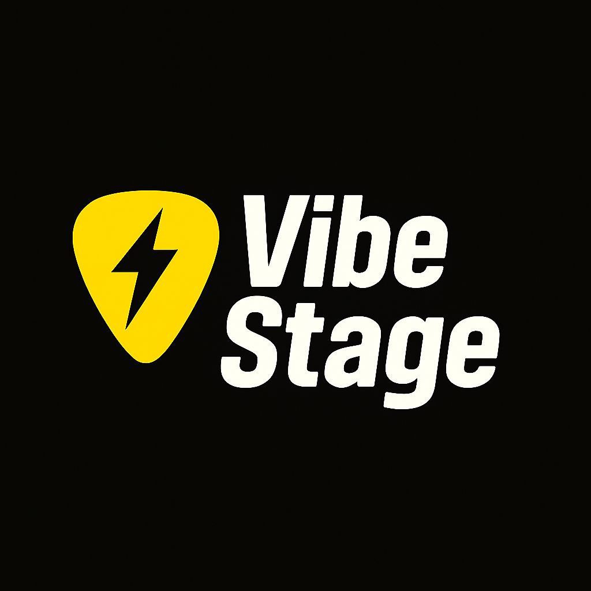) | **Songkick** | **GigSalad** | **Indie on the Move** |
|---------------|--------------|--------------|--------------|------------------------|
| **Perfil - Overview** | App móvil que conecta músicos emergentes con bares, promotores y espacios culturales. Ofrece contratación directa, contrato digital, pagos seguros (escrow) y herramientas de promoción. | Plataforma internacional que notifica sobre conciertos de artistas favoritos, con opción de compra de entradas. | Marketplace para contratar artistas y animadores para eventos privados (principalmente en EE. UU.). | Plataforma para que bandas independientes encuentren lugares donde tocar. Ofrece listas de contactos y recursos para planear giras. |
| **Ventaja competitiva** | Conexión directa y segura, contrato digital, logística integrada, sistema de pagos protegidos y promoción del evento. | Gran alcance global y facilidad para descubrir eventos, pero sin contratación directa ni gestión logística. | Facilidad para eventos privados, pero sin enfoque cultural ni contratación formal. | Buen recurso de base de datos, pero sin automatización, sin contratos ni pagos seguros. |
| **Mercado objetivo** | Músicos emergentes, bares, discotecas, centros culturales, promotores de eventos comunitarios. | Fans de la música que buscan descubrir conciertos y comprar entradas. | Organizadores de eventos privados que buscan entretenimiento (bodas, fiestas, etc.). | Bandas que organizan sus propias giras en EE. UU. |
| **Estrategias de marketing** | Redes sociales, colaboraciones con espacios culturales, showcases, recomendaciones por reputación y calificaciones. | Notificaciones personalizadas, integración con plataformas musicales. | Publicidad local y anuncios en redes para eventos privados. | Blog, comunidad en línea y estrategia de posicionamiento SEO. |
| **Productos & Servicios** | Plataforma integral: contratación, pago escrow, firma digital, agenda compartida, validación del rider técnico y promoción del evento. | Seguimiento de artistas, alertas de conciertos, venta de entradas. | Catálogo de artistas, perfiles profesionales, contacto directo. | Listas de contactos de venues, herramientas de planificación de giras. |
| **Precios & Costos** | Comisión por evento concretado. Acceso gratuito con opción premium para funciones adicionales. | Gratuito para usuarios. Ingresos por venta de entradas y acuerdos con promotores. | Comisión por contratación. Costos variables por tipo de artista. | Costos por acceso a base de datos y herramientas. Modelos freemium. |
| **Canales de distribución** | App móvil, WhatsApp Business, integración con plataformas de pago y redes sociales. | App móvil, notificaciones por correo y apps de música. | App y correo directo con artistas. | App responsiva. |
| **Fortalezas** | Contratación segura, experiencia automatizada, visibilidad para artistas emergentes, soporte integral al evento. | Gran base de usuarios y alianzas con plataformas musicales. | Amplia variedad de artistas para eventos sociales. | Apoyo a bandas independientes, útil para giras DIY. |
| **Debilidades** | Plataforma en crecimiento. Necesita generar masa crítica de usuarios y confianza del mercado. | No gestiona contrataciones ni logística de artistas. | Limitado a eventos privados. Poca presencia cultural o comunitaria. | Gestión manual. Sin soporte legal ni de pagos. Limitado a EE. UU. |
| **Oportunidades** | Expansión a más ciudades, alianzas con promotores, sistema de recompensas por reseñas, integración con plataformas de streaming. | Integración con redes sociales, nuevas funciones de comunidad. | Expansión internacional, integrar funciones logísticas. | Modernización con IA, agregar soporte contractual y pagos. |
| **Amenazas** | Competidores consolidados, reticencia a la digitalización en algunos sectores culturales, dependencia del éxito en eventos piloto. | Saturación del mercado de entradas, cambios en algoritmos de plataformas sociales. | Dependencia del mercado de eventos privados, reputación variable. | Competencia tecnológica, falta de diferenciación a largo plazo. |

####  2.1.2. Estrategias y tácticas frente a competidores.

Para sobresalir dentro del competitivo sector musical y de entretenimiento, VibeStage necesita poner en marcha estrategias y acciones diferenciadoras que fortalezcan su propuesta de valor y le permitan atraer tanto a artistas como a promotores y espacios de presentación. A continuación, se plantean algunas de las principales iniciativas y enfoques estratégicos diseñados para alcanzar este objetivo.

###### 1.**Desarrollar una Propuesta de Valor Única**
- **Estrategia:** Resaltar los beneficios clave de VibeStage como plataforma integral para la contratación y promoción de talento musical emergente.  
- **Táctica:** Enfatizar características como contratos digitales, pagos seguros (escrow), validación de rider técnico y agenda compartida para destacar la profesionalización del proceso.

###### 2. **Enfoque en la Experiencia del Usuario**
- **Estrategia:** Optimizar la experiencia tanto para músicos como para promotores mediante una interfaz clara, intuitiva y funcional.  
- **Táctica:** Mejorar continuamente la usabilidad de la plataforma, con flujos ágiles para programación de eventos, seguimiento de pagos y validación de logística técnica.

###### 3. **Ampliar la Base de Usuarios**
- **Estrategia:** Aumentar la comunidad de usuarios para consolidar la red y generar más oportunidades de conexión musical.  
- **Táctica:** Implementar campañas de referidos para músicos y promotores, junto con descuentos por primera contratación y beneficios por uso frecuente.

###### 4. **Marketing Digital Segmentado**
- **Estrategia:** Enfocar la comunicación digital hacia artistas independientes, bookers y dueños de locales culturales.  
- **Táctica:** Usar campañas dirigidas en redes sociales, con contenidos creativos (videos de artistas, experiencias de contratación) y pauta en nichos como festivales locales, ferias musicales y foros de emprendimiento artístico.

###### 5. **Alianzas Estratégicas**
- **Estrategia:** Colaborar con instituciones culturales, asociaciones de músicos y marcas relacionadas con la música en vivo para aumentar la visibilidad y credibilidad.  
- **Táctica:** Generar convenios con bares, discotecas, escuelas de música y empresas de sonido para ofrecer beneficios cruzados y asegurar presencia constante en la escena.

###   2.2. Entrevistas. 

####   2.2.1 Diseño de entrevistas. 

#### Segmento Objetivo Administradores de locales
#### Preguntas Objetivas:

**Características Demográficas:**
- ¿Cual es tu nombre?
- ¿Cuántos años tienes?
- ¿En qué ciudad y distrito está ubicado tu local?
- ¿Cuál es el aforo y tipo de espacio que administras (bar, discoteca, centro cultural, etc.)?

**Ocupación y Responsabilidades:**

- ¿Cuál es tu cargo dentro del establecimiento?
- ¿Qué funciones desempeñas específicamente en la organización y gestión de eventos?
- ¿Con qué frecuencia alquilas tu espacio para presentaciones musicales?
- ¿Cómo gestionas actualmente la programación de artistas y bandas?

**Uso de Tecnología:**

- ¿Qué dispositivos usas para gestionar tu local (PC, laptop, tablet, celular)?
- ¿Qué herramientas digitales o sistemas usas para reservas, programación o promoción?
- ¿Qué canales usas para comunicarte con músicos o productores?

#### Preguntas Subjetivas:

**Personalidad y Habilidades:**

- ¿Qué habilidades personales consideras claves para manejar eventos y relaciones con artistas?

**Objetivos y Frustraciones:**

- ¿Qué objetivos tienes al permitir que bandas se presenten en tu espacio?
- ¿Qué problemas o frustraciones enfrentas al gestionar reservas, pagos o promociones?
- ¿Qué procesos te gustaría automatizar?

**Preferencias y Canales Digitales:**
- ¿Qué funcionalidades valorarías en una plataforma que centralice reservas, pagos y promoción de eventos?
-¿Cómo prefieres recibir notificaciones sobre postulaciones o confirmaciones de artistas?

**Visión del Futuro:**

- ¿Cómo te gustaría que evolucionara el proceso de reserva y programación musical?
- ¿Qué mejoras digitales facilitarían tu trabajo como administrador de espacios?

#### Segmento Objetivo Artistas:
#### Preguntas Objetivas:

**Características Demográficas:**

- ¿Cuál es tu género?
- ¿Cuántos años tienes?
- ¿Cuál es tu rol musical (solista, vocalista, guitarrista, DJ, etc.)?
- ¿Tocas solo o formas parte de una banda?

**Ocupación y Responsabilidades:**

- ¿Desde hace cuánto tiempo estás activo/a como músico?
- ¿Cuántas presentaciones en vivo realizas en promedio al mes?
- ¿Qué tipo de escenarios frecuentas (bares, festivales, discotecas)?

**Uso de Tecnología:**

- ¿Qué dispositivos usas para organizar tus presentaciones (PC, celular, tablet)?
- ¿Qué redes o plataformas usas para gestionar tus bookings o mostrar tu trabajo (Instagram, SoundCloud, etc.)?
- ¿Usas algún sistema para generar contratos o manejar pagos?

#### Preguntas Subjetivas:

**Personalidad y Habilidades:**

- ¿Cómo defines tu estilo musical y tu enfoque en vivo?
- ¿Qué habilidades consideras esenciales para posicionarte como artista en la escena local?

**Objetivos y Frustraciones:**

- ¿Qué metas tienes en relación con tus presentaciones en vivo?
- ¿Qué dificultades encuentras al buscar espacios para tocar?
- ¿Qué parte del proceso (contacto, pagos, contratos, logística) te resulta más difícil o engorrosa?

**Preferencias y Canales Digitales:**

- ¿Qué funcionalidades valoras en una plataforma para músicos (contratos automáticos, pagos seguros, agenda, etc.)?
- ¿Por qué motivos dejarías de usar una plataforma si no cumpliera con tus expectativas?

**Visión del Futuro:**
- ¿Cómo te gustaría que evolucionaran los procesos de contratación y visibilidad para músicos independientes?
- ¿Qué esperas de una plataforma digital que prometa conectarte con promotores y espacios?

####   2.2.2 Registro de entrevistas. 

#### Segmento Administrador de locales

Entrevistado #1

| Campo                        | Información                                                                                                                           |
|-----------------------------|---------------------------------------------------------------------------------------------------------------------------------------|
| **Nombre del entrevistado** |                Eduardo Arenas                                                                                                           |
| **Edad**                    |                         23 años                                                                                                       |
| **Screenshot de la entrevista**|                                                                                 |
| **Link de la entrevista**   |                   [Ver entrevista en Youtube](https://youtu.be/Pw7NdsG1w44)                                                                                                      |
| **Tiempo de inicio y duración** |                 00:00 - 7:14                                                                  |                                                                                    |
| **Resumen**                 |       Eduardo Arenas, un joven trabajador de un bar en San Isidro, nos comparte los desafíos que enfrenta en la gestión de los eventos del local. Señala que trabajan de jueves a domingo, y que cada día se desarrolla bajo una temática distinta, lo que implica una constante organización y adaptación. Además, Eduardo nos brinda su opinión acerca de lo que le gustaría encontrar en una aplicación móvil que lo apoye en su labor diaria. En particular, espera que esta herramienta le permita desempeñar su trabajo de manera más eficiente y sencilla, facilitando la coordinación de las actividades y mejorando la experiencia tanto del personal como de los clientes.                                                          |

Entrevistado #2

| Campo                        | Información                                                                                                                           |
|-----------------------------|---------------------------------------------------------------------------------------------------------------------------------------|
| **Nombre del entrevistado** |               Anapaula Diaz                                                                                                         |
| **Edad**                    |                         25 años                                                                                                       |
| **Screenshot de la entrevista**|                                                                                 |
| **Link de la entrevista**   |                   [Ver entrevista en Youtube](https://youtu.be/lG9ygANtY2c)                                                                                                      |
| **Tiempo de inicio y duración** |                 00:00 - 9:40                                                                  |                                                                                    |
| **Resumen**                 |       Anapaula Díaz, una joven profesional del rubro de organización de eventos, nos comparte los procesos que sigue en su trabajo, las dificultades que enfrenta y sus expectativas respecto a una aplicación que pueda facilitar la gestión de eventos. Además, nos brinda algunas propuestas sobre las funcionalidades que le gustaría encontrar en esta app, con el objetivo de optimizar y potenciar su desempeño laboral.                                                          |

#### Segmento Artistas

Entrevistado #1

| Campo                        | Información                                                                                                                           |
|------------------------------|---------------------------------------------------------------------------------------------------------------------------------------|
| **Nombre del entrevistado**  |   Sebastian Rivera                                                                                                                    |
| **Edad**                     |    23 años                                                                                                                            |
| **Distrito**                 |         San Luis                                                                                                                    |
| **Screenshot de la entrevista** |                                  |
| **Link de la entrevista**    |                    [Ver entrevista en Youtube](https://youtu.be/fFyIb1JSkuo)                                                                                                  |
| **Tiempo de inicio y duración** |                  0:00 - 19:40                                                                                                  |
| **Resumen**                  |   Sebastián Rivera es un joven cantante y estudiante de la carrera de Música, que además desarrolla su talento de manera profesional tanto en coros como en presentaciones como solista. Nos comparte los diversos desafíos que enfrenta en su día a día dentro del mundo del canto profesional, así como su perspectiva sobre el mercado y las oportunidades que este ofrece. Asimismo, señala algunas deficiencias que ha identificado en distintas situaciones relacionadas con su ámbito artístico y nos brinda valiosas sugerencias sobre las mejoras que le gustaría encontrar en nuestra aplicación móvil, con el fin de que esta se adapte mejor a las necesidades de músicos y cantantes como él.                       |

Entrevistado #2

| Campo                           | Información                                                                                                                                                                                                                                                                                                                                                                                                                                                                                                                                                                                     |
| ------------------------------- | ----------------------------------------------------------------------------------------------------------------------------------------------------------------------------------------------------------------------------------------------------------------------------------------------------------------------------------------------------------------------------------------------------------------------------------------------------------------------------------------------------------------------------------------------------------------------------------------------- |
| **Nombre del entrevistado**     | Valeria Gómez                                                                                                                                                                                                                                                                                                                                                                                                                                                                                                                                                                                   |
| **Edad**                        | 26 años                                                                                                                                                                                                                                                                                                                                                                                                                                                                                                                                                                                         |
| **Distrito**                    | Jesús María                                                                                                                                                                                                                                                                                                                                                                                                                                                                                                                                                                                     |
| **Screenshot de la entrevista** |                                                                                                                                                                                                                                                                                                                                                                                                                                                                                |
| **Link de la entrevista**       | [Ver entrevista en Youtube](https://youtu.be/xyx-ALs1DmU)                                                                                                                                                                                                                                                                                                                                                                                                                                                                                                                                       |
| **Tiempo de inicio y duración** | 0:00 – 3:12                                                                                                                                                                                                                                                                                                                                                                                                                                                                                                                                                                                    |
| **Resumen**                     | Valeria Gómez es una joven cantautora solista que combina el canto con la guitarra. Con más de 5 años en la escena independiente, realiza de 3 a 4 presentaciones mensuales en bares y pequeños festivales. Destaca la importancia de transmitir emociones en vivo y la necesidad de autenticidad para posicionarse como artista local. Señala dificultades recurrentes: la informalidad en contratos, pagos poco claros y la falta de espacios para artistas emergentes. Resalta que valoraría en una plataforma funcionalidades como agenda integrada, contratos automáticos y pagos seguros. |

Entrevistado #3

| Campo                           | Información                                                                                                                                                                                                                                                                                                                                                                                                                                                                                                                                                                                                                                                                                          |
| ------------------------------- | -------------------------------------------------------------------------------------------------------------------------------------------------------------------------------------------------------------------------------------------------------------------------------------------------------------------------------------------------------------------------------------------------------------------------------------------------------------------------------------------------------------------------------------------------------------------------------------------------------------------------------------------------------------------------------------------------------- |
| **Nombre del entrevistado**     | Diego Fernández                                                                                                                                                                                                                                                                                                                                                                                                                                                                                                                                                                                                                                                                                          |
| **Edad**                        | 32 años                                                                                                                                                                                                                                                                                                                                                                                                                                                                                                                                                                                                                                                                                                  |
| **Distrito**                    | Miraflores                                                                                                                                                                                                                                                                                                                                                                                                                                                                                                                                                                                                                                                                                               |
| **Screenshot de la entrevista** |                                                                                                                                                                                                                                                                                                                                                                                                                                                                                                                                                                                           |
| **Link de la entrevista**       | [Ver entrevista en Youtube](https://youtu.be/R_xZXfhcGd8)                                                                                                                                                                                                                                                                                                                                                                                                                                                                                                                                                                                                                                                |
| **Tiempo de inicio y duración** | 0:00 – 21:15                                                                                                                                                                                                                                                                                                                                                                                                                                                                                                                                                                                                                                                                                             |
| **Resumen**                     | Diego Fernández es DJ y productor de música electrónica con más de 10 años de trayectoria en la escena limeña. Se presenta entre 6 y 8 veces al mes en discotecas y raves. Durante la entrevista menciona los problemas más frecuentes: pagos retrasados, negociaciones poco claras y condiciones que cambian a último minuto. Afirma que lo que más valora es mantener la energía en vivo y generar conexión con el público. Señala que para crecer en la escena es clave el networking con promotores y la visibilidad digital. Le interesaría contar con una plataforma que brinde pagos inmediatos, contratos automáticos y un sistema de reputación que aporte seguridad a músicos y organizadores. |

####   2.2.3 Análisis de entrevistas. 

#### Segmento Objetivo #1: Administradores de Locales

Tras las entrevistas realizadas a tres responsables de espacios culturales y de entretenimiento —(NOMBRE DE LOS ENTREVISTADOS)— se logró identificar una serie de patrones recurrentes, necesidades específicas y retos compartidos vinculados con la gestión de eventos musicales y los procesos de contratación de artistas en el ámbito independiente.

#### Uso de Tecnología y Herramientas de Gestión

Todos los entrevistados manifestaron usar tecnología básica para la gestión de sus espacios. Los dispositivos más frecuentes son el **celular y la laptop**, y las herramientas más empleadas son **WhatsApp, Instagram, llamadas telefónicas**, y **procesadores de texto como Word o Excel**.

Sin embargo, a pesar del uso cotidiano de herramientas digitales, la gestión aún es **altamente manual y descentralizada**. Se evidenció que:

- **100%** de los entrevistados utiliza WhatsApp como canal principal de coordinación con artistas.
- **100%** emplea hojas de cálculo (Excel o similar) para organizar agendas o contratos.
- **67%** aún redacta contratos de forma manual en Word.
- **67%** indicó que reciben propuestas artísticas por redes sociales, principalmente **Instagram**, lo que dificulta su seguimiento.
- **0%** usa actualmente una plataforma integral de contratación musical o programación de eventos.

---
#### Dispositivos Utilizados

A partir de las entrevistas realizadas, se evidenció que el 100% de los administradores hacen uso tanto de laptops como de teléfonos celulares para el desarrollo de sus actividades, lo que pone de manifiesto la importancia que otorgan a la portabilidad y a la flexibilidad en su gestión cotidiana. Asimismo, ninguno de los entrevistados mencionó utilizar tabletas ni depender de manera exclusiva de un único tipo de dispositivo, lo que refuerza la necesidad de contar con herramientas digitales adaptables a diferentes contextos y situaciones de trabajo.

| Canal                   | Uso (%) |
|------------------------|---------|
| Laptop                 | 100%    |
| Celular                | 100%    |

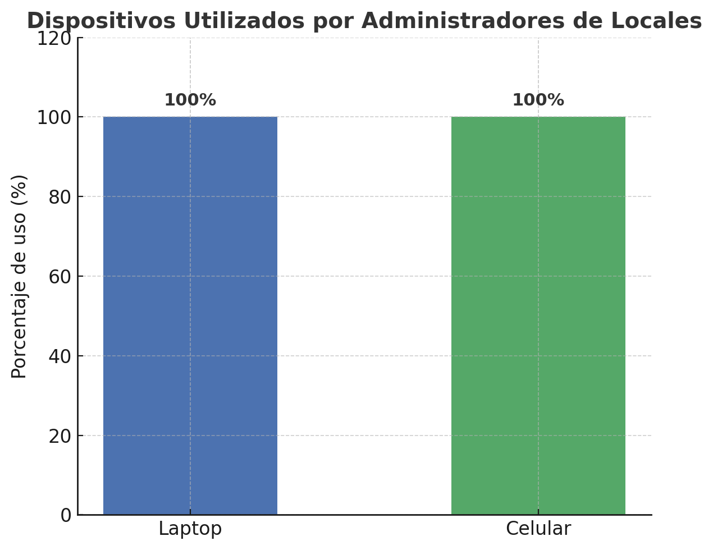

---

#### Canales de Comunicación más Usados

| Canal                   | Uso (%) |
|------------------------|---------|
| WhatsApp               | 100%    |
| Instagram (DMs)        | 67%     |
| Llamadas telefónicas   | 67%     |
| Correo electrónico     | 33%     |

.png>)

La informalidad en estos canales genera pérdida de información y dificulta el seguimiento de acuerdos o condiciones pactadas.

---

#### Expectativas hacia Soluciones Tecnológicas

Los tres entrevistados coincidieron en la necesidad de profesionalizar y automatizar sus procesos de gestión, resaltando que una solución digital debería incorporar funciones que aporten orden, transparencia y eficiencia en cada etapa del trabajo. Entre los elementos más valorados se encuentra la posibilidad de contar con una agenda visual compartida que facilite la programación de eventos y brinde claridad a todos los involucrados; la implementación de contratos digitales automatizados, con cláusulas estándar y firma integrada, que agilicen la formalización de acuerdos; y un sistema de pagos seguros y automáticos que evite retrasos y reduzca los malentendidos financieros. Asimismo, consideran fundamental disponer de un mecanismo de postulación filtrada por estilo musical, que elimine la necesidad de revisar mensajes irrelevantes, junto con un historial de bandas acompañado de evaluaciones post-evento, capaz de generar confianza y respaldar decisiones basadas en reputación. Finalmente, destacan como un aspecto logístico clave la opción de que el propio músico pueda realizar la carga directa de su rider técnico, optimizando la coordinación y reduciendo posibles contratiempos antes de cada presentación.

---

#### Principales Desafíos Identificados

| Desafío                                                    | Mención (%) |
|-------------------------------------------------------------|-------------|
| Informalidad en la contratación y comunicación              | 100%        |
| Falta de una agenda visual centralizada                     | 100%        |
| Redacción manual y repetitiva de contratos                  | 67%         |
| Dificultad para recibir y filtrar propuestas artísticas     | 67%         |
| Problemas logísticos derivados de cambios de último minuto  | 67%         |

---
.png>)
#### Conclusiones del Segmento

Los administradores entrevistados señalaron que enfrentan una alta carga operativa derivada de la informalidad en la gestión musical, lo que genera procesos fragmentados, poco eficientes y difíciles de sostener en el tiempo. Ante esta situación, se evidencia una necesidad latente de contar con una plataforma digital integral como VibeStage, capaz de centralizar en un mismo entorno la contratación de artistas, la gestión de pagos, la organización de agendas, la comunicación entre las partes y la promoción de eventos. Los responsables coincidieron en que una solución de este tipo tendría una rápida y amplia adopción, siempre que logre adaptarse a los flujos de trabajo ya existentes, reduzca la fricción operativa y contribuya a elevar el estándar profesional tanto para los espacios culturales como para los músicos independientes. Asimismo, se detecta un interés genuino en dejar atrás los métodos dispersos, manuales e informales que actualmente predominan, apostando por una gestión más moderna, eficiente, confiable y alineada con las demandas del sector.

---
### Segmento Objetivo #2: Artistas y Músicos Independientes

A partir de las entrevistas realizadas a tres músicos de distintos perfiles y géneros (NOMBRE DE LOS ARTISTAS Y MUSICOS) se lograron identificar patrones comunes que ponen en evidencia los problemas de informalidad, incertidumbre y desorganización que persisten en la escena musical independiente. Todos ellos coinciden en que, si bien participan en múltiples presentaciones cada mes, los procesos de contratación actuales resultan poco confiables, carecen de estandarización y generan un entorno de trabajo desordenado que dificulta tanto la planificación como la estabilidad profesional de los artistas.

---

#### Herramientas y dispositivos más utilizados

Los artistas entrevistados señalaron que hacen un uso intensivo de herramientas digitales básicas para coordinar y dar seguimiento a sus presentaciones. De manera unánime, mencionaron que el teléfono celular constituye su recurso principal de trabajo, al cual recurren constantemente para comunicarse y organizarse. Entre los canales más utilizados destacan WhatsApp, las llamadas directas y, en algunos casos, Instagram, plataformas que les permiten concretar acuerdos, resolver dudas de último minuto y mantenerse en contacto con los organizadores, aunque sin ofrecer una estructura formal que garantice orden y seguridad en los procesos.

| Herramienta / Dispositivo   | Uso (%) |
|-----------------------------|---------|
| Celular                     | 100%    |
| WhatsApp                    | 100%    |
| Llamadas telefónicas        | 100%    |
| Laptop                      | 67%     |
| Instagram                   | 33%     |

.png>)

Si bien los músicos recurren a medios digitales para coordinar sus actividades, la gestión actual se caracteriza por ser fragmentada y poco articulada. No hacen uso de plataformas centralizadas ni de herramientas especializadas que les permitan profesionalizar procesos clave como la contratación, la gestión de pagos o la promoción de sus presentaciones, lo que genera duplicidad de esfuerzos, falta de control y una evidente vulnerabilidad frente a imprevistos.

---

#### Canales de Coordinación

Los tres músicos entrevistados coincidieron en que la coordinación con los promotores se lleva a cabo casi de manera exclusiva a través de WhatsApp o llamadas telefónicas, mientras que uno de ellos mencionó que también recibe propuestas por mensajes directos en Instagram, aunque señaló que este canal suele dificultar el seguimiento y la organización de la información. Esta dinámica refleja una marcada dependencia de canales informales y dispersos, lo que no solo limita la eficiencia en la gestión, sino que también incrementa el riesgo de malentendidos y pérdidas de oportunidades. Al mismo tiempo, esta situación abre una oportunidad significativa para el desarrollo de una herramienta que permita centralizar la comunicación, estructurar los procesos y elevar el nivel de profesionalización en la escena musical independiente.

---

#### Desafíos Actuales Identificados

| Desafío                                                        | Mención (%) |
|----------------------------------------------------------------|-------------|
| Informalidad en pagos                                           | 100%        |
| Falta de contratos escritos o claros                           | 100%        |
| Cambios de último minuto en condiciones o fechas               | 67%         |
| Incertidumbre hasta el día del evento                          | 100%        |
| Mala comunicación con algunos locales                          | 67%         |

.png>)
---

#### Expectativas hacia soluciones tecnológicas

Todos los artistas expresaron un fuerte interés por contar con una solución que:

- Les permita centralizar fechas y postulaciones.
- Ofrezca contratos digitales automáticos.
- Garantice pagos seguros, idealmente bajo un sistema tipo escrow.
- Permita promocionar sus shows de forma profesional.
- Reduzca la necesidad de múltiples conversaciones y negociaciones por separado.

---

#### Conclusión del análisis

Los artistas entrevistados muestran un perfil activo y profesional, con una fuerte vocación hacia el crecimiento de su carrera, aunque actualmente se desenvuelven en un sistema marcado por la informalidad y la falta de estructura. En este contexto, se evidencia de manera clara la necesidad de una plataforma como TocaAquí, capaz de automatizar y profesionalizar el proceso completo de contratación musical, abarcando desde la postulación inicial hasta la confirmación del evento y el pago final de manera segura y transparente. Entre los aspectos más críticos señalados en las entrevistas destaca la ausencia de contratos formales y la inseguridad en los pagos, factores que generan incertidumbre y, en muchos casos, desconfianza en la relación con los organizadores. No obstante, los músicos también expresaron una alta disposición a incorporar nuevas tecnologías, siempre que estas logren reducir la carga operativa, eliminen la improvisación y les permitan concentrarse en lo que verdaderamente valoran: la creación y la interpretación de su música.

###   2.3. Needfinding. 

####   2.3.1 User Personas. 

Con el fin de comprender en mayor profundidad a nuestros usuarios clave, se diseñaron dos perfiles de User Persona que representan de manera ficticia, pero fundamentada, a los principales segmentos de nuestra plataforma: los artistas independientes y los administradores de locales. Estos arquetipos permiten identificar con claridad sus motivaciones, frustraciones, hábitos de trabajo y expectativas frente al uso de herramientas digitales, lo que a su vez facilita el diseño de una solución más cercana a sus necesidades reales. Al apoyarnos en estos perfiles, buscamos no solo optimizar la funcionalidad de la aplicación, sino también mejorar de forma significativa la experiencia integral de los usuarios al interactuar con nuestra App.

#### Segmento Objetivo Administradores de locales

#### Segmento Objetivo Artista independiente

####   2.3.2 User Task Matrix.

#### - Artista Independiente:

| **Tareas** | **Frecuencia** | **Importancia** |
|------------|----------------|-----------------|
| Buscar y postularse a nuevos escenarios y eventos | Always | High |
| Firmar contratos formales para presentaciones | Sometimes | High |
| Coordinar fechas, pagos y ensayos desde una sola plataforma | Always | High |
| Gestionar su agenda y compromisos artísticos | Always | High |
| Promocionar sus eventos en redes sociales | Sometimes | Medium |
| Crear y actualizar su perfil artístico profesional | Always | High |
| Evaluar presentaciones y recibir feedback para mejorar | Sometimes | Medium |
| Asegurar pagos mediante mecanismos confiables | Sometimes | High |
| Crear contenido para mantener su visibilidad en redes | Sometimes | Medium |

---

#### - Administrador de Local:

| **Tareas** | **Frecuencia** | **Importancia** |
|------------|----------------|-----------------|
| Publicar disponibilidad de fechas y espacios para eventos | Always | High |
| Recibir y filtrar propuestas de artistas | Always | High |
| Coordinar logística y ensayos de manera organizada | Sometimes | High |
| Formalizar contratos y pagos a través de una plataforma | Sometimes | High |
| Gestionar inventario técnico (sonido, luces, etc.) | Sometimes | Medium |
| Evaluar artistas después de los eventos | Sometimes | Medium |
| Promocionar eventos en redes sociales | Sometimes | Medium |
| Controlar asistencia y recolectar feedback del público | Sometimes | Medium |
| Automatizar tareas operativas para ahorrar tiempo | Always | High |

####   2.3.3 User Journey Mapping.

En esta sección, analizaremos el recorrido del usuario al utilizar nuestra App VibeStage

**Segmento 1: Músicos Independientes**  

**Segmento 2: Promotores**  

####   2.3.4 Empathy Mapping.

En esta sección se expone el Empathy Mapping, una herramienta que permite construir un perfil más completo de los user personas y, con ello, desarrollar una comprensión profunda de su manera de pensar, actuar y relacionarse con su entorno. A través de este recurso, se busca representar no solo los comportamientos observables, sino también las percepciones y emociones que influyen en sus decisiones. Para cada user persona se analizan cinco dimensiones fundamentales: lo que el usuario ve, lo que escucha, lo que dice, lo que hace y lo que siente, ofreciendo así una visión integral que facilita el diseño de soluciones más empáticas, relevantes y alineadas con sus necesidades reales.

**Segmento 1: Músicos Independientes**  

**Segmento 2: Promotores**  

####   2.3.5 Ubiquitous Language.
A continuación se presenta un glosario con los términos centrales del dominio de la plataforma ** VibeStage **. Este vocabulario compartido garantiza que todas las partes involucradas (usuarios, desarrolladores, stakeholders) utilicen un lenguaje consistente y sin ambigüedades.

| **Término (Inglés)**       | **Término (Español)**          | **Definición clara y compartida** |
|----------------------------|-------------------------------|-----------------------------------|
| **Artist**                 | Artista                        | Músico independiente o banda registrada en la plataforma que busca espacios para tocar en vivo. |
| **Venue**                  | Local / Espacio                | Bar, discoteca, café cultural u otro lugar físico que organiza eventos musicales y contrata artistas. |
| **Booking**                | Contratación / Reserva         | Proceso de solicitud, selección y confirmación de un artista por parte de un local para una fecha específica. |
| **Application**            | Postulación                    | Acción mediante la cual un artista se propone para tocar en una fecha publicada por un local. |
| **Digital Contract**       | Contrato digital               | Acuerdo legal generado automáticamente por la plataforma y firmado por ambas partes (artista y local). |
| **Escrow Payment**         | Pago con garantía (escrow)     | Sistema de pago seguro en el que el dinero se libera solo después de realizarse el evento según lo acordado. |
| **Technical Rider**        | Rider técnico                  | Documento que contiene los requerimientos técnicos del artista para su presentación (sonido, luces, etc.). |
| **Soundcheck**             | Prueba de sonido               | Ensayo técnico previo al evento para ajustar equipos de audio e instrumentos en el escenario. |
| **Shared Agenda**          | Agenda compartida              | Herramienta visual donde locales y artistas pueden ver fechas reservadas, confirmadas y disponibles. |
| **Event Promotion**        | Promoción del evento           | Acciones realizadas para visibilizar un show programado (publicación en redes, cartelera digital, etc.). |
| **Post-event Evaluation**  | Evaluación post-evento         | Sistema de calificación y feedback mutuo entre artistas y locales una vez realizado el evento. |
| **Filtered Application**   | Postulación filtrada           | Mecanismo mediante el cual los locales reciben propuestas artísticas según criterios definidos (género, reputación, etc.). |
| **Logistics Manager**      | Gestor de logística            | Módulo de la plataforma que centraliza todos los detalles técnicos, fechas, contratos y coordinación del evento. |

###   2.4. Requirements Specification.
####   2.4.1 User Stories.

| Epic ID  | Título                                    | Descripción |
|----------|-------------------------------------------|-------------|
| EPIC-01  | Construcción de la landing page           | Página inicial pública con información clara sobre Vibestage, sus beneficios, funcionalidades principales y llamado a la acción para captar usuarios. |
| EPIC-02  | Implementación responsive y visual        | Adaptación del diseño de la landing a todos los dispositivos y aplicación del Web Style Guide con identidad gráfica coherente. |
| EPIC-03  | Versiones multilenguaje y accesibilidad   | Inclusión de una versión en inglés y adecuación de la landing a criterios básicos de accesibilidad web. |
| EPIC-04  | Captura de interés y contacto             | Inclusión de botones de registro, sección de contacto funcional y otras herramientas para convertir visitantes en usuarios. |
| EPIC-05  | Registro y login como artista             | Creación de formulario de registro e inicio de sesión para artistas, con validación, recuperación de contraseña y redirección al dashboard. |
| EPIC-06  | Dashboard y navegación del artista        | Construcción del home privado del artista, con acceso rápido a perfil, eventos, postulaciones, agenda, pagos y evaluaciones. |
| EPIC-07  | Exploración de eventos y postulación      | Implementación del sistema de búsqueda de espacios/eventos y postulación automática con filtros por afinidad musical. |
| EPIC-08  | Perfil del artista                        | Creación, edición y visualización de perfil artístico incluyendo biografía, estilo musical, links multimedia y evaluaciones previas. |
| EPIC-09  | Contratos digitales y rider técnico       | Generación automática de contratos, firma digital integrada y flujo para subir, validar y coordinar logística técnica del show. |
| EPIC-10  | Sistema de pagos para artistas            | Gestión de pagos pendientes, pagos liberados vía escrow y visualización de historial económico. |
| EPIC-11  | Evaluación y reputación del artista       | Implementación de evaluaciones post evento hacia locales, visualización de reputación acumulada en el perfil del artista. |
| EPIC-12  | Registro y login como promotor/local      | Registro y acceso de administradores de espacios, con login, recuperación de contraseña y asignación automática de rol. |
| EPIC-13  | Dashboard del promotor/local              | Creación del home privado del local con vista rápida de shows agendados, publicaciones activas, agenda, contratos, pagos y evaluaciones. |
| EPIC-14  | Publicación y gestión de eventos          | Sistema de publicación de fechas, condiciones, restricciones técnicas y tipos de música aceptada. |
| EPIC-15  | Gestión de postulaciones e invitaciones   | Revisión de postulaciones recibidas, filtrado de bandas y opción para invitar a postular. |
| EPIC-16  | Contratos, validaciones y coordinación logística | Validación del rider técnico, firma digital del contrato y coordinación de pruebas de sonido. |
| EPIC-17  | Pagos y confirmación de shows             | Validación del show completado y activación del pago a artista a través del sistema escrow. |
| EPIC-18  | Evaluación de bandas y reputación         | Evaluación de las bandas post evento, con sistema de puntuación y visibilidad futura en el perfil del artista. |
| EPIC-19  | Implementación del formulario de contacto | Crear una sección "Contáctanos" en la landing page, que permita a los visitantes enviar consultas o dudas mediante un formulario de contacto con botón de envío claro y funcional. |
| EPIC-20  | Implementación de la sección de testimonios | Crear una sección de testimonios en la landing page que permita visualizar opiniones de artistas y promotores con nombre, rol y reseña breve de su experiencia. |
| EPIC-21  | Gestión de agenda y eventos confirmados   | Implementación de una vista de agenda con formato semanal que permita al artista organizar eventos confirmados, visualizar estados de pago/contrato y acceder a los detalles. |
| EPIC-22  | Vista rápida y resumen de actividades     | Crear módulos visuales dentro del dashboard que resuman actividades relevantes del artista, como próximos eventos y pagos pendientes. |
| EPIC-23  | Seguimiento de reservas activas           | Permitir al artista visualizar reservas confirmadas y acceder al detalle de cada una, incluyendo condiciones técnicas y contacto con el promotor. |

<table>
  <tr>
    <th>Story ID</th><th>User</th><th>Priority</th><th>Epic</th>
  </tr>
  <tr>
    <td>US01</td><td>Visitante (Artista o Local)</td><td>Alta</td><td>EPIC-01</td>
  </tr>
  <tr><th colspan="4">Title</th></tr>
  <tr><td colspan="4">Visualización clara del propósito de la plataforma</td></tr>
  <tr><th colspan="4">Description</th></tr>
  <tr><td colspan="4">Como visitante de ambos segmentos, quiero entender rápidamente qué es Vibestage y cómo funciona, para saber si es relevante para mí como artista o local.</td></tr>
  <tr><th colspan="4">Acceptance Criteria</th></tr>
  <tr><td colspan="4"><b>Escenario 1</b> Given que el visitante accede a la página principal When visualiza el encabezado principal y la descripción Then comprende claramente qué es la plataforma y qué roles pueden usarla.</td></tr>
</table>

<table>
  <tr><th>Story ID</th><th>User</th><th>Priority</th><th>Epic</th></tr>
  <tr><td>US02</td><td>Visitante (Artista o Local)</td><td>Alta</td><td>EPIC-01</td></tr>
  <tr><th colspan="4">Title</th></tr>
  <tr><td colspan="4">Navegación fluida entre secciones informativas</td></tr>
  <tr><th colspan="4">Description</th></tr>
  <tr><td colspan="4">Como visitante de ambos segmentos, quiero navegar entre secciones como "Sobre Nosotros" o "Planes" desde el menú principal, para explorar fácilmente la solución.</td></tr>
  <tr><th colspan="4">Acceptance Criteria</th></tr>
  <tr><td colspan="4"><b>Escenario 1</b> Given que el visitante está en cualquier parte de la landing When selecciona un ítem del menú Then la página se desplaza automáticamente sin recargar.  <b>Escenario 2</b> Given que el visitante hace clic en un ítem When selecciona una sección Then la página realiza un scroll automático y suave hacia esa sección.</td></tr>
</table>

<table>
  <tr><th>Story ID</th><th>User</th><th>Priority</th><th>Epic</th></tr>
  <tr><td>US03</td><td>Visitante (Artista o Local)</td><td>Alta</td><td>EPIC-02</td></tr>
  <tr><th colspan="4">Title</th></tr>
  <tr><td colspan="4">Visualización adecuada en móviles y pantallas pequeñas</td></tr>
  <tr><th colspan="4">Description</th></tr>
  <tr><td colspan="4">Como visitante de ambos segmentos, quiero que el sitio se adapte bien a mi celular o tablet, para tener una experiencia óptima sin importar el dispositivo.</td></tr>
  <tr><th colspan="4">Acceptance Criteria</th></tr>
  <tr><td colspan="4"><b>Escenario 1</b> Given que el visitante accede desde un dispositivo móvil When navega por la landing Then los elementos se reorganizan para visualización óptima.  <b>Escenario 2</b> Given que el visitante interactúa con elementos táctiles When selecciona botones o menús Then responden correctamente y permanecen accesibles sin errores.</td></tr>
</table>

<table>
  <tr><th>Story ID</th><th>User</th><th>Priority</th><th>Epic</th></tr>
  <tr><td>US04</td><td>Visitante (Artista o Local)</td><td>Media</td><td>EPIC-03</td></tr>
  <tr><th colspan="4">Title</th></tr>
  <tr><td colspan="4">Acceso a la versión en inglés del sitio</td></tr>
  <tr><th colspan="4">Description</th></tr>
  <tr><td colspan="4">Como visitante, quiero ver la página en inglés para comprender toda la información sin barreras de idioma.</td></tr>
  <tr><th colspan="4">Acceptance Criteria</th></tr>
  <tr><td colspan="4"><b>Escenario 1</b> Given que el visitante selecciona el idioma inglés When el contenido se actualiza Then todo el texto se muestra correctamente en inglés.</td></tr>
</table>

<table>
  <tr><th>Story ID</th><th>User</th><th>Priority</th><th>Epic</th></tr>
  <tr><td>US05</td><td>Visitante (Artista o Local)</td><td>Alta</td><td>EPIC-04</td></tr>
  <tr><th colspan="4">Title</th></tr>
  <tr><td colspan="4">Envío de un mensaje a través del formulario de contacto</td></tr>
  <tr><th colspan="4">Description</th></tr>
  <tr><td colspan="4">Como visitante con dudas, quiero enviar un mensaje desde el formulario de contacto, para comunicarme con el equipo de Vibestage.</td></tr>
  <tr><th colspan="4">Acceptance Criteria</th></tr>
  <tr><td colspan="4"><b>Escenario 1</b> Given que el visitante completa los campos requeridos When envía el formulario Then recibe confirmación de envío.  <b>Escenario 2</b> Given que el visitante omite un campo obligatorio When intenta enviar Then el sistema muestra un mensaje de error indicando el campo faltante.</td></tr>
</table>

<table>
  <tr><th>Story ID</th><th>User</th><th>Priority</th><th>Epic</th></tr>
  <tr><td>US06</td><td>Visitante (Artista o Local)</td><td>Alta</td><td>EPIC-04</td></tr>
  <tr><th colspan="4">Title</th></tr>
  <tr><td colspan="4">Selección del tipo de usuario desde la landing</td></tr>
  <tr><th colspan="4">Description</th></tr>
  <tr><td colspan="4">Como visitante interesado, quiero seleccionar si soy artista o promotor desde la landing, para iniciar mi registro correctamente.</td></tr>
  <tr><th colspan="4">Acceptance Criteria</th></tr>
  <tr><td colspan="4"><b>Escenario 1</b> Given que el visitante está en la landing When selecciona “Soy artista” o “Soy local” Then es redirigido al flujo de registro correspondiente.  <b>Escenario 2</b> Given que el visitante selecciona un rol When continúa navegando Then el contenido se adapta a ese rol.</td></tr>
</table>

<table>
  <tr><th>Story ID</th><th>User</th><th>Priority</th><th>Epic</th></tr>
  <tr><td>US07</td><td>Visitante Artista</td><td>Alta</td><td>EPIC-05</td></tr>
  <tr><th colspan="4">Title</th></tr>
  <tr><td colspan="4">Registro como artista en la plataforma</td></tr>
  <tr><th colspan="4">Description</th></tr>
  <tr><td colspan="4">Como artista nuevo, quiero registrarme en Vibestage seleccionando mi rol, para acceder a mi panel personalizado.</td></tr>
  <tr><th colspan="4">Acceptance Criteria</th></tr>
  <tr><td colspan="4"><b>Escenario 1</b> Given que el artista accede al formulario de registro When completa sus datos y selecciona “Artista” Then se crea su cuenta y accede al dashboard de artista.</td></tr>
</table>

<table>
  <tr><th>Story ID</th><th>User</th><th>Priority</th><th>Epic</th></tr>
  <tr><td>US08</td><td>Artista registrado</td><td>Alta</td><td>EPIC-06</td></tr>
  <tr><th colspan="4">Title</th></tr>
  <tr><td colspan="4">Acceso al dashboard personalizado de artista</td></tr>
  <tr><th colspan="4">Description</th></tr>
  <tr><td colspan="4">Como artista registrado, quiero ingresar a un panel con herramientas específicas, para gestionar mis eventos y perfil fácilmente.</td></tr>
  <tr><th colspan="4">Acceptance Criteria</th></tr>
  <tr><td colspan="4"><b>Escenario 1</b> Given que el artista inicia sesión When accede a la plataforma Then visualiza un dashboard con perfil, postulaciones, agenda y pagos.</td></tr>
</table>

<table>
  <tr><th>Story ID</th><th>User</th><th>Priority</th><th>Epic</th></tr>
  <tr><td>US09</td><td>Artista registrado</td><td>Alta</td><td>EPIC-07</td></tr>
  <tr><th colspan="4">Title</th></tr>
  <tr><td colspan="4">Búsqueda de eventos compatibles con mi perfil</td></tr>
  <tr><th colspan="4">Description</th></tr>
  <tr><td colspan="4">Como artista, quiero ver eventos recomendados según mi género musical y ubicación, para postular solo a los que se alinean con mi estilo.</td></tr>
  <tr><th colspan="4">Acceptance Criteria</th></tr>
  <tr><td colspan="4"><b>Escenario 1</b> Given que el artista accede a “Eventos recomendados” When consulta la sección Then visualiza eventos filtrados por afinidad musical, localización y disponibilidad.</td></tr>
</table>

<table>
  <tr><th>Story ID</th><th>User</th><th>Priority</th><th>Epic</th></tr>
  <tr><td>US10</td><td>Artista registrado</td><td>Alta</td><td>EPIC-07</td></tr>
  <tr><th colspan="4">Title</th></tr>
  <tr><td colspan="4">Postulación rápida a un evento desde la plataforma</td></tr>
  <tr><th colspan="4">Description</th></tr>
  <tr><td colspan="4">Como artista, quiero postularme a un evento en pocos pasos, para agilizar mi proceso.</td></tr>
  <tr><th colspan="4">Acceptance Criteria</th></tr>
  <tr><td colspan="4"><b>Escenario 1</b> Given que el artista encuentra un evento When selecciona “Postular” Then su solicitud se envía al local con su perfil.  <b>Escenario 2</b> Given que el artista se postula When la solicitud es enviada Then recibe confirmación visual de éxito.</td></tr>
</table>

<table>
  <tr><th>Story ID</th><th>User</th><th>Priority</th><th>Epic</th></tr>
  <tr><td>US11</td><td>Artista registrado</td><td>Alta</td><td>EPIC-08</td></tr>
  <tr><th colspan="4">Title</th></tr>
  <tr><td colspan="4">Gestión y edición de mi perfil artístico</td></tr>
  <tr><th colspan="4">Description</th></tr>
  <tr><td colspan="4">Como artista, quiero crear y editar mi perfil con biografía, estilo musical y contenido multimedia, para mostrarme profesionalmente a los locales.</td></tr>
  <tr><th colspan="4">Acceptance Criteria</th></tr>
  <tr><td colspan="4"><b>Escenario 1</b> Given que el artista accede a “Mi perfil” When edita biografía, redes o sube archivos multimedia Then los cambios se guardan y se muestran en su perfil público.</td></tr>
</table>

<table>
  <tr><th>Story ID</th><th>User</th><th>Priority</th><th>Epic</th></tr>
  <tr><td>US12</td><td>Artista confirmado</td><td>Alta</td><td>EPIC-09</td></tr>
  <tr><th colspan="4">Title</th></tr>
  <tr><td colspan="4">Subida y validación del rider técnico</td></tr>
  <tr><th colspan="4">Description</th></tr>
  <tr><td colspan="4">Como artista confirmado para un show, quiero subir mi rider técnico, para que el promotor lo revise y apruebe antes del evento.</td></tr>
  <tr><th colspan="4">Acceptance Criteria</th></tr>
  <tr><td colspan="4"><b>Escenario 1</b> Given que el artista tiene un show confirmado When accede a la sección de logística Then puede subir un archivo con sus requerimientos técnicos visible para el promotor.</td></tr>
</table>

<table>
  <tr><th>Story ID</th><th>User</th><th>Priority</th><th>Epic</th></tr>
  <tr><td>US13</td><td>Artista registrado</td><td>Alta</td><td>EPIC-10</td></tr>
  <tr><th colspan="4">Title</th></tr>
  <tr><td colspan="4">Visualización de pagos recibidos y pendientes</td></tr>
  <tr><th colspan="4">Description</th></tr>
  <tr><td colspan="4">Como artista, quiero revisar mis pagos pendientes, liberados y el historial de ingresos, para tener control sobre mis ganancias.</td></tr>
  <tr><th colspan="4">Acceptance Criteria</th></tr>
  <tr><td colspan="4"><b>Escenario 1</b> Given que el artista accede a “Pagos” When consulta la sección Then observa pagos realizados, pendientes y montos por evento.  <b>Escenario 2</b> Given que el artista revisa sus pagos When selecciona exportar Then descarga un reporte de historial.</td></tr>
</table>

<table>
  <tr><th>Story ID</th><th>User</th><th>Priority</th><th>Epic</th></tr>
  <tr><td>US14</td><td>Promotor/Local nuevo</td><td>Alta</td><td>EPIC-12</td></tr>
  <tr><th colspan="4">Title</th></tr>
  <tr><td colspan="4">Registro como administrador de local</td></tr>
  <tr><th colspan="4">Description</th></tr>
  <tr><td colspan="4">Como promotor/local, quiero registrarme en la plataforma con mi rol, para acceder a herramientas de publicación y gestión de eventos.</td></tr>
  <tr><th colspan="4">Acceptance Criteria</th></tr>
  <tr><td colspan="4"><b>Escenario 1</b> Given que el promotor accede al formulario de registro When completa sus datos y selecciona “Promotor / Local” Then se crea su cuenta con acceso al dashboard de local.</td></tr>
</table>

<table>
  <tr><th>Story ID</th><th>User</th><th>Priority</th><th>Epic</th></tr>
  <tr><td>US15</td><td>Promotor/Local</td><td>Alta</td><td>EPIC-13</td></tr>
  <tr><th colspan="4">Title</th></tr>
  <tr><td colspan="4">Acceso al dashboard del local</td></tr>
  <tr><th colspan="4">Description</th></tr>
  <tr><td colspan="4">Como promotor/local, quiero visualizar un panel con shows, publicaciones y herramientas clave, para organizar mis eventos.</td></tr>
  <tr><th colspan="4">Acceptance Criteria</th></tr>
  <tr><td colspan="4"><b>Escenario 1</b> Given que el promotor inicia sesión When accede a la plataforma Then visualiza un dashboard con eventos agendados, publicar show, agenda y evaluaciones.</td></tr>
</table>

<table>
  <tr><th>Story ID</th><th>User</th><th>Priority</th><th>Epic</th></tr>
  <tr><td>US16</td><td>Promotor/Local</td><td>Alta</td><td>EPIC-14</td></tr>
  <tr><th colspan="4">Title</th></tr>
  <tr><td colspan="4">Publicación de eventos musicales</td></tr>
  <tr><th colspan="4">Description</th></tr>
  <tr><td colspan="4">Como promotor/local, quiero publicar fechas disponibles con condiciones específicas, para recibir postulaciones de bandas que cumplan mis criterios.</td></tr>
  <tr><th colspan="4">Acceptance Criteria</th></tr>
  <tr><td colspan="4"><b>Escenario 1</b> Given que el promotor accede a “Publicar evento” When completa los datos requeridos (fecha, tipo de música, ubicación, requisitos técnicos) Then el evento queda publicado y visible.</td></tr>
</table>

<table>
  <tr><th>Story ID</th><th>User</th><th>Priority</th><th>Epic</th></tr>
  <tr><td>US17</td><td>Promotor/Local</td><td>Alta</td><td>EPIC-15</td></tr>
  <tr><th colspan="4">Title</th></tr>
  <tr><td colspan="4">Revisión de postulaciones y selección de artista</td></tr>
  <tr><th colspan="4">Description</th></tr>
  <tr><td colspan="4">Como promotor/local, quiero ver las postulaciones recibidas y elegir la mejor opción, para asegurar un show alineado a mi público.</td></tr>
  <tr><th colspan="4">Acceptance Criteria</th></tr>
  <tr><td colspan="4"><b>Escenario 1</b> Given que hay postulaciones en un evento When el promotor accede al panel de postulaciones Then puede revisar perfiles y aceptar una banda.</td></tr>
</table>

<table>
  <tr><th>Story ID</th><th>User</th><th>Priority</th><th>Epic</th></tr>
  <tr><td>US18</td><td>Promotor/Local</td><td>Media</td><td>EPIC-16</td></tr>
  <tr><th colspan="4">Title</th></tr>
  <tr><td colspan="4">Validación del rider técnico enviado por artista</td></tr>
  <tr><th colspan="4">Description</th></tr>
  <tr><td colspan="4">Como promotor/local, quiero revisar el rider técnico que sube el artista y enviar comentarios, para asegurar que la logística esté clara antes del show.</td></tr>
  <tr><th colspan="4">Acceptance Criteria</th></tr>
  <tr><td colspan="4"><b>Escenario 1</b> Given que un artista sube su rider When el promotor accede al archivo Then puede aprobarlo o devolverlo con observaciones.  <b>Escenario 2</b> Given que el promotor revisa el rider When tiene observaciones Then puede enviarlas directamente desde la interfaz.</td></tr>
</table>

<table>
  <tr><th>Story ID</th><th>User</th><th>Priority</th><th>Epic</th></tr>
  <tr><td>US19</td><td>Promotor/Local</td><td>Alta</td><td>EPIC-17</td></tr>
  <tr><th colspan="4">Title</th></tr>
  <tr><td colspan="4">Validación del show y ejecución del pago</td></tr>
  <tr><th colspan="4">Description</th></tr>
  <tr><td colspan="4">Como promotor/local, quiero confirmar que un evento se realizó correctamente, para que se libere el pago al artista desde el sistema escrow.</td></tr>
  <tr><th colspan="4">Acceptance Criteria</th></tr>
  <tr><td colspan="4"><b>Escenario 1</b> Given que un evento finalizó When el promotor lo marca como “realizado” Then el sistema libera automáticamente el pago al artista.</td></tr>
</table>

<table>
  <tr><th>Story ID</th><th>User</th><th>Priority</th><th>Epic</th></tr>
  <tr><td>US20</td><td>Promotor/Local</td><td>Media</td><td>EPIC-18</td></tr>
  <tr><th colspan="4">Title</th></tr>
  <tr><td colspan="4">Evaluación del artista luego del evento</td></tr>
  <tr><th colspan="4">Description</th></tr>
  <tr><td colspan="4">Como promotor/local, quiero calificar a las bandas que se presentaron, para contribuir a su reputación en la comunidad.</td></tr>
  <tr><th colspan="4">Acceptance Criteria</th></tr>
  <tr><td colspan="4"><b>Escenario 1</b> Given que un evento terminó con éxito When el promotor accede al perfil del artista Then puede dejar una calificación con estrellas y comentarios.</td></tr>
</table>

<table>
  <tr><th>Story ID</th><th>User</th><th>Priority</th><th>Epic</th></tr>
  <tr><td>US21</td><td>Visitante (Artista o Local)</td><td>Alta</td><td>EPIC-01</td></tr>
  <tr><th colspan="4">Title</th></tr>
  <tr><td colspan="4">Visualización de planes para artistas y promotores/locales</td></tr>
  <tr><th colspan="4">Description</th></tr>
  <tr><td colspan="4">Como visitante, quiero ver claramente los diferentes planes disponibles para artistas y locales, para decidir cuál se adapta mejor a mis necesidades.</td></tr>
  <tr><th colspan="4">Acceptance Criteria</th></tr>
  <tr><td colspan="4"><b>Escenario 1</b> Given que el visitante accede a la sección “Planes” When navega por la sección Then visualiza claramente las diferencias entre planes Básico, Medio y Premium según el tipo de usuario.</td></tr>
</table>

<table>
  <tr><th>Story ID</th><th>User</th><th>Priority</th><th>Epic</th></tr>
  <tr><td>US22</td><td>Visitante (Artista o Local)</td><td>Alta</td><td>EPIC-04</td></tr>
  <tr><th colspan="4">Title</th></tr>
  <tr><td colspan="4">Acceso rápido a registro desde botones CTA</td></tr>
  <tr><th colspan="4">Description</th></tr>
  <tr><td colspan="4">Como visitante interesado, quiero encontrar botones claros para registrarme como artista o como local, para comenzar a usar la plataforma con un clic.</td></tr>
  <tr><th colspan="4">Acceptance Criteria</th></tr>
  <tr><td colspan="4"><b>Escenario 1</b> Given que el visitante está en la landing When visualiza los botones “Soy artista” o “Soy local” Then puede hacer clic y ser redirigido al formulario de registro correspondiente.</td></tr>
</table>

<table>
  <tr><th>Story ID</th><th>User</th><th>Priority</th><th>Epic</th></tr>
  <tr><td>US23</td><td>Visitante (Artista o Local)</td><td>Media</td><td>EPIC-02</td></tr>
  <tr><th colspan="4">Title</th></tr>
  <tr><td colspan="4">Navegación accesible desde menú fijo</td></tr>
  <tr><th colspan="4">Description</th></tr>
  <tr><td colspan="4">Como visitante, quiero contar con un menú que permanezca visible mientras navego, para poder acceder fácilmente a cualquier sección de la página.</td></tr>
  <tr><th colspan="4">Acceptance Criteria</th></tr>
  <tr><td colspan="4"><b>Escenario 1</b> Given que el visitante hace scroll en la landing When se desplaza hacia abajo Then el menú permanece visible en la parte superior de la pantalla.</td></tr>
</table>

<table>
  <tr><th>Story ID</th><th>User</th><th>Priority</th><th>Epic</th></tr>
  <tr><td>US24</td><td>Visitante (Artista o Local)</td><td>Baja</td><td>EPIC-01</td></tr>
  <tr><th colspan="4">Title</th></tr>
  <tr><td colspan="4">Visualización del equipo de desarrollo en la landing</td></tr>
  <tr><th colspan="4">Description</th></tr>
  <tr><td colspan="4">Como visitante curioso, quiero conocer al equipo que desarrolla Vibestage, para sentir mayor confianza en la solución.</td></tr>
  <tr><th colspan="4">Acceptance Criteria</th></tr>
  <tr><td colspan="4"><b>Escenario 1</b> Given que el visitante accede a la sección “Nuestro equipo” When navega por ella Then visualiza tarjetas con nombre, rol e imagen de cada desarrollador.</td></tr>
</table>

<table>
  <tr><th>Story ID</th><th>User</th><th>Priority</th><th>Epic</th></tr>
  <tr><td>US26</td><td>Visitante (Artista o Local)</td><td>Media</td><td>EPIC-06</td></tr>
  <tr><th colspan="4">Title</th></tr>
  <tr><td colspan="4">Botón de Call to Action "Enviar" en la sección de "Contáctanos"</td></tr>
  <tr><th colspan="4">Description</th></tr>
  <tr><td colspan="4">Como visitante, quiero ver el botón de "Enviar" en la sección "Contáctanos", para poder enviar mis dudas o consultas directamente a la plataforma.</td></tr>
  <tr><th colspan="4">Acceptance Criteria</th></tr>
  <tr><td colspan="4"><b>Escenario 1</b> Given que el visitante está en la sección "Contáctanos" When visualiza el formulario Then observa un botón "Enviar".  <b>Escenario 2</b> Given que completa los campos requeridos When hace clic en "Enviar" Then el formulario se envía y muestra confirmación.</td></tr>
</table>

<table>
  <tr><th>Story ID</th><th>User</th><th>Priority</th><th>Epic</th></tr>
  <tr><td>US27</td><td>Artista registrado</td><td>Alta</td><td>EPIC-22</td></tr>
  <tr><th colspan="4">Title</th></tr>
  <tr><td colspan="4">Visualización de próximos eventos agendados</td></tr>
  <tr><th colspan="4">Description</th></tr>
  <tr><td colspan="4">Como artista, quiero ver un resumen de mis próximos eventos desde el panel principal, para tener claridad de mi agenda sin navegar demasiado.</td></tr>
  <tr><th colspan="4">Acceptance Criteria</th></tr>
  <tr><td colspan="4"><b>Escenario 1</b> Given que el artista tiene eventos agendados When accede al dashboard Then visualiza una tarjeta con próximos eventos (fecha, lugar, estado).  <b>Escenario 2</b> Given que no tiene eventos agendados When accede al dashboard Then visualiza un mensaje indicando que no hay eventos próximos.</td></tr>
</table>

<table>
  <tr><th>Story ID</th><th>User</th><th>Priority</th><th>Epic</th></tr>
  <tr><td>US28</td><td>Artista registrado</td><td>Alta</td><td>EPIC-06</td></tr>
  <tr><th colspan="4">Title</th></tr>
  <tr><td colspan="4">Visualización de pagos pendientes desde el dashboard</td></tr>
  <tr><th colspan="4">Description</th></tr>
  <tr><td colspan="4">Como artista, quiero ver de forma inmediata si tengo pagos pendientes, para gestionar mejor mis ingresos.</td></tr>
  <tr><th colspan="4">Acceptance Criteria</th></tr>
  <tr><td colspan="4"><b>Escenario 1</b> Given que el artista tiene pagos pendientes When consulta el dashboard Then visualiza el monto y estado de los pagos.  <b>Escenario 2</b> Given que un pago está atrasado When revisa pagos pendientes Then el sistema muestra una alerta visual.</td></tr>
</table>

<table>
  <tr><th>Story ID</th><th>User</th><th>Priority</th><th>Epic</th></tr>
  <tr><td>US29</td><td>Artista registrado</td><td>Media</td><td>EPIC-06</td></tr>
  <tr><th colspan="4">Title</th></tr>
  <tr><td colspan="4">Acceso rápido a calificaciones recibidas</td></tr>
  <tr><th colspan="4">Description</th></tr>
  <tr><td colspan="4">Como artista, quiero ver mis calificaciones directamente desde el panel, para conocer cómo me evalúan los locales.</td></tr>
  <tr><th colspan="4">Acceptance Criteria</th></tr>
  <tr><td colspan="4"><b>Escenario 1</b> Given que el artista tiene evaluaciones When accede al dashboard Then visualiza calificación promedio y número de evaluaciones.  <b>Escenario 2</b> Given que quiere detalles When selecciona el módulo de calificación Then accede al listado con evaluaciones y comentarios.</td></tr>
</table>

<table>
  <tr><th>Story ID</th><th>User</th><th>Priority</th><th>Epic</th></tr>
  <tr><td>US30</td><td>Artista registrado</td><td>Alta</td><td>EPIC-23</td></tr>
  <tr><th colspan="4">Title</th></tr>
  <tr><td colspan="4">Visualización de reservas confirmadas</td></tr>
  <tr><th colspan="4">Description</th></tr>
  <tr><td colspan="4">Como artista, quiero saber si tengo reservas activas con locales, para prepararme adecuadamente para mis presentaciones.</td></tr>
  <tr><th colspan="4">Acceptance Criteria</th></tr>
  <tr><td colspan="4"><b>Escenario 1</b> Given que el artista tiene reservas confirmadas When accede al dashboard Then visualiza un resumen de reservas activas.  <b>Escenario 2</b> Given que tiene reservas When selecciona la tarjeta “Reservas” Then accede al detalle completo con condiciones técnicas y contacto del promotor.</td></tr>
</table>

<table>
  <tr><th>Story ID</th><th>User</th><th>Priority</th><th>Epic</th></tr>
  <tr><td>US31</td><td>Nuevo usuario</td><td>Alta</td><td>EPIC-05</td></tr>
  <tr><th colspan="4">Title</th></tr>
  <tr><td colspan="4">Registro de usuario con selección de rol</td></tr>
  <tr><th colspan="4">Description</th></tr>
  <tr><td colspan="4">Como nuevo usuario, quiero registrarme eligiendo si soy músico/banda o promotor/espacio, para que la plataforma me dirija al flujo adecuado.</td></tr>
  <tr><th colspan="4">Acceptance Criteria</th></tr>
  <tr><td colspan="4"><b>Escenario 1</b> Given que el usuario accede a registro When selecciona un rol y completa los campos Then se crea su cuenta y es redirigido al dashboard correspondiente.  <b>Escenario 2</b> Given que intenta registrarse sin elegir un rol When hace clic en "Registrarse" Then el sistema muestra un mensaje indicando que debe seleccionar un rol.</td></tr>
</table>

<table>
  <tr><th>Story ID</th><th>User</th><th>Priority</th><th>Epic</th></tr>
  <tr><td>US32</td><td>Usuario registrado</td><td>Alta</td><td>EPIC-05</td></tr>
  <tr><th colspan="4">Title</th></tr>
  <tr><td colspan="4">Inicio de sesión para usuarios registrados</td></tr>
  <tr><th colspan="4">Description</th></tr>
  <tr><td colspan="4">Como usuario registrado, quiero iniciar sesión con mis credenciales, para acceder a mi panel y funcionalidades personalizadas.</td></tr>
  <tr><th colspan="4">Acceptance Criteria</th></tr>
  <tr><td colspan="4"><b>Escenario 1</b> Given que ya registró su cuenta When ingresa correo y contraseña válidos Then accede a su dashboard según su rol.  <b>Escenario 2</b> Given que introduce credenciales incorrectas When hace clic en “Iniciar sesión” Then el sistema muestra un mensaje de error.</td></tr>
</table>

<table>
  <tr><th>Story ID</th><th>User</th><th>Priority</th><th>Epic</th></tr>
  <tr><td>US33</td><td>Artista registrado</td><td>Alta</td><td>EPIC-10</td></tr>
  <tr><th colspan="4">Title</th></tr>
  <tr><td colspan="4">Visualización de pagos recibidos y pendientes</td></tr>
  <tr><th colspan="4">Description</th></tr>
  <tr><td colspan="4">Como artista, quiero visualizar mis pagos recibidos y pendientes, para hacer seguimiento de mis ingresos por eventos.</td></tr>
  <tr><th colspan="4">Acceptance Criteria</th></tr>
  <tr><td colspan="4"><b>Escenario 1</b> Given que el artista accede a "Pagos recibidos" When carga la sección Then ve una tabla con pagos (evento, monto, estado, fecha).  <b>Escenario 2</b> Given que consulta un pago When selecciona el ícono de acción Then visualiza detalle completo (evento, monto, método, cuenta, estado).  <b>Escenario 3</b> Given que observa la tabla When revisa el estado Then distingue visualmente si es "Pendiente", "Retenido" o "Completado".</td></tr>
</table>

<table>
  <tr><th>Story ID</th><th>User</th><th>Priority</th><th>Epic</th></tr>
  <tr><td>US34</td><td>Artista registrado</td><td>Alta</td><td>EPIC-21</td></tr>
  <tr><th colspan="4">Title</th></tr>
  <tr><td colspan="4">Visualización de agenda de eventos</td></tr>
  <tr><th colspan="4">Description</th></tr>
  <tr><td colspan="4">Como artista, quiero visualizar mis eventos confirmados en una agenda, para organizar mis fechas y acceder a los detalles fácilmente.</td></tr>
  <tr><th colspan="4">Acceptance Criteria</th></tr>
  <tr><td colspan="4"><b>Escenario 1</b> Given que accede a la sección "Agenda" When carga la vista Then observa un calendario semanal con eventos confirmados.  <b>Escenario 2</b> Given que tiene eventos confirmados When revisa la agenda Then ve nombre, fecha, hora, lugar y estado de contrato/pago.  <b>Escenario 3</b> Given que hay estados asociados When revisa detalles Then visualiza etiquetas como “Contrato firmado” o “Pago 50%”.</td></tr>
</table>

<table>
  <tr><th>Story ID</th><th>User</th><th>Priority</th><th>Epic</th></tr>
  <tr><td>US35</td><td>Artista registrado</td><td>Media</td><td>EPIC-11</td></tr>
  <tr><th colspan="4">Title</th></tr>
  <tr><td colspan="4">Confirmación visual del estado del contrato</td></tr>
  <tr><th colspan="4">Description</th></tr>
  <tr><td colspan="4">Como artista, quiero visualizar fácilmente si un contrato fue firmado por ambas partes, para estar seguro del compromiso.</td></tr>
  <tr><th colspan="4">Acceptance Criteria</th></tr>
  <tr><td colspan="4"><b>Escenario 1</b> Given que tiene un contrato pendiente o firmado When accede al panel Then observa una tarjeta con estado “Pendiente” o “Firmado por ambos”.  <b>Escenario 2</b> Given que selecciona el enlace When accede al contrato Then lo visualiza directamente.</td></tr>
</table>

<table>
  <tr><th>Story ID</th><th>User</th><th>Priority</th><th>Epic</th></tr>
  <tr><td>US36</td><td>Artista registrado</td><td>Media</td><td>EPIC-15</td></tr>
  <tr><th colspan="4">Title</th></tr>
  <tr><td colspan="4">Visualización de validación de rider técnico</td></tr>
  <tr><th colspan="4">Description</th></tr>
  <tr><td colspan="4">Como artista, quiero saber si mi rider técnico fue validado por el promotor, para confirmar la logística del show.</td></tr>
  <tr><th colspan="4">Acceptance Criteria</th></tr>
  <tr><td colspan="4"><b>Escenario 1</b> Given que el rider fue aprobado o rechazado When accede al dashboard Then visualiza una tarjeta con estado “Aprobado” o “Rechazado” y la fecha.  <b>Escenario 2</b> Given que selecciona el enlace When accede al rider Then lo visualiza completo.</td></tr>
</table>

<table>
  <tr><th>Story ID</th><th>User</th><th>Priority</th><th>Epic</th></tr>
  <tr><td>US37</td><td>Artista registrado</td><td>Alta</td><td>EPIC-10</td></tr>
  <tr><th colspan="4">Title</th></tr>
  <tr><td colspan="4">Indicador de pago liberado en el evento</td></tr>
  <tr><th colspan="4">Description</th></tr>
  <tr><td colspan="4">Como artista, quiero saber que el evento ya fue confirmado como realizado, para validar que el pago se liberó.</td></tr>
  <tr><th colspan="4">Acceptance Criteria</th></tr>
  <tr><td colspan="4"><b>Escenario 1</b> Given que el evento fue confirmado como realizado When consulta detalles Then observa estado “Pago liberado” o “Pago en revisión”.  <b>Escenario 2</b> Given que recibió un pago When accede a la sección de comprobantes Then puede descargar el comprobante correspondiente.</td></tr>
</table>

<table>
  <tr><th>Story ID</th><th>User</th><th>Priority</th><th>Epic</th></tr>
  <tr><td>US38</td><td>Artista registrado</td><td>Media</td><td>EPIC-11</td></tr>
  <tr><th colspan="4">Title</th></tr>
  <tr><td colspan="4">Acceso directo al contrato desde el evento</td></tr>
  <tr><th colspan="4">Description</th></tr>
  <tr><td colspan="4">Como artista, quiero acceder directamente al contrato firmado desde la ficha del evento, para consultar condiciones.</td></tr>
  <tr><th colspan="4">Acceptance Criteria</th></tr>
  <tr><td colspan="4"><b>Escenario 1</b> Given que el evento tiene un contrato firmado When accede a la ficha del evento Then observa un botón “Ver contrato”.  <b>Escenario 2</b> Given que selecciona el botón “Ver contrato” When el contrato ya está firmado Then lo visualiza en PDF o lo descarga.</td></tr>
</table>

<table>
  <tr><th>Story ID</th><th>User</th><th>Priority</th><th>Epic</th></tr>
  <tr><td>TS1</td><td>Developer</td><td>Alta</td><td>EPIC-01</td></tr>
  <tr><th colspan="4">Title</th></tr>
  <tr><td colspan="4">Menú fijo y scroll suave. </td></tr>
  <tr><th colspan="4">Description</th></tr>
  <tr><td colspan="4">Como desarrollador, quiero implementar el encabezado principal con tagline y botón de acción, para que los visitantes entiendan qué es VibeStage y cómo empezar.</td></tr>
  <tr><th colspan="4">Acceptance Criteria</th></tr>
  <tr><td colspan="4"><b>Escenario 1</b> Given que el evento tiene un contrato firmado When accede a la ficha del evento Then observa un botón “Ver contrato”.</td></tr>
</table>

<table>
  <tr><th>Story ID</th><th>User</th><th>Priority</th><th>Epic</th></tr>
  <tr><td>TS2</td><td>Developer</td><td>Alta</td><td>EPIC-02</td></tr>
  <tr><th colspan="4">Title</th></tr>
  <tr><td colspan="4">Menú fijo y scroll suave</td></tr>
  <tr><th colspan="4">Description</th></tr>
  <tr><td colspan="4">Como desarrollador, quiero implementar un menú sticky con navegación por anclas, para facilitar el recorrido entre secciones.</td></tr>
  <tr><th colspan="4">Acceptance Criteria</th></tr>
  <tr><td colspan="4"><b>Escenario 1</b> Given que el visitante hace clic en un ítem del menú, When selecciona una sección, Then la página realiza un scroll suave sin recargar.</td></tr>
</table>

<table>
  <tr><th>Story ID</th><th>User</th><th>Priority</th><th>Epic</th></tr>
  <tr><td>TS3</td><td>Developer</td><td>Alta</td><td>EPIC-02</td></tr>
  <tr><th colspan="4">Title</th></tr>
  <tr><td colspan="4">Diseño responsive</td></tr>
  <tr><th colspan="4">Description</th></tr>
  <tr><td colspan="4">Como desarrollador, quiero adaptar la landing a todos los dispositivos.</td></tr>
  <tr><th colspan="4">Acceptance Criteria</th></tr>
  <tr><td colspan="4"><b>Escenario 1</b> Given que el visitante accede desde un dispositivo móvil, When navega por la landing, Then la UI se reorganiza.</td></tr>
</table>

<table>
  <tr><th>Story ID</th><th>User</th><th>Priority</th><th>Epic</th></tr>
  <tr><td>TS4</td><td>Developer</td><td>Media</td><td>EPIC-03</td></tr>
  <tr><th colspan="4">Title</th></tr>
  <tr><td colspan="4">Implementar multilenguaje (ES/EN)</td></tr>
  <tr><th colspan="4">Description</th></tr>
  <tr><td colspan="4">Como desarrollador, quiero habilitar traducción completa en inglés, para que los visitantes internacionales comprendan la información.</td></tr>
  <tr><th colspan="4">Acceptance Criteria</th></tr>
  <tr><td colspan="4"><b>Escenario 1</b> Given que el visitante selecciona idioma inglés, When la landing recarga el contenido, Then todos los textos aparecen traducidos al inglés.</td></tr>
</table>

<table>
  <tr><th>Story ID</th><th>User</th><th>Priority</th><th>Epic</th></tr>
  <tr><td>TS5</td><td>Developer</td><td>Alta</td><td>EPIC-04</td></tr>
  <tr><th colspan="4">Title</th></tr>
  <tr><td colspan="4">Formulario de contacto funcional</td></tr>
  <tr><th colspan="4">Description</th></tr>
  <tr><td colspan="4">Como desarrollador, quiero implementar la sección “Contáctanos” con validaciones, para que los visitantes envíen consultas.</td></tr>
  <tr><th colspan="4">Acceptance Criteria</th></tr>
  <tr><td colspan="4"><b>Escenario 1</b> Given que el visitante completa los campos requeridos, When envía el formulario, Then recibe confirmación de envío.  <b>Escenario 2</b> Given que omite un campo, When intenta enviar, Then se muestra un mensaje de error.</td></tr></td></tr>
</table>

<table>
  <tr><th>Story ID</th><th>User</th><th>Priority</th><th>Epic</th></tr>
  <tr><td>TS6</td><td>Developer</td><td>Alta</td><td>EPIC-04</td></tr>
  <tr><th colspan="4">Title</th></tr>
  <tr><td colspan="4">Botones de registro por rol</td></tr>
  <tr><th colspan="4">Description</th></tr>
  <tr><td colspan="4">Como desarrollador, quiero implementar botones “Soy artista” / “Soy local” en la landing, para redirigir a los visitantes al flujo de registro correcto.</td></tr>
  <tr><th colspan="4">Acceptance Criteria</th></tr>
  <tr><td colspan="4"><b>Escenario 1</b> Given que el visitante hace clic en un CTA, When selecciona un rol, Then es redirigido al formulario de registro correspondiente.</td></tr>
</table>

<table>
  <tr><th>Story ID</th><th>User</th><th>Priority</th><th>Epic</th></tr>
  <tr><td>TS7</td><td>Developer</td><td>Media</td><td>EPIC-20</td></tr>
  <tr><th colspan="4">Title</th></tr>
  <tr><td colspan="4">Sección de testimonios</td></tr>
  <tr><th colspan="4">Description</th></tr>
  <tr><td colspan="4">Como desarrollador, quiero implementar una sección de testimonios con foto, nombre, rol y reseña breve, para dar confianza a los visitantes.</td></tr>
  <tr><th colspan="4">Acceptance Criteria</th></tr>
  <tr><td colspan="4"><b>Escenario 1</b> Given que el visitante accede a la landing, When navega a la sección “Testimonios”, Then visualiza opiniones de artistas y locales con nombre y rol.</td></tr>
</table>

<table>
  <tr><th>Story ID</th><th>User</th><th>Priority</th><th>Epic</th></tr>
  <tr><td>TS8</td><td>Developer</td><td>Alta</td><td>EPIC-24</td></tr>
  <tr><th colspan="4">Title</th></tr>
  <tr><td colspan="4">Diagrama del Contexto del Artista</td></tr>
  <tr><th colspan="4">Description</th></tr>
  <tr><td colspan="4">Como desarrollador, quiero hacer el diagrama del Contexto del Artista, para mostrar de manera general cómo el músico se conecta con la app y con servicios externos (contratos, pagos, locales).</td></tr>
  <tr><th colspan="4">Acceptance Criteria</th></tr>
  <tr><td colspan="4"><b>Escenario 1</b> GDado el archivo artist-context.puml, cuando lo dibujo, entonces se ve al Artista y sus conexiones (perfil, eventos, contratos, pagos, calificaciones).</td></tr>
</table>

<table>
  <tr><th>Story ID</th><th>User</th><th>Priority</th><th>Epic</th></tr>
  <tr><td>TS9</td><td>Developer</td><td>Alta</td><td>EPIC-24</td></tr>
  <tr><th colspan="4">Title</th></tr>
  <tr><td colspan="4">Componentes de Eventos</td></tr>
  <tr><th colspan="4">Description</th></tr>
  <tr><td colspan="4">Como desarrollador, quiero hacer el diagrama de Componentes de Eventos, para mostrar en detalle los servicios que permiten publicar, buscar, postular y aceptar artistas en eventos.</td></tr>
  <tr><th colspan="4">Acceptance Criteria</th></tr>
  <tr><td colspan="4"><b>Escenario 1</b> Dado el archivo events-components.puml, cuando lo genero, entonces se ven los servicios: Eventos, Postulaciones y Motor de Recomendación.</td></tr>
</table>

<table>
  <tr><th>Story ID</th><th>User</th><th>Priority</th><th>Epic</th></tr>
  <tr><td>TS10</td><td>Developer</td><td>Alta</td><td>EPIC-24</td></tr>
  <tr><th colspan="4">Title</th></tr>
  <tr><td colspan="4">Componentes de Contratos y Riders</td></tr>
  <tr><th colspan="4">Description</th></tr>
  <tr><td colspan="4">Como desarrollador, quiero hacer el diagrama de Contratos y Riders, para enseñar cómo la app crea contratos y cómo los artistas suben su rider técnico para que el organizador lo apruebe.</td></tr>
  <tr><th colspan="4">Acceptance Criteria</th></tr>
  <tr><td colspan="4"><b>Escenario 1</b> Dado el archivo contracts-riders.puml, cuando lo muestro, entonces aparecen los servicios de Contratos y Riders conectados al Backend y al API de contratos digitales. Esc 2: Dado el diagrama, cuando QA lo compare con las HU, entonces cada flujo de firma y validación se ve reflejado.</td></tr>
</table>

<table>
  <tr><th>Story ID</th><th>User</th><th>Priority</th><th>Epic</th></tr>
  <tr><td>TS11</td><td>Developer</td><td>Alta</td><td>EPIC-24</td></tr>
  <tr><th colspan="4">Title</th></tr>
  <tr><td colspan="4">Código de Pagos y Reputación</td></tr>
  <tr><th colspan="4">Description</th></tr>
  <tr><td colspan="4">Como desarrollador, quiero hacer el diagrama del código de Pagos y Reputación, para mostrar qué clases, carpetas y endpoints se usan en estos módulos.</td></tr>
  <tr><th colspan="4">Acceptance Criteria</th></tr>
  <tr><td colspan="4"><b>Escenario 1</b> Dado el archivo payments-reviews-code.md, cuando lo publique, entonces lista las carpetas payments/ y reviews/ con endpoints /api/v1/payments y /api/v1/reviews. Esc 2: Dado el documento, cuando se compare con las HU de pagos y evaluaciones, entonces coincide con lo que pide el negocio.</td></tr>
</table>

####   2.4.2 Impact Mapping.

####   2.4.3 Product Backlog.
| Orden | User Story ID | Título                                                  | Story Points |
|-------|---------------|---------------------------------------------------------|--------------|
| 1     | US01          | Visualización clara del propósito de la plataforma       | 3            |
| 2     | US02          | Navegación fluida entre secciones informativas           | 3            |
| 3     | US03          | Visualización adecuada en móviles y pantallas pequeñas   | 5            |
| 4     | US04          | Acceso a la versión en inglés del sitio                  | 2            |
| 5     | US21          | Visualización de planes para artistas y promotores/locales | 3          |
| 6     | US22          | Acceso rápido a registro desde botones CTA               | 3            |
| 7     | US23          | Navegación accesible desde menú fijo                     | 2            |
| 8     | US24          | Visualización del equipo de desarrollo en la landing     | 2            |
| 9     | US26          | Botón de Call to Action "Enviar" en la sección "Contáctanos" | 2         |

###   2.5. Strategic-Level Domain-Driven Design.
####   2.5.1. EventStorming.
En esta sección se presentará la aplicación de Event Storming como técnica de modelado colaborativo dentro del proyecto. El propósito es descubrir y visualizar los principales eventos de dominio, así como los actores, comandos, políticas y dependencias externas que interactúan entre sí. De esta manera, se logra una comprensión compartida del flujo del negocio y se sientan las bases para definir los bounded contexts y sus relaciones, permitiendo estructurar una arquitectura flexible y alineada con los objetivos del sistema.

#####   2.5.1.1. Candidate Context Discovery.

Link: [Candidate Context Discovery](https://miro.com/app/board/uXjVJG4rmNc=/?share_link_id=748212961655)

#####   2.5.1.2. Domain Message Flows Modeling.

Link: [Domain Message Flows Modeling](https://miro.com/app/board/uXjVJG4rmNc=/?share_link_id=748212961655)

#####   2.5.1.3. Bounded Context Canvases.

####   2.5.2. Context Mapping.
El Context Mapping es la práctica de delimitar los alcances de cada Bounded Context, permitiendo que cada uno cuente con su propia tecnología, lenguaje y arquitectura para representar de manera precisa su parte del dominio. Mediante los Context Maps se visualizan las relaciones entre contextos, definiendo reglas de traducción y señalando qué contextos actúan como Upstream (proveedores de servicios) y cuáles como Downstream (consumidores), con el fin de asegurar la coherencia e independencia de cada modelo.

#### Events Context
El Events Context es el núcleo del dominio, ya que gestiona el ciclo de vida de los eventos y provee información esencial a otros bounded contexts. Funciona como Upstream para Invitations, Event Applicants y Evaluations, que consumen su modelo bajo un patrón Conformist; mientras que con Payments mantiene una relación Customer/Supplier usando un ACL para exponer solo el estado necesario del evento.

#### Invitations Context
Invitations gestiona la emisión y validación de invitaciones para los artistas. Event Applicants provee las postulaciones que se transforman en invitaciones (Customer–Supplier con patrón Conformist), mientras Events consume estas invitaciones para integrarlas en el ciclo de vida del evento (Customer–Supplier con patrón Conformist).

#### Event Applicants Context
Event Applicants centraliza la gestión de postulaciones de los artistas. Expone información que es consumida tanto por Events como por Invitations, bajo un patrón Customer–Supplier con relación Conformist, asegurando coherencia en los datos compartidos para confirmar la participación y generar invitaciones.

#### Payments Context
Payments gestiona el registro y validación de pagos a artistas. Se relaciona con Events bajo un patrón Customer–Supplier, usando un ACL para verificar el estado del evento antes de autorizar desembolsos. Además, se conecta con Evaluations mediante un patrón Conformist para reflejar los resultados de pago y mantener trazabilidad.

#### Evaluations Context
Evaluations centraliza la retroalimentación de eventos y artistas. Se integra con Events y Payments bajo un patrón Conformist, transmitiendo resultados de evaluaciones sin transformaciones adicionales. Su rol principal es garantizar que la información de feedback fluya de forma estandarizada para apoyar la toma de decisiones y validar pagos.

####   2.5.3.  Software Architecture.
##### 2.5.3.1. Software Architecture Context Level Diagrams.

##### 2.5.3.2. Software Architecture Container Level Diagrams.

##### 2.5.3.3. Software Architecture Deployment Diagrams.

# Capítulo III: Solution UI/UX Design
## 3.1. Product design
### 3.1.1. Style Guidelines
VibeStage es una aplicación móvil que estará disponible en App Store y Play Store, diseñada para ser accesible a músicos, promotores y usuarios desde el dispositivo más utilizado: el celular. Contará con una interfaz intuitiva y fácil de usar, donde elementos como el logo y diversas imágenes han sido colocados estratégicamente para guiar al usuario y permitirle descubrir todas las ventajas y funcionalidades de la aplicación de manera clara y atractiva. 

#### 3.1.1.1. General Style Guidelines

Hemos diseñado el logo de nuestra aplicación VibeStage con una visión moderna, alineada con la temática musical de la aplicación. Para reforzar esta conexión, incorporamos una plumilla de guitarra en el diseño, ofreciendo una referencia directa al mundo de la música. En cuanto a la tipografía, seleccionamos un estilo claro y legible que también refleje la identidad musical de la aplicación.La paleta de colores elegida busca transmitir energía y dinamismo, al mismo tiempo que mantiene coherencia con la temática central de VibeStage, creando una experiencia visual atractiva y representativa de nuestra propuesta. A continuacion presentamos el logo de VibeStage.

**Typography**
En cuanto a la tipografía, hemos elegido Montserrat como fuente principal, una sans-serif que aporta una apariencia limpia y facilita la lectura para el usuario. Para los encabezados y títulos, optamos por Roboto, cuya versatilidad y dinamismo lo hacen ideal para destacar secciones importantes y captar la atención del usuario de manera efectiva.}

  
  

**Colors**

La paleta de colores de VibeStage fue diseñada con el objetivo de transmitir energía y reflejar la esencia de nuestra aplicación. Se eligieron tonos que se asocian con distintos géneros musicales, lo que garantiza que la temática de la música esté siempre presente en la experiencia del usuario dentro de la aplicación móvil.

**Espaciado y Layout**

- El logo se colocará en la esquina izquierda de la pantalla.  
- Algunos títulos estarán centrados, mientras que otros se alinearán a la izquierda según la jerarquía visual.  
- Se prioriza la legibilidad y facilidad de navegación, asegurando un espacio adecuado entre los elementos de la interfaz.

**Tono de comunicación**

El lenguaje y estilo de la aplicación buscan conectar eficazmente con el público objetivo, transmitiendo un mensaje cercano, claro y profesional. La comunicación en la landing page y la app móvil mantiene coherencia, adaptándose al formato de cada plataforma.  

**Web Style Guidelines**

- La landing page se adaptará tanto a pantallas grandes como móviles, manteniendo consistencia visual y tipográfica.  
- Se aplicarán los elementos de branding, colores y tipografía.  
- Los layouts respetarán márgenes y alineaciones, manteniendo la experiencia visual y jerarquía de información.

**Mobile Style Guidelines**

- La aplicación móvil prioriza una interfaz y navegación intuitiva.  
- Los títulos, botones y elementos interactivos seguirán la tipografía y la paleta de colores definidas.  
- Se respetarán los alineamientos y espaciados optimizados para pantallas pequeñas, asegurando una experiencia clara y consistente.

### 3.1.2. Information Architecture
La arquitectura de información es esencial para organizar y estructurar el contenido de manera que sea fácilmente accesible y comprensible para los usuarios de la plataforma **VibeStage**. En esta sección, se presentan los sistemas de organización, etiquetado, etiquetas SEO y metaetiquetas, sistemas de búsqueda y navegación que guiarán la experiencia del usuario. Estas directrices están diseñadas para mejorar la usabilidad, promover la exploración fluida del contenido y garantizar que cada usuario —ya sea músico o promotor— encuentre rápidamente lo que necesita.

#### 3.1.2.1. Organization Systems
Los sistemas de organización que se implementarán en **VibeStage** responden a distintos contextos de uso y tipos de contenido que ofrece la plataforma. A continuación, se describen los tipos de organización aplicados y los esquemas de categorización adoptados:

**Organización Jerárquica (Visual Hierarchy)**

Se utilizará para estructurar la **navegación principal** y secciones clave como:

- **Inicio**
- **Explorar Eventos**
- **Perfil del Usuario (Músico / Promotor)**
- **Agenda / Contratos / Pagos**

Este modelo permite descomponer la información desde niveles generales a específicos  
(por ejemplo: "Explorar Eventos" → "Por Género Musical" → "Rock / Jazz / Cumbia").

**Organización Secuencial (Step-by-Step)**

Aplicada en flujos que requieren que el usuario siga pasos lógicos y cronológicos, como:

- **Publicar un evento** (para locales/promotores)
- **Postular a un evento** (para músicos)
- **Proceso de firma de contrato y pagos**

Este modelo guía al usuario en tareas complejas, asegurando que cada paso sea completado antes de continuar.

**Organización Matricial**

Utilizada en las interfaces de exploración de eventos o perfiles, donde los usuarios podrán:

- **Filtrar por múltiples criterios** (género, ubicación, fecha, tipo de espacio)
- **Comparar distintos resultados** en base a atributos visibles (rating, disponibilidad, tipo de música)

La combinación flexible de filtros permite una navegación personalizada y precisa.

**Esquemas de Categorización**

Para facilitar aún más la exploración, el contenido se clasificará con base en diferentes esquemas según el contexto:

- **Por Tópico:**  
  Utilizado en secciones como *blog*, *centro de ayuda* o *categorías musicales* (ej. “Rock”, “Jazz”, “Electrónica”).

- **Por Audiencia:**  
  El contenido diferenciado para **músicos** y **promotores** será organizado en menús y vistas personalizadas, destacando las funciones que cada uno utiliza más frecuentemente.

- **Cronológico:**  
  Aplicado en la **agenda de eventos**, **historial de contrataciones** y **publicaciones recientes**.

- **Alfabético:**  
  Utilizado en listados como **directorios de bandas o lugares registrados**, para facilitar búsquedas directas.

#### 3.1.2.2. Labelling Systems
Los sistemas de etiquetado (Labeling Systems) son fundamentales para mejorar la usabilidad, navegación y optimización en motores de búsqueda. En el caso de VibeStage, se ha adoptado una estrategia de etiquetado clara, concisa y centrada en las necesidades de cada tipo de usuario: músicos y promotores.

#### Tipos de Etiquetado

- **Etiquetado Descriptivo**: Se utilizan etiquetas claras y comprensibles como "I'm an Artist", "I'm a Venue", "Select your ideal plan" o "Key tools to play live" que resumen con precisión el contenido y ayudan al usuario a encontrar lo que busca rápidamente.

- **Etiquetado por Audiencia**: Se personalizan las secciones según el rol del usuario, usando etiquetas como “For Artists” y “For Venues” en los planes de membresía, mejorando la segmentación del contenido.

- **Etiquetado Funcional**: Botones como “Get Started”, “Join today”, “Enviar” y “Apply Now” comunican acciones específicas que guían la interacción del usuario.

#### 3.1.2.3. SEO Tags and Meta Tags
A continuación se detallan los principales metaetiquetas que se incluirán para cada página clave:

**Landing Page (`index.html`)**

- **Title**: VibeStage – Where Musicians and Stages Meet
- **Meta Description**: Discover VibeStage, the platform that connects emerging artists with venues and promoters. Direct booking, digital contracts, secure payments, and event promotion in one place.
- **Meta Keywords**: music booking, live gigs, musician platform, concert promotion, secure contracts, event management
- **Meta Author**: VibeStage Dev Team

**Sección de Planes (`#package`)**

- **Title**: VibeStage Plans – Choose Your Ideal Membership
- **Meta Description**: Compare VibeStage plans for artists and venues. Enjoy features like escrow payments, technical validation, and promotion tools to manage your musical events.
- **Meta Keywords**: musician plans, venue subscriptions, music gigs platform, artist benefits, live music tools
- **Meta Author**: VibeStage Dev Team

**Sección de Contacto (`#contact`)**

- **Title**: Contact VibeStage – Get in Touch with Our Team
- **Meta Description**: Send us a message with your questions or feedback. We're here to help artists and venues connect more effectively.
- **Meta Keywords**: contact VibeStage, music event platform, artist support, venue contact
- **Meta Author**: VibeStage Dev Team

**Sección de Acerca de Nosotros (`#about-us`)**

- **Title**: About VibeStage – Empowering Live Music Connections
- **Meta Description**: Learn more about the mission behind VibeStage, our development team, and how we’re revolutionizing live music bookings.
- **Meta Keywords**: about VibeStage, music platform team, music technology, live music innovation
- **Meta Author**: VibeStage Dev Team

#### 3.1.2.4. Searching Systems
El motor de búsqueda en **VibeStage** es esencial para conectar eficazmente a músicos emergentes con promotores y espacios culturales. Permite a los usuarios encontrar rápidamente talento o lugares que se ajusten a sus necesidades específicas.

#### Características claves

**Búsqueda por objetivo:**  
Los usuarios podrán buscar según su intención principal, ya sea **contratar un músico para un evento específico**, encontrar **espacios disponibles para presentaciones**, o **descubrir nuevos talentos musicales** según el estilo deseado.

**Búsqueda por características:**  

Los usuarios podrán filtrar por características específicas como:  
- **Género musical** (rock, jazz, urbano, clásico, etc.)  
- **Tipo de evento** (bar, teatro, festival, privado)  
- **Cantidad de integrantes**  
- **Instrumentos principales o configuración escénica**  
- **Valoraciones de otros eventos**

**Filtros avanzados:**  
El sistema incluirá filtros dinámicos como:  
- Ubicación geográfica  
- Disponibilidad en fechas y horarios  
- Rango de precios  
- Experiencia previa en tipos de evento  
- Validación de rider técnico

**Resultados relevantes:**  
Los resultados de búsqueda serán personalizados y ordenados de acuerdo a:  
- Coincidencia con criterios del usuario  
- Popularidad y reseñas  
- Disponibilidad inmediata  
- Afinidad con eventos anteriores contratados por el usuario

#### 3.1.2.5. Navigation Systems
El Sistema de Navegación es la estructura que permite a los usuarios desplazarse eficientemente entre las distintas secciones y páginas de la aplicación  

**Estructura de navegación:**  El Sistema de Navegación constará de las siguientes secciones principales en la barra de navegación

-  Home
-  Abour Us
-  Packages
-  Cotact Us
-  Es
-  Start Now

### 3.1.3. Landing Page UI Design
#### 3.1.3.1. Landing Page Wireframe

#### 3.1.3.2. Landing Page Mock-up

Procederemos a mostrar el Landing Page Mock-up de la aplicación:

### 3.1.4. Mobile Applications UX/UI Design

#### 3.1.4.1. Mobile Applications Wireframes

En esta sección se muestran los wireframes realizados para nuestro Mobil Application.

Documentación completa del flujo de la aplicación

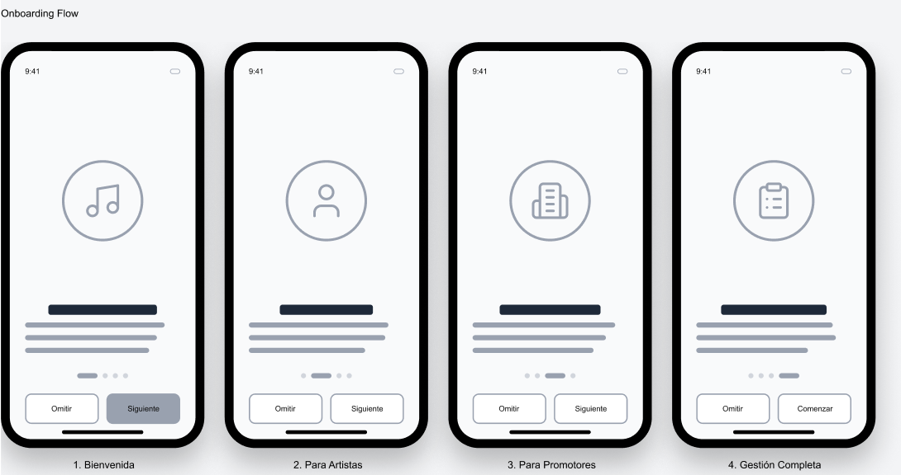

Authentication Flow

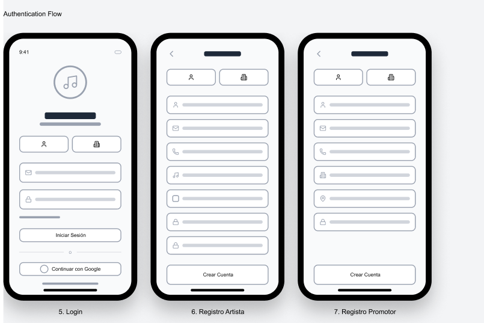

Artist Flow
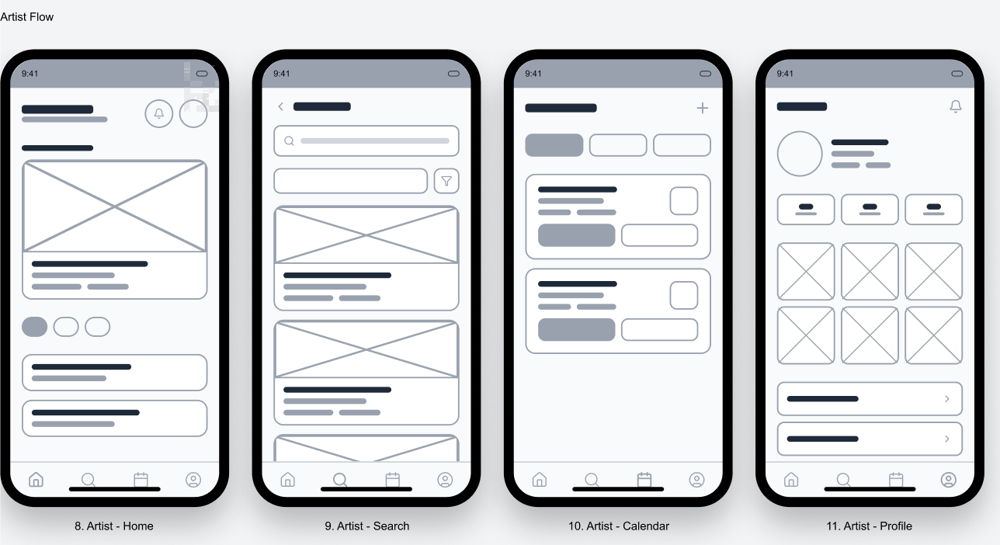

Promoter Flow

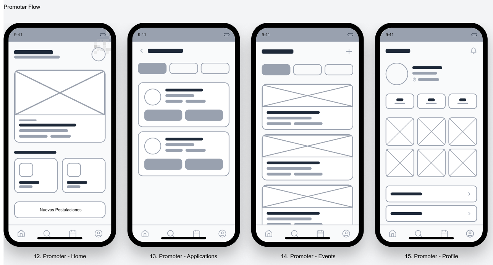

#### 3.1.4.2. Mobile Applications Wireflow Diagrams

Los Wireflows se utilizan principalmente en el diseño UX o por sus siglas, experiencia de usuario y especialmente para aplicaciones que involucran flujos de trabajo e interacciones complejas.

Complete User Journey

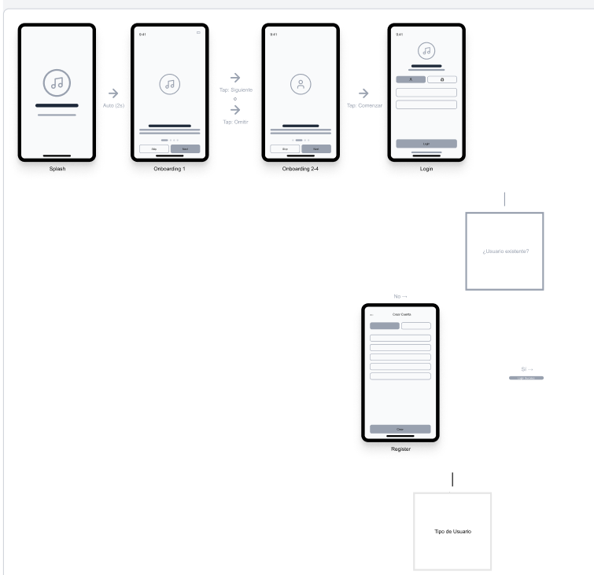

Artist Flow - Main Navigation

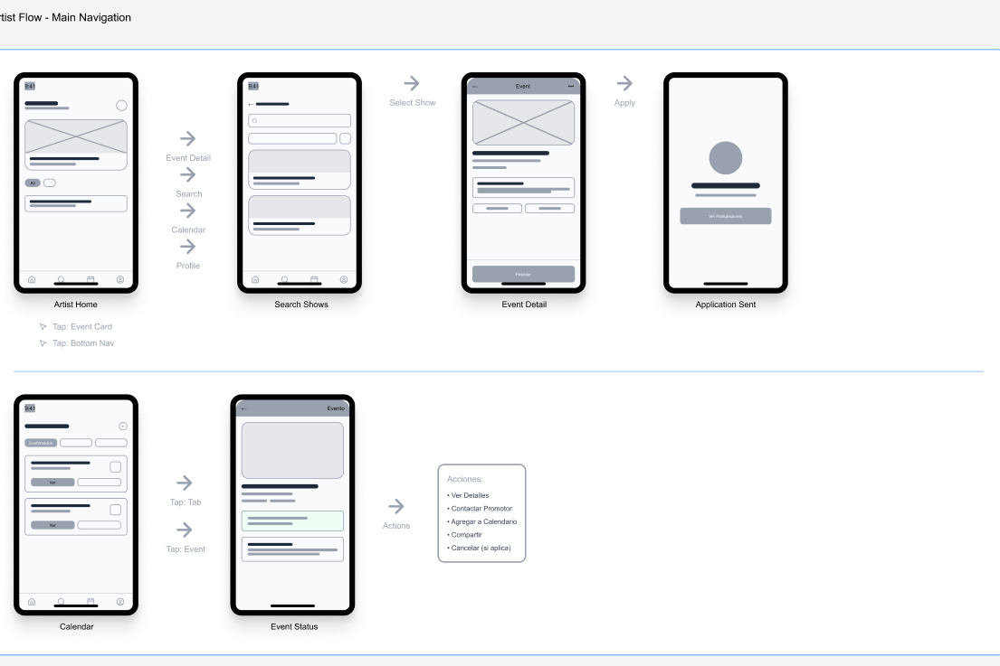

Promoter Flow - Application Management

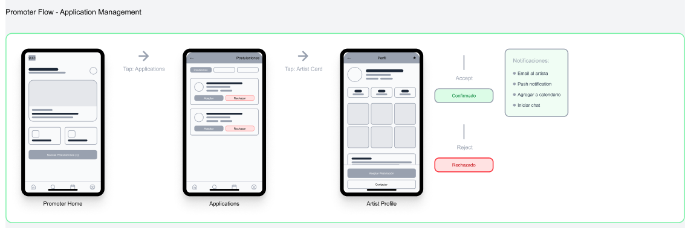

#### 3.1.4.3. Mobile Applications Mock-ups

En esta sección se muestran los mock-ups realizados para nuestro Mobile Applications.

Onboarding Experience
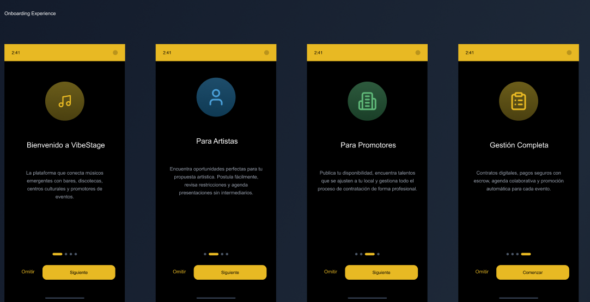
Authentication

Artist Experience
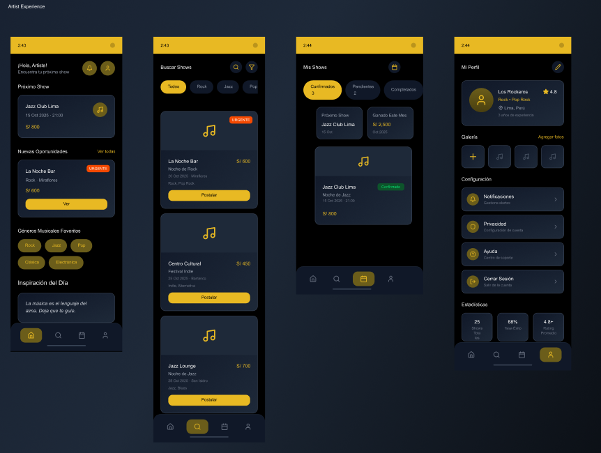
Promoter Experience
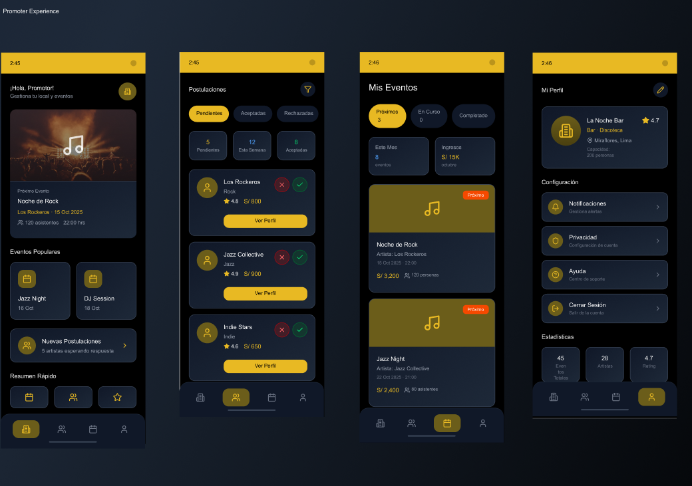
#### 3.1.4.4. Mobile Applications User Flow Diagrams
La presente sección muestra los **User Flow Diagrams** de la aplicación móvil, los cuales representan el recorrido que realiza el usuario al interactuar con las diferentes pantallas y funcionalidades de la app. Estos diagramas permiten visualizar la secuencia lógica de acciones, decisiones y transiciones, facilitando la comprensión de la experiencia de usuario y asegurando una navegación fluida e intuitiva dentro del sistema.

Flujo Completo de Onboarding y Registro

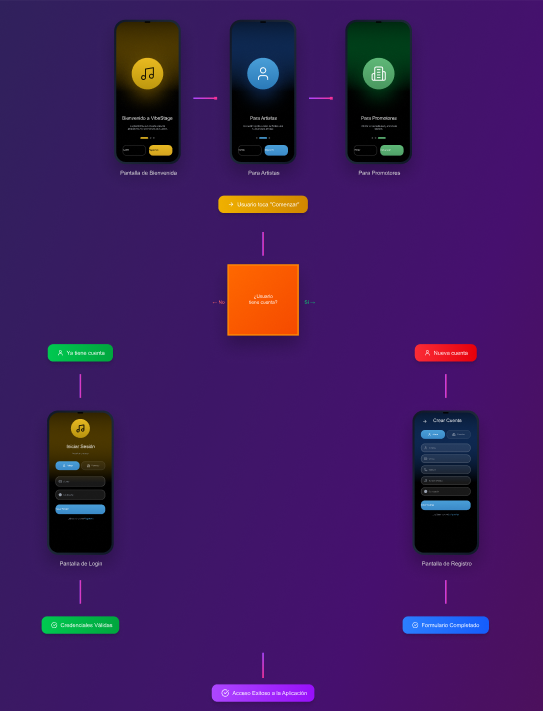

Flujo del Artista - Búsqueda y Postulación a Shows

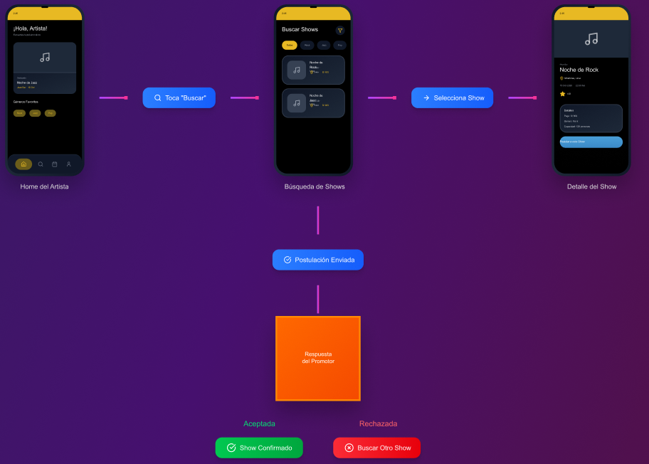

Flujo del Promotor - Gestión de Postulaciones

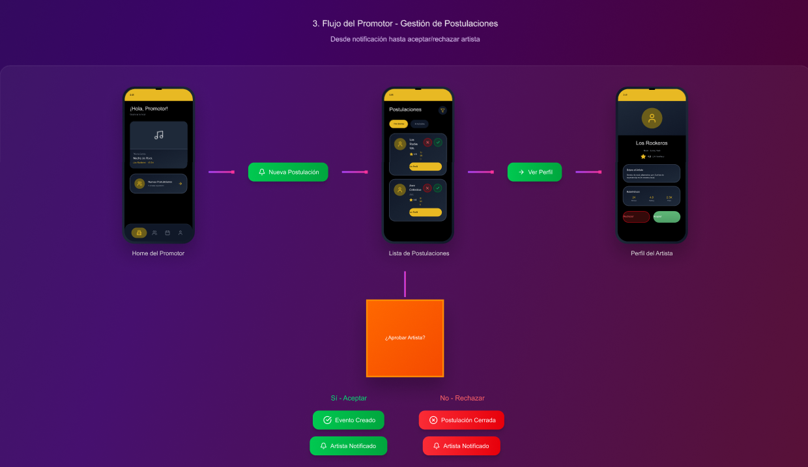

Para visualizar el diseño completo de la aplicación, puedes acceder al siguiente enlace de Figma:  

[Ver diseño en Figma](https://www.figma.com/design/SkxFiyo67OT8ELv0hhT7C9/Untitled?node-id=27-4949&t=CkEEcWPDrhgvO0aC-1)

#### 3.1.4.5. Mobile Applications Prototyping

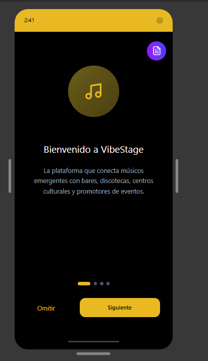

### 🎥 Video de la aplicación móvil Vibestage  
Ver video demostrativo en OneDrive:  
[Video demostrativo en OneDrive](https://upcedupe-my.sharepoint.com/:v:/g/personal/u201923571_upc_edu_pe/EcKTzlOtZ9JLlvc714647RgBHxl2Gm1s0qdNq0CKHMX8fw?nav=eyJyZWZlcnJhbEluOnsicmVmZXJyYWxBcHAiOiJPbmVEcml2ZUZvckJ1c2luZXNzIiwicmVmZXJyYWxBcHBQbGF0Zm9ybSI6IldlYiIsInJlZmVycmFsTW9kZSI6InZpZXciLCJyZWZlcnJhbFZpZXciOiJNeUZpbGVzTGlua0NvcHkifX0&e=6Aa1cl)

### 🔗 Prototipo de la aplicación móvil VibeStage en Figma  
[Prototipo en Figma](https://www.figma.com/design/SkxFiyo67OT8ELv0hhT7C9/Untitled?node-id=0-1&t=3UnZLelDV2MRvozJ-1)

# Capítulo IV: Product Implementation & Validation

## 4. Product Implementation & Validation

### 4.1. Software Configuration Management
Todo software requiere distintos entornos para su desarrollo, validación, despliegue y funcionamiento.  
La configuración del entorno de implementación consiste en establecer y mantener estos espacios de trabajo, asegurando que cada fase del ciclo de vida del proyecto cuente con las condiciones necesarias.  
Por ello, en esta sección se describen las principales herramientas empleadas para la gestión y configuración de dichos entornos.

**4.1.1.** Software Development Environment Configuration  
### Project Management  
**1. [WhatsApp](https://www.whatsapp.com/)**  
Usamos WhatsApp como nuestro principal medio de comunicación y coordinación del equipo.  
Nos permitió mantener una comunicación constante, compartir avances rápidamente y realizar llamadas grupales para discutir decisiones importantes del proyecto.  

---

### Requirements Management  
**1. [Trello](https://trello.com/)**  
Usamos esta herramienta para el manejo de nuestros requerimientos con el objetivo de organizar de manera más efectiva el backlog en equipo.  
Trello es una aplicación para gestionar proyectos. Te permite crear y organizar tareas, plazos y equipos.  
Trello se adapta a cualquier tipo de proyecto y se integra con otras aplicaciones.  

---

### Product UX/UI Design  
**1. [UXPressia](https://uxpressia.com/)**  
Esta herramienta nos ayudó en el desarrollo de nuestras *User Personas*, *Customer Journey Map*, *Empathy Map* e *Impact Map*,  
debido a que ofrece plantillas que facilitan el desarrollo ágil de estos artefactos.  

**2. [Mural](https://www.mural.co/)**  
Realizamos nuestro *Scenario Mapping* para nuestros dos segmentos objetivos,  
debido a que Mural es una herramienta fácil de usar y brinda plantillas de uso libre.  

**3. [Figma](https://www.figma.com/)**  
Usamos esta herramienta para la creación de nuestros *Wireframes*, *Mockups* y *Mobile Application Prototypes*,  
ya que permite trabajar de manera colaborativa y cuenta con múltiples utilidades.  

---

### Software Development  
**1. Landing Page**  
Para el desarrollo de nuestra *Landing Page* usamos herramientas básicas para el diseño de páginas web como lo son:  
**HTML5**, **CSS3** y **JavaScript**.  

**2. Android Studio**  
Empleamos **Android Studio** como entorno de desarrollo integrado (IDE) para la creación y prueba de nuestra aplicación móvil nativa.  
Esta herramienta nos permitió implementar funcionalidades directamente sobre Android, realizar emulaciones en distintos dispositivos  
y optimizar el rendimiento de la app mediante Kotlin y XML.  

---

### Software Documentation  
**1. [LucidChart](https://lucid.app/)**  
Esta herramienta la usamos para el desarrollo de *User Flow Diagrams*, *Wireflows* y el *Diagrama de Clases*.  
En LucidChart se pueden crear diversos diagramas de forma rápida y colaborativa.  

**2. [Structurizr](https://www.structurizr.com/)**  
Nos permitió realizar los diagramas **C4** de manera rápida con el lenguaje de programación **C#**.  

**3. [Vertabelo](https://vertabelo.com/)**  
Realizamos nuestra base de datos en esta herramienta debido a que cuenta con una amplia variedad de motores  
y permite trabajar colaborativamente.  

**4.1.2.** Source Code Management  

La gestión y actualización tanto de nuestra *landing page* como de este informe se llevaron a cabo mediante un repositorio colaborativo en **[GitHub](https://github.com/)**,donde administramos el control de versiones y registramos los cambios realizados por cada integrante del equipo. 

**Organization:** [https://github.com/1ACC0238-2520-14650-VIBE-STAGE](https://github.com/1ACC0238-2520-14650-VIBE-STAGE)  
**Landing Page Repository:** [https://github.com/1ACC0238-2520-14650-VIBE-STAGE/Landing-Page](https://github.com/1ACC0238-2520-14650-VIBE-STAGE/Landing-Page)  
**Report Repository:** [https://github.com/1ACC0238-2520-14650-VIBE-STAGE/Vibestage-Report](https://github.com/1ACC0238-2520-14650-VIBE-STAGE/Vibestage-Report)

Para optimizar la organización del código y asegurar un flujo de trabajo ordenado, implementamos la metodología **GitFlow**,  
que facilita la creación y administración de ramas durante el ciclo de desarrollo.  
Dentro de esta estructura, mantenemos dos ramas principales:  

- **Main:** Contiene la versión estable y lista para producción del proyecto, representando el historial oficial de lanzamientos.  
- **Develop:** Funciona como la rama central de integración, donde se reúnen y prueban las nuevas funcionalidades antes de ser publicadas.  

Además, utilizamos ramas auxiliares llamadas **Feature**, destinadas a la implementación de nuevas características o mejoras.  
Estas ramas parten de *develop* y se integran nuevamente una vez completadas, lo que permite trabajar en paralelo sin comprometer la estabilidad del entorno principal.  

**4.1.3.** Source Code Style Guide & Conventions  
**4.1.4.** Software Deployment Configuration  
En esta seccion colocaremos las evidenciaas de los pasos que seguimos para desplegar nuestra Landing Page.

1. Ingresamos a nuestra organización y seleccionamos el repositorio correspondiente a la Landing Page de nuestro proyecto.
   
2. Una vez dentro del repositorio, seleccionamos la opción settings.
   
3. En el menú de la parte izquierda seleccionamos, la opción pages y en esta realizamos las configuraciones necesarias, una vez finalizadas nos dara un link.
   
4. Por último, podremos ver nuestra Landing Page desplegada.
   

### 4.2. *Landing Page & Mobile Application Implementation*
#### 4.2.1. *Sprint 1*
**4.2.1.1.** Sprint Planning 1 

| **Sprint #** | **Sprint 1** |
|---------------|--------------|
| **Sprint Planning Background** | |
| **Date** | 08/10/2025 |
| **Time** | 16:00 pm |
| **Location** | Modalidad remota por Discord |
| **Prepared By** | Equipo VibeStage |
| **Attendees** | Todos los miembros del grupo VibeStage |
| **Sprint n - 0 Review Summary** | Se desarrolló la **Landing Page** y la primera versión de la **Aplicación móvil**, ambas alineadas con los objetivos del proyecto *VibeStage*.    **Landing Page:** Propósito claro de la plataforma, Navegación fluida entre secciones, Diseño responsive adaptable,Versión en inglés y soporte multilenguaje, Formulario de contacto funcional, Selección del tipo de usuario,Visualización de planes por tipo de usuario, Botones CTA funcionales, Menú fijo con desplazamiento suave, Sección del equipo visible, Botón de “Enviar” funcional.    **Aplicación móvil:** Registro de artista, Acceso al dashboard del artista, Búsqueda de eventos por afinidad, Postulación rápida a eventos, Registro del promotor/local, Dashboard del promotor/local, Registro de usuario con selección de rol, Inicio de sesión con credenciales, Agenda de eventos del artista.    **Notas técnicas:** Se implementó estructura modular, pantallas por rol, flujo de registro y login funcional, navegación estable, interfaz coherente con la identidad visual de VibeStage y componentes reutilizables con Material Design. |
| **Sprint n - 1 Retrospective Summary** | **Puntos positivos:** Se logró cumplir el alcance total del Sprint, entregando una experiencia funcional tanto en la web como en la app. Se consolidó la base de la arquitectura, diseño visual, navegación, e internacionalización.   **Aspectos destacados:** Alta cohesión en equipo, cumplimiento de tiempos, y pruebas exitosas en dispositivos móviles y navegadores.   **Próximos pasos:** (1) Integración con backend para gestión real de datos; (2) implementación de base de datos; (3) optimización SEO y despliegue productivo; (4) conexión del módulo de eventos, pagos y reputación. |
| **Sprint Goal & User Stories** | **Objetivo del Sprint 1:** Implementar la base visual y funcional de *VibeStage* (Landing Page y App Móvil) para presentar el propósito del producto, atraer nuevos usuarios (artistas y promotores) y establecer el flujo inicial de registro y navegación por rol.    **User Stories desarrolladas:**   - *Landing Page:* US01, US02, US03, US04, US05, US06, US21, US22, US23, US24, US26.   - *Aplicación móvil:* US07, US08, US09, US10, US14, US15, US31, US32, US34.    **Technical Stories :** TS1, TS2, TS3, TS4, TS5, TS6, TS7, TS8, TS9, TS10, TS11.|
| **Sprint 1 Velocity** | **Total de HU completadas:** 19   |  **Velocidad total:** 19 puntos |  **Estado general:** Sprint 1 completado exitosamente con todos los entregables funcionales y alineados al MVP de VibeStage. |

**4.2.1.2.** Sprint Backlog 1  

En esta sección se especifican los detalles del Sprint Backlog, que es una lista de tareas que se deben realizar para completar el Sprint.

| **Sprint #** | **Sprint 1** |
|---------------|--------------|

| **User Story** | **Work-Item / Task** | | | | | |
|----------------|----------------------|---|---|---|---|---|
| **Id** | **Title** | **Id** | **Title** | **Description** | **Estimation (Hours)** | **Assigned To** | **Status (To-do / In-Process / To-Review / Done)** |
| **US01** | Propósito claro de la plataforma | **T01** | Implementar encabezado principal y tagline | Mostrar el propósito de VibeStage y botón de acción principal. | 2 | Stephano Landauri | Done |
| | | **T02** | Agregar logotipo y menú principal | Incluir logo, navegación y enlaces internos. | 2 | Carlos Álvarez | Done |
| **US02** | Navegación fluida entre secciones | **T03** | Implementar scroll suave | Permitir desplazamiento fluido por anclas internas del menú. | 1 | Juan Paul Llamccaya | Done |
| | | **T04** | Configurar navegación responsive | Asegurar que el menú se adapte correctamente a todos los dispositivos. | 1.5 | Gabriel Lapa | Done |
| **US03** | Diseño responsive adaptable | **T05** | Crear media queries | Asegurar visualización correcta en móviles y tablets. | 2 | Rafael Cuya | Done |
| **US04** | Implementar versión en inglés | **T06** | Configurar traducción ES/EN | Añadir archivo `translations.js` y textos bilingües. | 2 | Stephano Landauri | Done |
| **US05** | Formulario de contacto funcional | **T07** | Crear formulario con validaciones | Implementar inputs, validación y mensaje de confirmación. | 3 | Carlos Álvarez | Done |
| **US06** | Selección del tipo de usuario | **T08** | Agregar botones “Soy artista” / “Soy local” | Redirigir a flujo de registro según rol. | 2 | Juan Paul Llamccaya | Done |
| **US21** | Visualización de planes | **T09** | Crear sección de planes | Mostrar planes para artistas y locales con sus características. | 3 | Gabriel Lapa | Done |
| **US22** | Botones CTA funcionales | **T10** | Implementar botones de registro | Añadir acciones directas hacia el registro desde la landing. | 1 | Rafael Cuya | Done |
| **US23** | Menú fijo y desplazamiento suave | **T11** | Añadir efecto sticky al menú | Mantener visible el menú durante el desplazamiento. | 1.5 | Stephano Landauri | Done |
| **US24** | Sección del equipo visible | **T12** | Crear sección "Nuestro equipo" | Mostrar foto, rol y enlaces de cada miembro. | 3 | Carlos Álvarez | Done |
| **US26** | Botón “Enviar” funcional | **T13** | Añadir botón de envío en contacto | Validar datos y mostrar mensaje de éxito. | 1 | Rafael Cuya | Done |
| **US07** | Registro de artista | **T14** | Diseñar formulario de registro | Crear flujo visual de registro para artistas. | 3 | Stephano Landauri | Done |
| **US08** | Dashboard del artista | **T15** | Crear vista principal del artista | Incluir resumen de perfil, agenda y eventos. | 4 | Carlos Álvarez | Done |
| **US14** | Registro del promotor/local | **T16** | Crear flujo de registro para locales | Implementar formulario y vista inicial. | 2.5 | Juan Paul Llamccaya | Done |
| **US15** | Dashboard del promotor/local | **T17** | Diseñar panel administrativo | Mostrar publicaciones, agenda y evaluaciones. | 3 | Gabriel Lapa | Done |
| **US31** | Registro con selección de rol | **T18** | Implementar elección de rol | Permitir elegir entre Artista o Local al registrarse. | 2 | Rafael Cuya | Done |
| **US32** | Inicio de sesión | **T19** | Crear flujo de login | Iniciar sesión y redirigir al dashboard. | 3 | Stephano Landauri | Done |
| **US34** | Agenda del artista | **T20** | Crear vista de agenda | Mostrar eventos confirmados con fechas y estados. | 2 | Carlos Álvarez | Done |
| **TS01** | Implementación del encabezado | **T21** | Crear estructura HTML/CSS del header | Mostrar tagline y botón principal. | 1.5 | Stephano Landauri | Done |
| **TS02** | Menú fijo y navegación | **T22** | Agregar lógica JS del menú responsive | Controlar apertura/cierre del menú y scroll. | 2 | Rafael Cuya | Done |
| **TS03** | Diseño responsive | **T23** | Configurar estilos adaptativos | Ajustar tamaños, grillas y tipografía por dispositivo. | 2 | Carlos Álvarez | Done |
| **TS04** | Implementar traducción EN/ES | **T24** | Desarrollar archivo `translations.js` | Definir textos multilenguaje. | 1.5 | Stephano Landauri | Done |
| **TS05** | Formulario de contacto | **T25** | Añadir validación JS | Mostrar alertas de confirmación o error. | 2 | Juan Paul Llamccaya | Done |
| **TS06** | Botones de registro por rol | **T26** | Vincular botones CTA con secciones de registro | Habilitar navegación dinámica. | 1.5 | Gabriel Lapa | Done |
| **TS07** | Sección de testimonios | **T27** | Crear sección “Testimonios” | Incluir tarjetas con nombre, rol y opinión. | 2 | Carlos Álvarez | Done |
| **TS08** | Diagrama de contexto del artista | **T28** | Elaborar C4 Context Diagram | Mostrar interacción del artista con servicios externos. | 2 | Stephano Landauri | Done |
| **TS09** | Componentes de eventos | **T29** | Crear C4 de componentes | Mostrar interacción entre servicios de eventos. | 2.5 | Rafael Cuya | Done |
| **TS10** | Contratos y Riders | **T30** | Diseñar diagrama C4 del módulo | Representar flujo de firma digital y validación técnica. | 2 | Juan Paul Llamccaya | Done |
| **TS11** | Pagos y reputación | **T31** | Generar código estructurado del backend simulado | Mostrar endpoints y entidades de pagos/evaluaciones. | 3 | Stephano Landauri | Done |

**4.2.1.3.** Development Evidence for Sprint Review 

| **Repository** | **Branch** | **Commit ID** | **Author** | **Message** | **Time ago** |
|----------------|-------------|---------------|-------------|--------------|---------------|
| **vibestage-kotlin-app** | main | c1c8c1b | bluexdev | feat: fix style | 08/10/2025 |
| vibestage-kotlin-app | main | 347def1 | bluexdev | feat: fix style | 08/10/2025 |
| vibestage-kotlin-app | main | 584574d | bluexdev | feat: fix style | 08/10/2025 |
| vibestage-kotlin-app | main | 7382f26 | bluexdev | feat(promoter): release version 2 with navigation and UI bug fixes | 06/10/2025 |
| vibestage-kotlin-app | main | d2d79c1 | bluexdev | Initial version | 05/10/2025 |
| **Landing Page** | main | 47c98e9 | bluexdev | feat: add new team member to landing page with photo, name, and alt text | 17/09/2025 |
| Landing Page | main | ac3175c | Rafael Cuya | Feat added some pictures | 17/09/2025 |
| Landing Page | main | ed6a9bf | Rafael Cuya | Merge remote-tracking branch 'origin/main' | 17/09/2025 |
| Landing Page | main | e197375 | Rafael Cuya | Feat added style | 17/09/2025 |
| Landing Page | main | 4426a42 | Rafael Cuya | Feat added main-en | 17/09/2025 |
| Landing Page | main | 8904fd8 | Rafael Cuya | Feat added main.js | 17/09/2025 |
| Landing Page | main | 8a91016 | Rafael Cuya | Feat added index | 17/09/2025 |
| Landing Page | main | a746977 | Rafael Cuya | Feat added translation | 17/09/2025 |
| Landing Page | main | aff4c44 | Rafael Cuya | Feat added pictures | 17/09/2025 |
| Landing Page | main | 7bd30af | Rafael Cuya | feat added README | 17/09/2025 |
| Landing Page | main | 8cc4fc3 | Rafael Cuya | Feat added Readme | 17/09/2025 |
| Landing Page | main | 961ad56 | Rafael Cuya | Initial commit | 17/09/2025 |

**4.2.1.4.** Testing Suite Evidence for Sprint Review 

   
**4.2.1.5.** Execution Evidence for Sprint Review 
**Landing Page**

**Mobile App**

**Backend**

**4.2.1.6.** Services Documentation Evidence for Sprint Review 

Durante el Sprint 1 se desarrollaron y documentaron los servicios correspondientes a los repositorios Landing Page y VibeStage Kotlin App, evidenciando el avance del proyecto mediante commits verificados y funcionales. En la Landing Page, se implementaron las secciones principales de la plataforma web, incluyendo encabezado, menú de navegación, diseño responsive, traducción bilingüe y formularios interactivos, cumpliendo con los requerimientos definidos en las historias de usuario. En la aplicación VibeStage Kotlin, se realizaron avances en la interfaz móvil, navegación entre pantallas y correcciones de estilo, alcanzando la versión 2 con mejoras visuales y de usabilidad. Ambas implementaciones reflejan un trabajo colaborativo y continuo, con un control de versiones que garantiza trazabilidad, calidad del código y cumplimiento de los objetivos establecidos para el Sprint 1.

**4.2.1.7.** Software Deployment Evidence for Sprint Review  
**4.2.1.8.** Team Collaboration Insights during Sprint  

En esta sección se presentarán las evidencias que reflejan el trabajo colaborativo realizado durante el desarrollo del proyecto VibeStage.

**Report**

**Landing Page**

**Mobile App**

### 4.3 Validation Interviews
#### 4.3.1 Diseño de entrevistas

**Objetivo de la entrevista:**

Validar la usabilidad y efectividad de la landing page y de los flujos de usuario (user flows) de la aplicación móvil **VibeStage**, asegurando que cada flujo sea intuitivo, claro y funcional para los dos segmentos objetivo: **Promotores** y **Artistas**. Las entrevistas permitirán identificar percepciones, niveles de satisfacción y posibles mejoras en la experiencia general de uso.

---

#### Saludo y presentación

Comenzamos con una introducción breve de los entrevistados para recordar quiénes son:

1. ¿Cómo se llama?  
2. ¿Cuántos años tiene?  
3. ¿En qué distrito vive?  

---

#### Preguntas

Estas preguntas nos ayudarán a conocer la experiencia del usuario con la plataforma **VibeStage**, evaluar si la interfaz y las funciones cumplen sus expectativas, y recoger sugerencias para futuras mejoras.

---

**Promotor:**

1. ¿Al ver la landing page comprendiste rápidamente el propósito de **VibeStage** y cómo podría ayudarte como promotor?  
2. ¿Te pareció atractiva y clara la interfaz del sitio web?  
3. ¿Que te pareció la funcionalidad de crear tu cuenta y registrar la información de tu local o espacio para eventos en la app?  
4. ¿Qué tan claro te pareció el proceso para revisar, aceptar o rechazar postulaciones de artistas?  
5. ¿Consideras útil la vista de **Mis Eventos**, donde puedes gestionar tus próximos, en curso y completados?  
6. ¿La aplicación te ayuda a llevar un control eficiente de tus contrataciones, pagos y fechas?  
7. ¿Qué tan importante consideras la función de promoción automática de eventos dentro de la app?  
8. ¿Qué función agregarías o mejorarías en **VibeStage** para que se adapte mejor a tus necesidades como promotor?  

---

**Artista:**

1. ¿Al ingresar a la landing page entendiste fácilmente qué ofrece **VibeStage** y a quién está dirigida la plataforma?  
2. ¿Te pareció atractiva la presentación visual de la landing (colores, tipografía, secciones)?  
3. ¿Qué tan fácil te resultó registrarte y crear tu perfil como artista dentro de la aplicación móvil?  
4. ¿La app te ayudó a entender rápidamente cómo buscar y postular a presentaciones?  
5. ¿Te parece útil que la aplicación muestre tus shows confirmados y pendientes en una agenda digital?  
6. ¿Consideras importante que los contratos y pagos se gestionen digitalmente dentro de la app?  
7. ¿Qué tan valioso te resulta recibir notificaciones o recordatorios sobre tus próximos eventos o evaluaciones?  
8. ¿Qué función o herramienta agregarías o mejorarías para que **VibeStage** se adapte mejor a tu carrera artística?   

**4.3.2.** Registro de Entrevistas  

#### Segmento Segmento Administrador de locales

Entrevistado #1

| **Nombre del entrevistado**  |   Angela Ushiñahua                                                                                                               |
| **Edad**                     |    25 años                                                                                                                            |
| **Distrito**                 |         Villa el Salvador                                                                                                                    |
| **Screenshot de la entrevista** |                                   |
| **Link de la entrevista**    |                    [Ver entrevista en Youtube](https://youtu.be/joRDd0F2s2U)                                                                                                  |
| **Tiempo de inicio y duración** |                  0:00 - 9:51                                                                                                  |
| **Resumen**                  |   Angela es una artista del ámbito musical que compartió su experiencia al usar la aplicación **VibeStage**, destacando su facilidad de uso, el diseño atractivo y la claridad del propósito dirigido a músicos. Señaló que el registro y la búsqueda de presentaciones son simples, valoró la utilidad de la agenda para organizar sus eventos y consideró muy importante la gestión digital de contratos y pagos. Finalmente, sugirió agregar un botón interactivo que haga la aplicación más dinámica y funcional para los artistas.                       |

**4.3.3.** Evaluaciones según heurísticas  

## Conclusiones
Actualización constante:
Durante el desarrollo de VibeStage nos dimos cuenta de la importancia de mantenernos actualizados en las herramientas y metodologías que usamos. La tecnología cambia muy rápido, y para poder responder a las necesidades del proyecto fue necesario reforzar conocimientos previos y aprender nuevas prácticas que hicieron más eficiente el proceso.

Investigación continua:
En varias etapas del proyecto fue evidente que no bastaba con lo que ya conocíamos. Tuvimos que investigar conceptos y soluciones adicionales, lo que nos permitió comprender mejor ciertos problemas y proponer alternativas más sólidas. Esta experiencia reafirma que la investigación es una parte clave del trabajo profesional en ingeniería de software.

Trabajo colaborativo en GitHub:
El uso de GitHub como repositorio compartido nos ayudó a organizarnos mejor y a trabajar de manera colaborativa. Cada integrante pudo aportar sus cambios, revisarlos y corregirlos, evitando confusiones y pérdidas de información. Esto fortaleció la dinámica del equipo y nos dio una experiencia práctica en el manejo de proyectos colaborativos con control de versiones.

## Anexos
Landing-Page: https://1acc0238-2520-14650-vibe-stage.github.io/Landing-Page/ 

