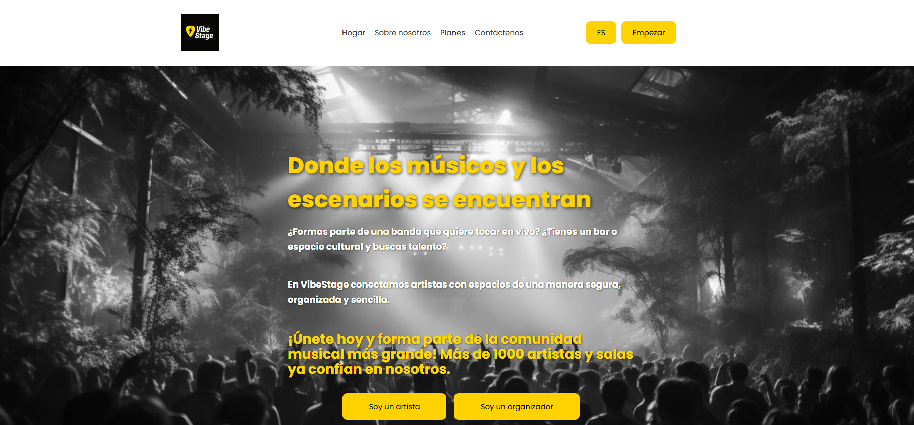
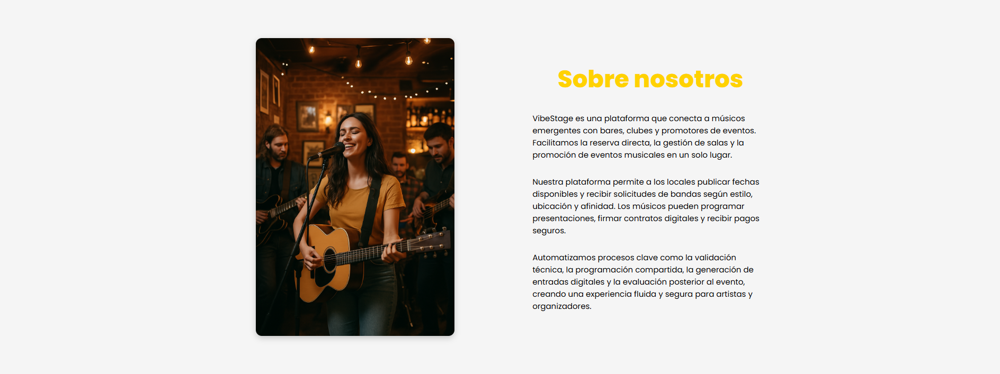
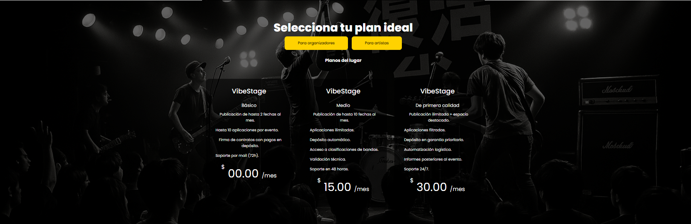
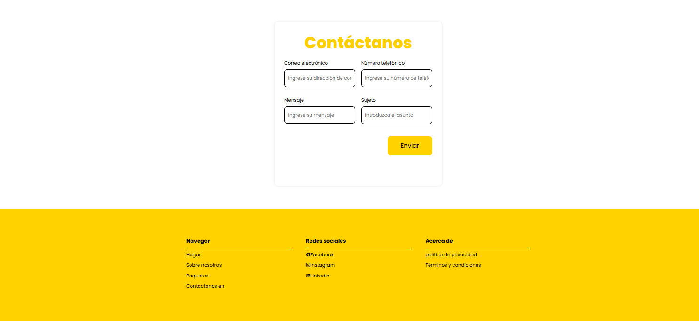

# Capítulo III: Solution UI/UX Design
## 3.1. Product design
### 3.1.1. Style Guidelines
VibeStage es una aplicación móvil que estará disponible en App Store y Play Store, diseñada para ser accesible a músicos, promotores y usuarios desde el dispositivo más utilizado: el celular. Contará con una interfaz intuitiva y fácil de usar, donde elementos como el logo y diversas imágenes han sido colocados estratégicamente para guiar al usuario y permitirle descubrir todas las ventajas y funcionalidades de la aplicación de manera clara y atractiva. 

#### 3.1.1.1. General Style Guidelines

Hemos diseñado el logo de nuestra aplicación VibeStage con una visión moderna, alineada con la temática musical de la aplicación. Para reforzar esta conexión, incorporamos una plumilla de guitarra en el diseño, ofreciendo una referencia directa al mundo de la música. En cuanto a la tipografía, seleccionamos un estilo claro y legible que también refleje la identidad musical de la aplicación.La paleta de colores elegida busca transmitir energía y dinamismo, al mismo tiempo que mantiene coherencia con la temática central de VibeStage, creando una experiencia visual atractiva y representativa de nuestra propuesta. A continuacion presentamos el logo de VibeStage.

**Typography**
En cuanto a la tipografía, hemos elegido Montserrat como fuente principal, una sans-serif que aporta una apariencia limpia y facilita la lectura para el usuario. Para los encabezados y títulos, optamos por Roboto, cuya versatilidad y dinamismo lo hacen ideal para destacar secciones importantes y captar la atención del usuario de manera efectiva.}

  
  

**Colors**

La paleta de colores de VibeStage fue diseñada con el objetivo de transmitir energía y reflejar la esencia de nuestra aplicación. Se eligieron tonos que se asocian con distintos géneros musicales, lo que garantiza que la temática de la música esté siempre presente en la experiencia del usuario dentro de la aplicación móvil.

**Espaciado y Layout**

- El logo se colocará en la esquina izquierda de la pantalla.  
- Algunos títulos estarán centrados, mientras que otros se alinearán a la izquierda según la jerarquía visual.  
- Se prioriza la legibilidad y facilidad de navegación, asegurando un espacio adecuado entre los elementos de la interfaz.

**Tono de comunicación**

El lenguaje y estilo de la aplicación buscan conectar eficazmente con el público objetivo, transmitiendo un mensaje cercano, claro y profesional. La comunicación en la landing page y la app móvil mantiene coherencia, adaptándose al formato de cada plataforma.  

**Web Style Guidelines**

- La landing page se adaptará tanto a pantallas grandes como móviles, manteniendo consistencia visual y tipográfica.  
- Se aplicarán los elementos de branding, colores y tipografía.  
- Los layouts respetarán márgenes y alineaciones, manteniendo la experiencia visual y jerarquía de información.

**Mobile Style Guidelines**

- La aplicación móvil prioriza una interfaz y navegación intuitiva.  
- Los títulos, botones y elementos interactivos seguirán la tipografía y la paleta de colores definidas.  
- Se respetarán los alineamientos y espaciados optimizados para pantallas pequeñas, asegurando una experiencia clara y consistente.

### 3.1.2. Information Architecture
La arquitectura de información es esencial para organizar y estructurar el contenido de manera que sea fácilmente accesible y comprensible para los usuarios de la plataforma **VibeStage**. En esta sección, se presentan los sistemas de organización, etiquetado, etiquetas SEO y metaetiquetas, sistemas de búsqueda y navegación que guiarán la experiencia del usuario. Estas directrices están diseñadas para mejorar la usabilidad, promover la exploración fluida del contenido y garantizar que cada usuario —ya sea músico o promotor— encuentre rápidamente lo que necesita.

#### 3.1.2.1. Organization Systems
Los sistemas de organización que se implementarán en **VibeStage** responden a distintos contextos de uso y tipos de contenido que ofrece la plataforma. A continuación, se describen los tipos de organización aplicados y los esquemas de categorización adoptados:

**Organización Jerárquica (Visual Hierarchy)**

Se utilizará para estructurar la **navegación principal** y secciones clave como:

- **Inicio**
- **Explorar Eventos**
- **Perfil del Usuario (Músico / Promotor)**
- **Agenda / Contratos / Pagos**

Este modelo permite descomponer la información desde niveles generales a específicos  
(por ejemplo: "Explorar Eventos" → "Por Género Musical" → "Rock / Jazz / Cumbia").

**Organización Secuencial (Step-by-Step)**

Aplicada en flujos que requieren que el usuario siga pasos lógicos y cronológicos, como:

- **Publicar un evento** (para locales/promotores)
- **Postular a un evento** (para músicos)
- **Proceso de firma de contrato y pagos**

Este modelo guía al usuario en tareas complejas, asegurando que cada paso sea completado antes de continuar.

**Organización Matricial**

Utilizada en las interfaces de exploración de eventos o perfiles, donde los usuarios podrán:

- **Filtrar por múltiples criterios** (género, ubicación, fecha, tipo de espacio)
- **Comparar distintos resultados** en base a atributos visibles (rating, disponibilidad, tipo de música)

La combinación flexible de filtros permite una navegación personalizada y precisa.

**Esquemas de Categorización**

Para facilitar aún más la exploración, el contenido se clasificará con base en diferentes esquemas según el contexto:

- **Por Tópico:**  
  Utilizado en secciones como *blog*, *centro de ayuda* o *categorías musicales* (ej. “Rock”, “Jazz”, “Electrónica”).

- **Por Audiencia:**  
  El contenido diferenciado para **músicos** y **promotores** será organizado en menús y vistas personalizadas, destacando las funciones que cada uno utiliza más frecuentemente.

- **Cronológico:**  
  Aplicado en la **agenda de eventos**, **historial de contrataciones** y **publicaciones recientes**.

- **Alfabético:**  
  Utilizado en listados como **directorios de bandas o lugares registrados**, para facilitar búsquedas directas.

#### 3.1.2.2. Labelling Systems
Los sistemas de etiquetado (Labeling Systems) son fundamentales para mejorar la usabilidad, navegación y optimización en motores de búsqueda. En el caso de VibeStage, se ha adoptado una estrategia de etiquetado clara, concisa y centrada en las necesidades de cada tipo de usuario: músicos y promotores.

#### Tipos de Etiquetado

- **Etiquetado Descriptivo**: Se utilizan etiquetas claras y comprensibles como "I'm an Artist", "I'm a Venue", "Select your ideal plan" o "Key tools to play live" que resumen con precisión el contenido y ayudan al usuario a encontrar lo que busca rápidamente.

- **Etiquetado por Audiencia**: Se personalizan las secciones según el rol del usuario, usando etiquetas como “For Artists” y “For Venues” en los planes de membresía, mejorando la segmentación del contenido.

- **Etiquetado Funcional**: Botones como “Get Started”, “Join today”, “Enviar” y “Apply Now” comunican acciones específicas que guían la interacción del usuario.

#### 3.1.2.3. SEO Tags and Meta Tags
A continuación se detallan los principales metaetiquetas que se incluirán para cada página clave:

**Landing Page (`index.html`)**

- **Title**: VibeStage – Where Musicians and Stages Meet
- **Meta Description**: Discover VibeStage, the platform that connects emerging artists with venues and promoters. Direct booking, digital contracts, secure payments, and event promotion in one place.
- **Meta Keywords**: music booking, live gigs, musician platform, concert promotion, secure contracts, event management
- **Meta Author**: VibeStage Dev Team

**Sección de Planes (`#package`)**

- **Title**: VibeStage Plans – Choose Your Ideal Membership
- **Meta Description**: Compare VibeStage plans for artists and venues. Enjoy features like escrow payments, technical validation, and promotion tools to manage your musical events.
- **Meta Keywords**: musician plans, venue subscriptions, music gigs platform, artist benefits, live music tools
- **Meta Author**: VibeStage Dev Team

**Sección de Contacto (`#contact`)**

- **Title**: Contact VibeStage – Get in Touch with Our Team
- **Meta Description**: Send us a message with your questions or feedback. We're here to help artists and venues connect more effectively.
- **Meta Keywords**: contact VibeStage, music event platform, artist support, venue contact
- **Meta Author**: VibeStage Dev Team

**Sección de Acerca de Nosotros (`#about-us`)**

- **Title**: About VibeStage – Empowering Live Music Connections
- **Meta Description**: Learn more about the mission behind VibeStage, our development team, and how we’re revolutionizing live music bookings.
- **Meta Keywords**: about VibeStage, music platform team, music technology, live music innovation
- **Meta Author**: VibeStage Dev Team

#### 3.1.2.4. Searching Systems
El motor de búsqueda en **VibeStage** es esencial para conectar eficazmente a músicos emergentes con promotores y espacios culturales. Permite a los usuarios encontrar rápidamente talento o lugares que se ajusten a sus necesidades específicas.

#### Características claves

**Búsqueda por objetivo:**  
Los usuarios podrán buscar según su intención principal, ya sea **contratar un músico para un evento específico**, encontrar **espacios disponibles para presentaciones**, o **descubrir nuevos talentos musicales** según el estilo deseado.

**Búsqueda por características:**  

Los usuarios podrán filtrar por características específicas como:  
- **Género musical** (rock, jazz, urbano, clásico, etc.)  
- **Tipo de evento** (bar, teatro, festival, privado)  
- **Cantidad de integrantes**  
- **Instrumentos principales o configuración escénica**  
- **Valoraciones de otros eventos**

**Filtros avanzados:**  
El sistema incluirá filtros dinámicos como:  
- Ubicación geográfica  
- Disponibilidad en fechas y horarios  
- Rango de precios  
- Experiencia previa en tipos de evento  
- Validación de rider técnico

**Resultados relevantes:**  
Los resultados de búsqueda serán personalizados y ordenados de acuerdo a:  
- Coincidencia con criterios del usuario  
- Popularidad y reseñas  
- Disponibilidad inmediata  
- Afinidad con eventos anteriores contratados por el usuario

#### 3.1.2.5. Navigation Systems
El Sistema de Navegación es la estructura que permite a los usuarios desplazarse eficientemente entre las distintas secciones y páginas de la aplicación  

**Estructura de navegación:**  El Sistema de Navegación constará de las siguientes secciones principales en la barra de navegación

-  Home
-  Abour Us
-  Packages
-  Cotact Us
-  Es
-  Start Now

### 3.1.3. Landing Page UI Design
#### 3.1.3.1. Landing Page Wireframe

#### 3.1.3.2. Landing Page Mock-up

Procederemos a mostrar el Landing Page Mock-up de la aplicación:

### 3.1.4. Mobile Applications UX/UI Design

#### 3.1.4.1. Mobile Applications Wireframes
#### 3.1.4.2. Mobile Applications Wireflow Diagrams
#### 3.1.4.3. Mobile Applications Mock-ups
#### 3.1.4.4. Mobile Applications User Flow Diagrams
#### 3.1.4.5. Mobile Applications Prototyping
